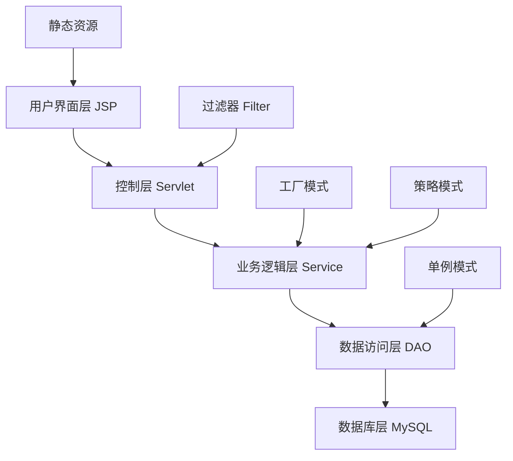
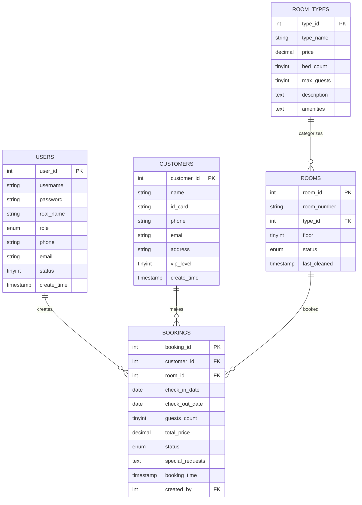
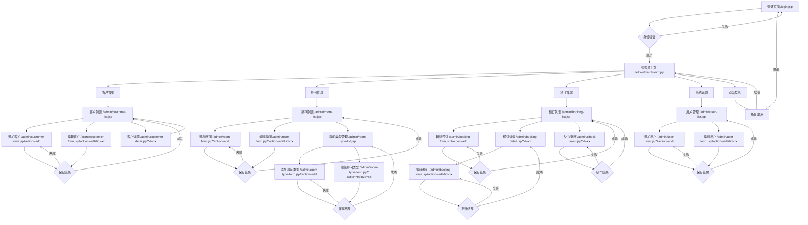
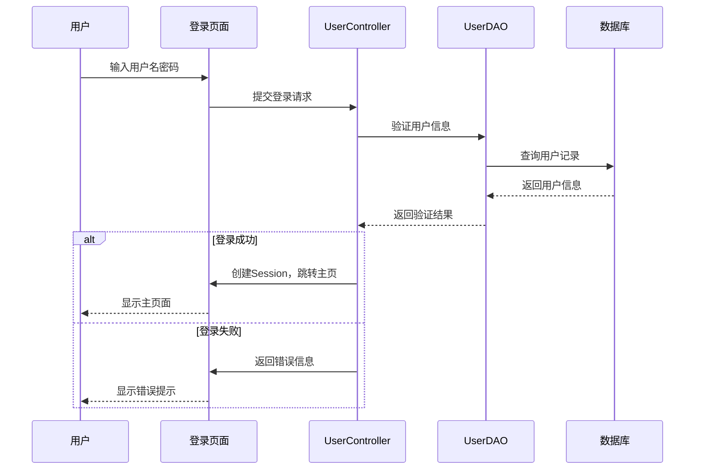
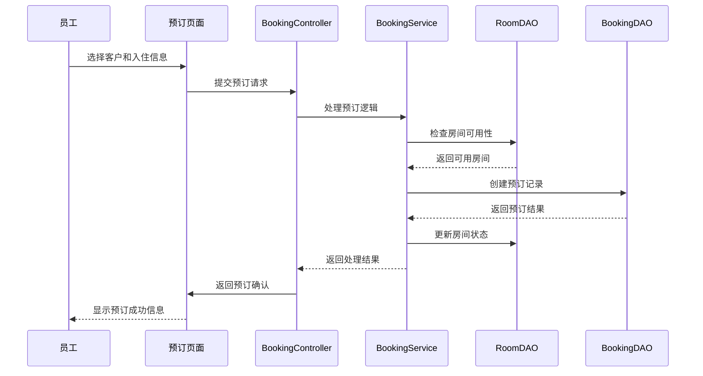
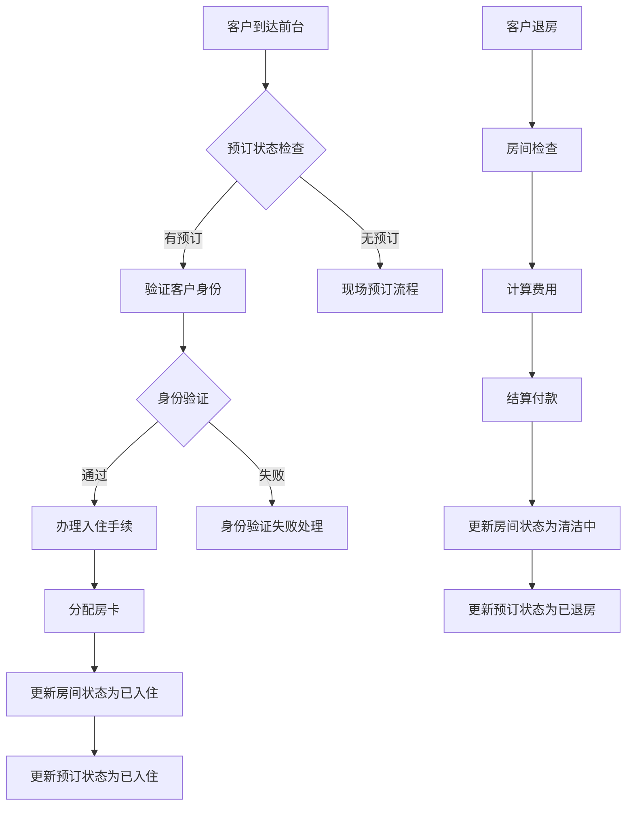

# 酒店管理系统基础版本设计文档

## 项目概述

基于JavaWeb + JSP + MySQL + Tomcat的酒店管理系统基础版本，实现酒店日常运营的核心功能，包括客房管理、客户管理、预订管理和基本的系统管理功能。

### 技术栈
- **后端**: Java Servlet + JSP
- **数据库**: MySQL 8.0
- **服务器**: Apache Tomcat 9.0
- **前端**: HTML + CSS + JavaScript + Bootstrap
- **开发工具**: IDEA + Maven

## 系统架构

### 整体架构图



### 设计模式应用

#### 1. 单例模式 (Singleton Pattern)
应用场景：数据库连接池管理、配置管理器
```java
// 数据库连接池单例
public class ConnectionPool {
    private static volatile ConnectionPool instance;
    private DataSource dataSource;
    
    private ConnectionPool() {
        // 初始化数据源
    }
    
    public static ConnectionPool getInstance() {
        if (instance == null) {
            synchronized (ConnectionPool.class) {
                if (instance == null) {
                    instance = new ConnectionPool();
                }
            }
        }
        return instance;
    }
}
```

#### 2. 工厂模式 (Factory Pattern)
应用场景：DAO对象创建、Service对象创建
```java
// DAO工厂类
public class DAOFactory {
    public static UserDAO createUserDAO() {
        return new UserDAOImpl();
    }
    
    public static CustomerDAO createCustomerDAO() {
        return new CustomerDAOImpl();
    }
    
    public static RoomDAO createRoomDAO() {
        return new RoomDAOImpl();
    }
    
    public static BookingDAO createBookingDAO() {
        return new BookingDAOImpl();
    }
}

// Service工厂类
public class ServiceFactory {
    public static UserService createUserService() {
        return new UserServiceImpl();
    }
    
    public static CustomerService createCustomerService() {
        return new CustomerServiceImpl();
    }
    
    public static RoomService createRoomService() {
        return new RoomServiceImpl();
    }
    
    public static BookingService createBookingService() {
        return new BookingServiceImpl();
    }
}
```

#### 3. 策略模式 (Strategy Pattern)
应用场景：价格计算策略、权限验证策略
```java
// 价格计算策略接口
public interface PriceCalculationStrategy {
    BigDecimal calculatePrice(Booking booking);
}

// 普通客户价格策略
public class RegularPriceStrategy implements PriceCalculationStrategy {
    public BigDecimal calculatePrice(Booking booking) {
        // 普通价格计算逻辑
    }
}

// VIP客户价格策略
public class VIPPriceStrategy implements PriceCalculationStrategy {
    public BigDecimal calculatePrice(Booking booking) {
        // VIP折扣价格计算逻辑
    }
}

// 价格计算上下文
public class PriceCalculator {
    private PriceCalculationStrategy strategy;
    
    public void setStrategy(PriceCalculationStrategy strategy) {
        this.strategy = strategy;
    }
    
    public BigDecimal calculate(Booking booking) {
        return strategy.calculatePrice(booking);
    }
}
```

#### 4. 观察者模式 (Observer Pattern)
应用场景：房间状态变更通知
```java
// 房间状态观察者接口
public interface RoomStatusObserver {
    void onStatusChanged(Room room, RoomStatus oldStatus, RoomStatus newStatus);
}

// 房间状态主题
public class RoomStatusSubject {
    private List<RoomStatusObserver> observers = new ArrayList<>();
    
    public void addObserver(RoomStatusObserver observer) {
        observers.add(observer);
    }
    
    public void removeObserver(RoomStatusObserver observer) {
        observers.remove(observer);
    }
    
    public void notifyObservers(Room room, RoomStatus oldStatus, RoomStatus newStatus) {
        for (RoomStatusObserver observer : observers) {
            observer.onStatusChanged(room, oldStatus, newStatus);
        }
    }
}
```

#### 5. 模板方法模式 (Template Method Pattern)
应用场景：基础Controller模板
```java
// 基础Controller模板
public abstract class BaseController extends HttpServlet {
    
    protected void doGet(HttpServletRequest request, HttpServletResponse response) 
            throws ServletException, IOException {
        processRequest(request, response);
    }
    
    protected void doPost(HttpServletRequest request, HttpServletResponse response) 
            throws ServletException, IOException {
        processRequest(request, response);
    }
    
    // 模板方法
    private void processRequest(HttpServletRequest request, HttpServletResponse response) 
            throws ServletException, IOException {
        try {
            // 1. 参数验证
            if (!validateParameters(request)) {
                handleValidationError(request, response);
                return;
            }
            
            // 2. 权限检查
            if (!checkPermission(request)) {
                handlePermissionError(request, response);
                return;
            }
            
            // 3. 业务处理（由子类实现）
            String result = handleBusinessLogic(request, response);
            
            // 4. 结果处理
            handleResult(request, response, result);
            
        } catch (Exception e) {
            handleException(request, response, e);
        }
    }
    
    // 抽象方法，由子类实现
    protected abstract String handleBusinessLogic(HttpServletRequest request, 
                                                 HttpServletResponse response) throws Exception;
    
    // 钩子方法，子类可以重写
    protected boolean validateParameters(HttpServletRequest request) { return true; }
    protected boolean checkPermission(HttpServletRequest request) { return true; }
    protected void handleValidationError(HttpServletRequest request, HttpServletResponse response) {}
    protected void handlePermissionError(HttpServletRequest request, HttpServletResponse response) {}
    protected void handleResult(HttpServletRequest request, HttpServletResponse response, String result) {}
    protected void handleException(HttpServletRequest request, HttpServletResponse response, Exception e) {}
}
```

### 项目目录结构

```
hotel-management/
├── src/
│   └── main/
│       ├── java/
│       │   └── com/
│       │       └── hotel/
│       │           ├── controller/     # Servlet控制器
│       │           ├── service/        # 业务逻辑层
│       │           ├── dao/            # 数据访问层
│       │           ├── model/          # 实体类
│       │           ├── util/           # 工具类
│       │           └── filter/         # 过滤器
│       └── resources/
│           └── db.properties          # 数据库配置
└── web/
    ├── WEB-INF/
    │   ├── web.xml                    # Web配置文件
    │   └── lib/                       # 第三方jar包
    ├── css/                           # 样式文件
    ├── js/                            # JavaScript文件
    ├── images/                        # 图片资源
    ├── admin/                         # 管理员页面
    ├── customer/                      # 客户页面
    └── common/                        # 公共页面
```

## 数据库设计

### 数据库表结构

#### 1. 用户表 (users)
| 字段名 | 类型 | 长度 | 约束 | 说明 |
|--------|------|------|------|------|
| user_id | INT | - | PRIMARY KEY, AUTO_INCREMENT | 用户ID |
| username | VARCHAR | 50 | NOT NULL, UNIQUE | 用户名 |
| password | VARCHAR | 100 | NOT NULL | 密码(加密存储) |
| real_name | VARCHAR | 50 | NOT NULL | 真实姓名 |
| role | ENUM | - | 'ADMIN','STAFF' | 用户角色 |
| phone | VARCHAR | 20 | - | 联系电话 |
| email | VARCHAR | 100 | - | 邮箱地址 |
| status | TINYINT | 1 | DEFAULT 1 | 状态(1:正常,0:禁用) |
| create_time | TIMESTAMP | - | DEFAULT CURRENT_TIMESTAMP | 创建时间 |

#### 2. 客户表 (customers)
| 字段名 | 类型 | 长度 | 约束 | 说明 |
|--------|------|------|------|------|
| customer_id | INT | - | PRIMARY KEY, AUTO_INCREMENT | 客户ID |
| name | VARCHAR | 50 | NOT NULL | 客户姓名 |
| id_card | VARCHAR | 18 | NOT NULL, UNIQUE | 身份证号 |
| phone | VARCHAR | 20 | NOT NULL | 联系电话 |
| email | VARCHAR | 100 | - | 邮箱地址 |
| address | VARCHAR | 200 | - | 联系地址 |
| vip_level | TINYINT | 1 | DEFAULT 0 | VIP等级(0:普通,1-5:VIP等级) |
| create_time | TIMESTAMP | - | DEFAULT CURRENT_TIMESTAMP | 注册时间 |

#### 3. 房间类型表 (room_types)
| 字段名 | 类型 | 长度 | 约束 | 说明 |
|--------|------|------|------|------|
| type_id | INT | - | PRIMARY KEY, AUTO_INCREMENT | 类型ID |
| type_name | VARCHAR | 50 | NOT NULL | 房间类型名称 |
| price | DECIMAL | 10,2 | NOT NULL | 价格/晚 |
| bed_count | TINYINT | 1 | NOT NULL | 床位数 |
| max_guests | TINYINT | 1 | NOT NULL | 最大入住人数 |
| description | TEXT | - | - | 房间描述 |
| amenities | TEXT | - | - | 房间设施 |

#### 4. 房间表 (rooms)
| 字段名 | 类型 | 长度 | 约束 | 说明 |
|--------|------|------|------|------|
| room_id | INT | - | PRIMARY KEY, AUTO_INCREMENT | 房间ID |
| room_number | VARCHAR | 10 | NOT NULL, UNIQUE | 房间号 |
| type_id | INT | - | NOT NULL, FOREIGN KEY | 房间类型ID |
| floor | TINYINT | 2 | NOT NULL | 楼层 |
| status | ENUM | - | 'AVAILABLE','OCCUPIED','MAINTENANCE','CLEANING' | 房间状态 |
| last_cleaned | TIMESTAMP | - | - | 最后清洁时间 |

#### 5. 预订表 (bookings)
| 字段名 | 类型 | 长度 | 约束 | 说明 |
|--------|------|------|------|------|
| booking_id | INT | - | PRIMARY KEY, AUTO_INCREMENT | 预订ID |
| customer_id | INT | - | NOT NULL, FOREIGN KEY | 客户ID |
| room_id | INT | - | NOT NULL, FOREIGN KEY | 房间ID |
| check_in_date | DATE | - | NOT NULL | 入住日期 |
| check_out_date | DATE | - | NOT NULL | 退房日期 |
| guests_count | TINYINT | 1 | NOT NULL | 入住人数 |
| total_price | DECIMAL | 10,2 | NOT NULL | 总价格 |
| status | ENUM | - | 'PENDING','CONFIRMED','CHECKED_IN','CHECKED_OUT','CANCELLED' | 预订状态 |
| special_requests | TEXT | - | - | 特殊要求 |
| booking_time | TIMESTAMP | - | DEFAULT CURRENT_TIMESTAMP | 预订时间 |
| created_by | INT | - | FOREIGN KEY | 创建人(员工ID) |

### 数据库关系图



## 核心功能模块

### 1. 用户管理模块

#### 功能描述
- 管理员和员工账户管理
- 用户登录/登出
- 权限控制

#### 主要页面
- 登录页面 (`/login.jsp`)
- 用户列表页面 (`/admin/user-list.jsp`)
- 用户添加/编辑页面 (`/admin/user-form.jsp`)

#### 相关类
```
UserController (Servlet)
├── login()           # 用户登录
├── logout()          # 用户登出
├── addUser()         # 添加用户
├── updateUser()      # 更新用户信息
├── deleteUser()      # 删除用户
└── getUserList()     # 获取用户列表

UserService
├── authenticate()    # 身份验证
├── createUser()      # 创建用户
├── updateUser()      # 更新用户
├── deleteUser()      # 删除用户
└── findAllUsers()    # 查找所有用户

UserDAO
├── findByUsername()     # 根据用户名查找
├── insert()            # 插入用户
├── update()            # 更新用户
├── delete()            # 删除用户
└── findAll()           # 查找所有用户
```

### 2. 客户管理模块

#### 功能描述
- 客户信息注册和管理
- 客户信息查询和修改
- VIP客户管理

#### 主要页面
- 客户列表页面 (`/admin/customer-list.jsp`)
- 客户详情页面 (`/admin/customer-detail.jsp`)
- 客户添加/编辑页面 (`/admin/customer-form.jsp`)

#### 相关类
```
CustomerController (Servlet)
├── addCustomer()        # 添加客户
├── updateCustomer()     # 更新客户信息
├── deleteCustomer()     # 删除客户
├── getCustomerList()    # 获取客户列表
└── getCustomerDetail()  # 获取客户详情

CustomerService
├── createCustomer()     # 创建客户
├── updateCustomer()     # 更新客户
├── deleteCustomer()     # 删除客户
├── findAllCustomers()   # 查找所有客户
└── findCustomerById()   # 根据ID查找客户

CustomerDAO
├── insert()            # 插入客户
├── update()            # 更新客户
├── delete()            # 删除客户
├── findAll()           # 查找所有客户
├── findById()          # 根据ID查找
└── findByIdCard()      # 根据身份证查找
```

### 3. 房间管理模块

#### 功能描述
- 房间信息管理
- 房间类型管理
- 房间状态管理

#### 主要页面
- 房间列表页面 (`/admin/room-list.jsp`)
- 房间类型管理页面 (`/admin/room-type-list.jsp`)
- 房间添加/编辑页面 (`/admin/room-form.jsp`)

#### 相关类
```
RoomController (Servlet)
├── addRoom()            # 添加房间
├── updateRoom()         # 更新房间信息
├── deleteRoom()         # 删除房间
├── getRoomList()        # 获取房间列表
├── updateRoomStatus()   # 更新房间状态
└── getAvailableRooms()  # 获取可用房间

RoomService
├── createRoom()         # 创建房间
├── updateRoom()         # 更新房间
├── deleteRoom()         # 删除房间
├── findAllRooms()       # 查找所有房间
├── findAvailableRooms() # 查找可用房间
└── updateRoomStatus()   # 更新房间状态

RoomDAO
├── insert()            # 插入房间
├── update()            # 更新房间
├── delete()            # 删除房间
├── findAll()           # 查找所有房间
├── findById()          # 根据ID查找
└── findByStatus()      # 根据状态查找
```

### 4. 预订管理模块

#### 功能描述  
- 客房预订
- 预订信息管理
- 入住/退房管理

#### 主要页面
- 预订列表页面 (`/admin/booking-list.jsp`)
- 新建预订页面 (`/admin/booking-form.jsp`)
- 预订详情页面 (`/admin/booking-detail.jsp`)
- 入住/退房页面 (`/admin/check-inout.jsp`)

#### 相关类
```
BookingController (Servlet)
├── createBooking()      # 创建预订
├── updateBooking()      # 更新预订
├── cancelBooking()      # 取消预订
├── checkIn()           # 办理入住
├── checkOut()          # 办理退房
├── getBookingList()    # 获取预订列表
└── getBookingDetail()  # 获取预订详情

BookingService
├── createBooking()      # 创建预订
├── updateBooking()      # 更新预订
├── cancelBooking()      # 取消预订
├── checkIn()           # 入住处理
├── checkOut()          # 退房处理
├── findAllBookings()   # 查找所有预订
└── calculatePrice()    # 计算价格

BookingDAO
├── insert()            # 插入预订
├── update()            # 更新预订
├── delete()            # 删除预订
├── findAll()           # 查找所有预订
├── findById()          # 根据ID查找
└── findByCustomer()    # 根据客户查找
```

## 页面导航结构

### 系统导航流程图



### 详细跳转逻辑设计

#### 1. 登录跳转逻辑
```java
// LoginController跳转逻辑
public class LoginController extends HttpServlet {
    protected void doPost(HttpServletRequest request, HttpServletResponse response) {
        String username = request.getParameter("username");
        String password = request.getParameter("password");
        
        try {
            User user = userService.authenticate(username, password);
            if (user != null) {
                // 登录成功
                HttpSession session = request.getSession();
                session.setAttribute("user", user);
                session.setAttribute("role", user.getRole());
                
                // 根据角色跳转到不同页面
                if ("ADMIN".equals(user.getRole())) {
                    response.sendRedirect(request.getContextPath() + "/admin/dashboard.jsp");
                } else {
                    response.sendRedirect(request.getContextPath() + "/staff/dashboard.jsp");
                }
            } else {
                // 登录失败
                request.setAttribute("error", "用户名或密码错误");
                request.getRequestDispatcher("/login.jsp").forward(request, response);
            }
        } catch (Exception e) {
            request.setAttribute("error", "系统错误，请稍后重试");
            request.getRequestDispatcher("/login.jsp").forward(request, response);
        }
    }
}
```

#### 2. 客户管理跳转逻辑
```java
// CustomerController跳转逻辑
public class CustomerController extends BaseController {
    
    @Override
    protected String handleBusinessLogic(HttpServletRequest request, HttpServletResponse response) {
        String action = request.getParameter("action");
        
        switch (action) {
            case "list":
                return handleList(request, response);
            case "add":
                return handleAdd(request, response);
            case "edit":
                return handleEdit(request, response);
            case "save":
                return handleSave(request, response);
            case "delete":
                return handleDelete(request, response);
            case "detail":
                return handleDetail(request, response);
            default:
                return "redirect:/admin/customer-list.jsp";
        }
    }
    
    private String handleSave(HttpServletRequest request, HttpServletResponse response) {
        try {
            Customer customer = buildCustomerFromRequest(request);
            String id = request.getParameter("id");
            
            if (id != null && !id.isEmpty()) {
                // 更新客户
                customer.setCustomerId(Integer.parseInt(id));
                customerService.updateCustomer(customer);
                return "redirect:/admin/customer-detail.jsp?id=" + id + "&message=更新成功";
            } else {
                // 新增客户
                int newId = customerService.createCustomer(customer);
                return "redirect:/admin/customer-detail.jsp?id=" + newId + "&message=添加成功";
            }
        } catch (Exception e) {
            request.setAttribute("error", "保存失败：" + e.getMessage());
            String id = request.getParameter("id");
            if (id != null && !id.isEmpty()) {
                return "forward:/admin/customer-form.jsp?action=edit&id=" + id;
            } else {
                return "forward:/admin/customer-form.jsp?action=add";
            }
        }
    }
}
```

#### 3. 预订管理跳转逻辑
```java
// BookingController跳转逻辑
public class BookingController extends BaseController {
    
    private String handleCheckIn(HttpServletRequest request, HttpServletResponse response) {
        try {
            int bookingId = Integer.parseInt(request.getParameter("id"));
            Booking booking = bookingService.findBookingById(bookingId);
            
            if (booking == null) {
                return "redirect:/admin/booking-list.jsp?error=预订不存在";
            }
            
            if (!"CONFIRMED".equals(booking.getStatus())) {
                return "redirect:/admin/booking-detail.jsp?id=" + bookingId + "&error=预订状态不允许入住";
            }
            
            // 执行入住操作
            bookingService.checkIn(bookingId);
            
            return "redirect:/admin/booking-detail.jsp?id=" + bookingId + "&message=入住成功";
            
        } catch (Exception e) {
            int bookingId = Integer.parseInt(request.getParameter("id"));
            return "redirect:/admin/booking-detail.jsp?id=" + bookingId + "&error=入住失败：" + e.getMessage();
        }
    }
    
    private String handleCheckOut(HttpServletRequest request, HttpServletResponse response) {
        try {
            int bookingId = Integer.parseInt(request.getParameter("id"));
            Booking booking = bookingService.findBookingById(bookingId);
            
            if (booking == null) {
                return "redirect:/admin/booking-list.jsp?error=预订不存在";
            }
            
            if (!"CHECKED_IN".equals(booking.getStatus())) {
                return "redirect:/admin/booking-detail.jsp?id=" + bookingId + "&error=预订状态不允许退房";
            }
            
            // 执行退房操作
            BigDecimal finalAmount = bookingService.checkOut(bookingId);
            
            return "redirect:/admin/booking-detail.jsp?id=" + bookingId + "&message=退房成功，总费用：" + finalAmount;
            
        } catch (Exception e) {
            int bookingId = Integer.parseInt(request.getParameter("id"));
            return "redirect:/admin/booking-detail.jsp?id=" + bookingId + "&error=退房失败：" + e.getMessage();
        }
    }
}
```

#### 4. 统一跳转处理器
```java
// 跳转处理工具类
public class NavigationHandler {
    
    public static void handleNavigation(HttpServletRequest request, HttpServletResponse response, String result) 
            throws ServletException, IOException {
        
        if (result.startsWith("redirect:")) {
            // 重定向跳转
            String url = result.substring(9);
            if (!url.startsWith("/")) {
                url = request.getContextPath() + "/" + url;
            }
            response.sendRedirect(url);
            
        } else if (result.startsWith("forward:")) {
            // 转发跳转
            String url = result.substring(8);
            request.getRequestDispatcher(url).forward(request, response);
            
        } else {
            // 默认为转发
            request.getRequestDispatcher(result).forward(request, response);
        }
    }
    
    // 带参数的重定向
    public static String buildRedirectUrl(String basePath, Map<String, String> params) {
        StringBuilder url = new StringBuilder("redirect:" + basePath);
        if (params != null && !params.isEmpty()) {
            url.append("?");
            params.entrySet().forEach(entry -> {
                url.append(entry.getKey()).append("=").append(entry.getValue()).append("&");
            });
            // 移除最后一个&
            url.setLength(url.length() - 1);
        }
        return url.toString();
    }
}
```

#### 5. 权限检查跳转逻辑
```java
// 权限过滤器跳转逻辑
public class AuthorizationFilter implements Filter {
    
    public void doFilter(ServletRequest request, ServletResponse response, FilterChain chain) 
            throws IOException, ServletException {
        
        HttpServletRequest httpRequest = (HttpServletRequest) request;
        HttpServletResponse httpResponse = (HttpServletResponse) response;
        HttpSession session = httpRequest.getSession(false);
        
        String requestURI = httpRequest.getRequestURI();
        String contextPath = httpRequest.getContextPath();
        
        // 不需要验证的页面
        if (isPublicResource(requestURI, contextPath)) {
            chain.doFilter(request, response);
            return;
        }
        
        // 检查是否已登录
        if (session == null || session.getAttribute("user") == null) {
            // 未登录，重定向到登录页面
            String loginUrl = contextPath + "/login.jsp";
            httpResponse.sendRedirect(loginUrl);
            return;
        }
        
        // 检查权限
        User user = (User) session.getAttribute("user");
        if (!hasPermission(user, requestURI, contextPath)) {
            // 无权限，跳转到错误页面
            httpRequest.setAttribute("error", "您没有权限访问此页面");
            httpRequest.getRequestDispatcher("/error/403.jsp").forward(request, response);
            return;
        }
        
        chain.doFilter(request, response);
    }
    
    private boolean isPublicResource(String requestURI, String contextPath) {
        String[] publicPaths = {
            "/login.jsp", "/css/", "/js/", "/images/", "/error/"
        };
        
        String path = requestURI.substring(contextPath.length());
        for (String publicPath : publicPaths) {
            if (path.startsWith(publicPath)) {
                return true;
            }
        }
        return false;
    }
    
    private boolean hasPermission(User user, String requestURI, String contextPath) {
        String path = requestURI.substring(contextPath.length());
        
        // 管理员拥有所有权限
        if ("ADMIN".equals(user.getRole())) {
            return true;
        }
        
        // 员工只能访问特定页面
        if ("STAFF".equals(user.getRole())) {
            return path.startsWith("/staff/") || path.startsWith("/common/");
        }
        
        return false;
    }
}
```

### 6. 错误处理和异常跳转
```java
// 全局异常处理过滤器
public class ExceptionHandlerFilter implements Filter {
    
    public void doFilter(ServletRequest request, ServletResponse response, FilterChain chain) 
            throws IOException, ServletException {
        
        HttpServletRequest httpRequest = (HttpServletRequest) request;
        HttpServletResponse httpResponse = (HttpServletResponse) response;
        
        try {
            chain.doFilter(request, response);
        } catch (Exception e) {
            handleException(httpRequest, httpResponse, e);
        }
    }
    
    private void handleException(HttpServletRequest request, HttpServletResponse response, Exception e) 
            throws ServletException, IOException {
        
        // 记录异常日志
        logger.error("处理请求时发生异常", e);
        
        // 根据异常类型跳转到不同错误页面
        if (e instanceof SQLException) {
            request.setAttribute("error", "数据库操作失败，请稍后重试");
            request.getRequestDispatcher("/error/500.jsp").forward(request, response);
        } else if (e instanceof IllegalArgumentException) {
            request.setAttribute("error", "参数错误：" + e.getMessage());
            request.getRequestDispatcher("/error/400.jsp").forward(request, response);
        } else {
            request.setAttribute("error", "系统错误，请联系管理员");
            request.getRequestDispatcher("/error/500.jsp").forward(request, response);
        }
    }
}
```

### 7. AJAX请求跳转处理
```java
// AJAX请求处理工具类
public class AjaxResponseHandler {
    
    public static void handleAjaxResponse(HttpServletRequest request, HttpServletResponse response, 
                                        boolean success, String message, Object data) 
            throws IOException {
        
        response.setContentType("application/json;charset=UTF-8");
        
        JSONObject result = new JSONObject();
        result.put("success", success);
        result.put("message", message);
        result.put("data", data);
        
        PrintWriter out = response.getWriter();
        out.print(result.toString());
        out.flush();
    }
    
    public static boolean isAjaxRequest(HttpServletRequest request) {
        String requestType = request.getHeader("X-Requested-With");
        return "XMLHttpRequest".equals(requestType) || 
               "application/json".equals(request.getContentType());
    }
}

// 在Controller中使用AJAX处理
public class CustomerController extends BaseController {
    
    private String handleDelete(HttpServletRequest request, HttpServletResponse response) 
            throws IOException {
        
        try {
            int customerId = Integer.parseInt(request.getParameter("id"));
            customerService.deleteCustomer(customerId);
            
            if (AjaxResponseHandler.isAjaxRequest(request)) {
                // AJAX请求，返回JSON响应
                AjaxResponseHandler.handleAjaxResponse(request, response, true, "删除成功", null);
                return null; // 不需要跳转
            } else {
                // 普通请求，重定向到列表页面
                return "redirect:/admin/customer-list.jsp?message=删除成功";
            }
            
        } catch (Exception e) {
            if (AjaxResponseHandler.isAjaxRequest(request)) {
                AjaxResponseHandler.handleAjaxResponse(request, response, false, 
                    "删除失败：" + e.getMessage(), null);
                return null;
            } else {
                return "redirect:/admin/customer-list.jsp?error=删除失败";
            }
        }
    }
}
```

### 主要页面列表

#### 公共页面
- `/login.jsp` - 登录页面
- `/index.jsp` - 系统首页
- `/common/header.jsp` - 页面头部
- `/common/footer.jsp` - 页面底部
- `/common/sidebar.jsp` - 侧边导航
- `/error/400.jsp` - 参数错误页面
- `/error/403.jsp` - 无权限访问页面
- `/error/404.jsp` - 页面不存在页面
- `/error/500.jsp` - 服务器内部错误页面

#### 管理员页面
- `/admin/dashboard.jsp` - 管理员仪表板
- `/admin/user-list.jsp` - 用户管理列表
- `/admin/user-form.jsp` - 用户添加/编辑表单
- `/admin/customer-list.jsp` - 客户管理列表
- `/admin/customer-form.jsp` - 客户添加/编辑表单
- `/admin/customer-detail.jsp` - 客户详情页面
- `/admin/room-list.jsp` - 房间管理列表
- `/admin/room-form.jsp` - 房间添加/编辑表单
- `/admin/room-type-list.jsp` - 房间类型管理
- `/admin/room-type-form.jsp` - 房间类型添加/编辑表单
- `/admin/booking-list.jsp` - 预订管理列表
- `/admin/booking-form.jsp` - 预订添加/编辑表单
- `/admin/booking-detail.jsp` - 预订详情页面
- `/admin/check-inout.jsp` - 入住/退房处理

#### 员工页面
- `/staff/dashboard.jsp` - 员工仪表板
- `/staff/booking-list.jsp` - 预订查看列表
- `/staff/room-status.jsp` - 房间状态查看
- `/staff/check-inout.jsp` - 入住/退房处理

## 业务流程设计

### 1. 用户登录流程



### 2. 房间预订流程



### 3. 入住/退房流程



## 技术实现要点

### 1. 设计模式实现细节

#### 单例模式实现
```java
// 位置: src/main/java/com/hotel/util/ConnectionPool.java
public class ConnectionPool {
    private static volatile ConnectionPool instance;
    private ComboPooledDataSource dataSource;
    
    private ConnectionPool() {
        try {
            dataSource = new ComboPooledDataSource();
            dataSource.setDriverClass("com.mysql.cj.jdbc.Driver");
            dataSource.setJdbcUrl("jdbc:mysql://localhost:3306/hotel_management");
            dataSource.setUser("root");
            dataSource.setPassword("password");
            dataSource.setMaxPoolSize(20);
            dataSource.setMinPoolSize(5);
        } catch (PropertyVetoException e) {
            throw new RuntimeException("数据库初始化失败", e);
        }
    }
    
    public static ConnectionPool getInstance() {
        if (instance == null) {
            synchronized (ConnectionPool.class) {
                if (instance == null) {
                    instance = new ConnectionPool();
                }
            }
        }
        return instance;
    }
    
    public Connection getConnection() throws SQLException {
        return dataSource.getConnection();
    }
}
```

#### 工厂模式实现
```java
// 位置: src/main/java/com/hotel/factory/ServiceFactory.java
public class ServiceFactory {
    private static final Map<Class<?>, Object> serviceCache = new ConcurrentHashMap<>();
    
    @SuppressWarnings("unchecked")
    public static <T> T getService(Class<T> serviceClass) {
        T service = (T) serviceCache.get(serviceClass);
        if (service == null) {
            synchronized (serviceClass) {
                service = (T) serviceCache.get(serviceClass);
                if (service == null) {
                    service = createService(serviceClass);
                    serviceCache.put(serviceClass, service);
                }
            }
        }
        return service;
    }
    
    private static <T> T createService(Class<T> serviceClass) {
        if (serviceClass == UserService.class) {
            return (T) new UserServiceImpl();
        } else if (serviceClass == CustomerService.class) {
            return (T) new CustomerServiceImpl();
        } else if (serviceClass == RoomService.class) {
            return (T) new RoomServiceImpl();
        } else if (serviceClass == BookingService.class) {
            return (T) new BookingServiceImpl();
        }
        throw new IllegalArgumentException("不支持的服务类型: " + serviceClass.getName());
    }
}
```

#### 策略模式实现
```java
// 位置: src/main/java/com/hotel/strategy/PriceCalculationContext.java
public class PriceCalculationContext {
    private final Map<String, PriceCalculationStrategy> strategies;
    
    public PriceCalculationContext() {
        strategies = new HashMap<>();
        strategies.put("REGULAR", new RegularPriceStrategy());
        strategies.put("VIP", new VIPPriceStrategy());
        strategies.put("WEEKEND", new WeekendPriceStrategy());
    }
    
    public BigDecimal calculatePrice(Booking booking, String strategyType) {
        PriceCalculationStrategy strategy = strategies.get(strategyType);
        if (strategy == null) {
            strategy = strategies.get("REGULAR"); // 默认策略
        }
        return strategy.calculatePrice(booking);
    }
}

// VIP价格策略实现
public class VIPPriceStrategy implements PriceCalculationStrategy {
    @Override
    public BigDecimal calculatePrice(Booking booking) {
        RoomType roomType = booking.getRoom().getRoomType();
        long days = ChronoUnit.DAYS.between(booking.getCheckInDate(), booking.getCheckOutDate());
        
        BigDecimal basePrice = roomType.getPrice().multiply(BigDecimal.valueOf(days));
        
        // VIP折扣
        Customer customer = booking.getCustomer();
        BigDecimal discount = getVIPDiscount(customer.getVipLevel());
        
        return basePrice.multiply(BigDecimal.ONE.subtract(discount));
    }
    
    private BigDecimal getVIPDiscount(int vipLevel) {
        switch (vipLevel) {
            case 1: return new BigDecimal("0.05"); // 5%折扣
            case 2: return new BigDecimal("0.10"); // 10%折扣
            case 3: return new BigDecimal("0.15"); // 15%折扣
            case 4: return new BigDecimal("0.20"); // 20%折扣
            case 5: return new BigDecimal("0.25"); // 25%折扣
            default: return BigDecimal.ZERO;
        }
    }
}
```

#### 模板方法模式实现
```java
// 位置: src/main/java/com/hotel/controller/BaseController.java
public abstract class BaseController extends HttpServlet {
    protected final Logger logger = LoggerFactory.getLogger(this.getClass());
    
    @Override
    protected final void doGet(HttpServletRequest request, HttpServletResponse response) 
            throws ServletException, IOException {
        processRequest(request, response);
    }
    
    @Override
    protected final void doPost(HttpServletRequest request, HttpServletResponse response) 
            throws ServletException, IOException {
        processRequest(request, response);
    }
    
    // 模板方法 - 定义算法骨架
    private final void processRequest(HttpServletRequest request, HttpServletResponse response) 
            throws ServletException, IOException {
        
        long startTime = System.currentTimeMillis();
        String requestId = UUID.randomUUID().toString();
        
        try {
            // 1. 记录请求日志
            logRequest(request, requestId);
            
            // 2. 设置响应头
            setResponseHeaders(response);
            
            // 3. 参数验证
            if (!validateParameters(request)) {
                handleValidationError(request, response);
                return;
            }
            
            // 4. 权限检查
            if (!checkPermission(request)) {
                handlePermissionError(request, response);
                return;
            }
            
            // 5. 业务处理（由子类实现）
            String result = handleBusinessLogic(request, response);
            
            // 6. 结果处理
            if (result != null) {
                NavigationHandler.handleNavigation(request, response, result);
            }
            
        } catch (Exception e) {
            handleException(request, response, e);
        } finally {
            // 7. 记录响应日志
            long endTime = System.currentTimeMillis();
            logResponse(request, requestId, endTime - startTime);
        }
    }
    
    // 抽象方法 - 子类必须实现
    protected abstract String handleBusinessLogic(HttpServletRequest request, 
                                                 HttpServletResponse response) throws Exception;
    
    // 钩子方法 - 子类可选重写
    protected boolean validateParameters(HttpServletRequest request) {
        return true;
    }
    
    protected boolean checkPermission(HttpServletRequest request) {
        HttpSession session = request.getSession(false);
        return session != null && session.getAttribute("user") != null;
    }
    
    protected void setResponseHeaders(HttpServletResponse response) {
        response.setCharacterEncoding("UTF-8");
        response.setHeader("Cache-Control", "no-cache");
    }
    
    protected void handleValidationError(HttpServletRequest request, HttpServletResponse response) 
            throws ServletException, IOException {
        request.setAttribute("error", "参数验证失败");
        request.getRequestDispatcher("/error/400.jsp").forward(request, response);
    }
    
    protected void handlePermissionError(HttpServletRequest request, HttpServletResponse response) 
            throws ServletException, IOException {
        request.setAttribute("error", "无权限访问");
        request.getRequestDispatcher("/error/403.jsp").forward(request, response);
    }
    
    protected void handleException(HttpServletRequest request, HttpServletResponse response, Exception e) 
            throws ServletException, IOException {
        logger.error("处理请求异常", e);
        request.setAttribute("error", "系统错误，请稍后重试");
        request.getRequestDispatcher("/error/500.jsp").forward(request, response);
    }
    
    private void logRequest(HttpServletRequest request, String requestId) {
        logger.info("Request [{}]: {} {}", requestId, request.getMethod(), request.getRequestURI());
    }
    
    private void logResponse(HttpServletRequest request, String requestId, long duration) {
        logger.info("Response [{}]: {} ms", requestId, duration);
    }
}
```

### 2. 数据库连接配置
```java
// 位置: src/main/java/com/hotel/util/DBUtil.java
public class DBUtil {
    // 数据库连接池配置
    // 获取数据库连接方法
    // 关闭数据库连接方法
}
```

#### 配置文件
```properties
# 位置: src/main/resources/db.properties
jdbc.driver=com.mysql.cj.jdbc.Driver
jdbc.url=jdbc:mysql://localhost:3306/hotel_management?useSSL=false&serverTimezone=UTC&characterEncoding=UTF-8
jdbc.username=root
jdbc.password=your_password
```

#### 数据库连接工具类
```java
// 位置: src/main/java/com/hotel/util/DBUtil.java
public class DBUtil {
    private static final ConnectionPool connectionPool = ConnectionPool.getInstance();
    
    public static Connection getConnection() throws SQLException {
        return connectionPool.getConnection();
    }
    
    public static void closeConnection(Connection conn) {
        if (conn != null) {
            try {
                conn.close();
            } catch (SQLException e) {
                LoggerFactory.getLogger(DBUtil.class).error("关闭数据库连接失败", e);
            }
        }
    }
    
    public static void closeResources(Connection conn, PreparedStatement pstmt, ResultSet rs) {
        if (rs != null) {
            try {
                rs.close();
            } catch (SQLException e) {
                LoggerFactory.getLogger(DBUtil.class).error("关闭ResultSet失败", e);
            }
        }
        if (pstmt != null) {
            try {
                pstmt.close();
            } catch (SQLException e) {
                LoggerFactory.getLogger(DBUtil.class).error("关闭PreparedStatement失败", e);
            }
        }
        closeConnection(conn);
    }
}
```

### 3. Web配置

#### web.xml基础配置
```xml
<!-- 位置: web/WEB-INF/web.xml -->
<!-- Servlet映射配置 -->
<!-- 过滤器配置 -->
<!-- 欢迎页面配置 -->
<!-- 错误页面配置 -->
```

#### web.xml基础配置
```xml
<!-- 位置: web/WEB-INF/web.xml -->
<?xml version="1.0" encoding="UTF-8"?>
<web-app xmlns="http://xmlns.jcp.org/xml/ns/javaee"
         xmlns:xsi="http://www.w3.org/2001/XMLSchema-instance"
         xsi:schemaLocation="http://xmlns.jcp.org/xml/ns/javaee 
         http://xmlns.jcp.org/xml/ns/javaee/web-app_4_0.xsd"
         version="4.0">

    <display-name>Hotel Management System</display-name>
    
    <!-- 字符编码过滤器 -->
    <filter>
        <filter-name>CharacterEncodingFilter</filter-name>
        <filter-class>com.hotel.filter.CharacterEncodingFilter</filter-class>
        <init-param>
            <param-name>encoding</param-name>
            <param-value>UTF-8</param-value>
        </init-param>
    </filter>
    <filter-mapping>
        <filter-name>CharacterEncodingFilter</filter-name>
        <url-pattern>/*</url-pattern>
    </filter-mapping>
    
    <!-- 登录验证过滤器 -->
    <filter>
        <filter-name>LoginFilter</filter-name>
        <filter-class>com.hotel.filter.LoginFilter</filter-class>
    </filter>
    <filter-mapping>
        <filter-name>LoginFilter</filter-name>
        <url-pattern>/admin/*</url-pattern>
    </filter-mapping>
    <filter-mapping>
        <filter-name>LoginFilter</filter-name>
        <url-pattern>/staff/*</url-pattern>
    </filter-mapping>
    
    <!-- 权限检查过滤器 -->
    <filter>
        <filter-name>AuthorizationFilter</filter-name>
        <filter-class>com.hotel.filter.AuthorizationFilter</filter-class>
    </filter>
    <filter-mapping>
        <filter-name>AuthorizationFilter</filter-name>
        <url-pattern>/admin/*</url-pattern>
    </filter-mapping>
    
    <!-- 异常处理过滤器 -->
    <filter>
        <filter-name>ExceptionHandlerFilter</filter-name>
        <filter-class>com.hotel.filter.ExceptionHandlerFilter</filter-class>
    </filter>
    <filter-mapping>
        <filter-name>ExceptionHandlerFilter</filter-name>
        <url-pattern>/*</url-pattern>
    </filter-mapping>
    
    <!-- Servlet配置 -->
    <servlet>
        <servlet-name>LoginController</servlet-name>
        <servlet-class>com.hotel.controller.LoginController</servlet-class>
    </servlet>
    <servlet-mapping>
        <servlet-name>LoginController</servlet-name>
        <url-pattern>/login</url-pattern>
    </servlet-mapping>
    
    <servlet>
        <servlet-name>UserController</servlet-name>
        <servlet-class>com.hotel.controller.UserController</servlet-class>
    </servlet>
    <servlet-mapping>
        <servlet-name>UserController</servlet-name>
        <url-pattern>/admin/user</url-pattern>
    </servlet-mapping>
    
    <servlet>
        <servlet-name>CustomerController</servlet-name>
        <servlet-class>com.hotel.controller.CustomerController</servlet-class>
    </servlet>
    <servlet-mapping>
        <servlet-name>CustomerController</servlet-name>
        <url-pattern>/admin/customer</url-pattern>
    </servlet-mapping>
    
    <servlet>
        <servlet-name>RoomController</servlet-name>
        <servlet-class>com.hotel.controller.RoomController</servlet-class>
    </servlet>
    <servlet-mapping>
        <servlet-name>RoomController</servlet-name>
        <url-pattern>/admin/room</url-pattern>
    </servlet-mapping>
    
    <servlet>
        <servlet-name>BookingController</servlet-name>
        <servlet-class>com.hotel.controller.BookingController</servlet-class>
    </servlet>
    <servlet-mapping>
        <servlet-name>BookingController</servlet-name>
        <url-pattern>/admin/booking</url-pattern>
    </servlet-mapping>
    
    <!-- 欢迎页面 -->
    <welcome-file-list>
        <welcome-file>login.jsp</welcome-file>
    </welcome-file-list>
    
    <!-- 错误页面配置 -->
    <error-page>
        <error-code>404</error-code>
        <location>/error/404.jsp</location>
    </error-page>
    <error-page>
        <error-code>500</error-code>
        <location>/error/500.jsp</location>
    </error-page>
    <error-page>
        <exception-type>java.lang.Exception</exception-type>
        <location>/error/500.jsp</location>
    </error-page>
    
    <!-- 会话超时配置（30分钟） -->
    <session-config>
        <session-timeout>30</session-timeout>
    </session-config>
    
</web-app>
```

### 4. 权限控制

#### 登录验证过滤器
```java
// 位置: src/main/java/com/hotel/filter/LoginFilter.java
public class LoginFilter implements Filter {
    // 检查用户是否已登录
    // 未登录用户重定向到登录页面
    // 已登录用户继续访问
}
```

#### 登录验证过滤器
```java
// 位置: src/main/java/com/hotel/filter/LoginFilter.java
public class LoginFilter implements Filter {
    private static final Logger logger = LoggerFactory.getLogger(LoginFilter.class);
    
    @Override
    public void doFilter(ServletRequest request, ServletResponse response, FilterChain chain) 
            throws IOException, ServletException {
        
        HttpServletRequest httpRequest = (HttpServletRequest) request;
        HttpServletResponse httpResponse = (HttpServletResponse) response;
        HttpSession session = httpRequest.getSession(false);
        
        String requestURI = httpRequest.getRequestURI();
        String contextPath = httpRequest.getContextPath();
        
        logger.debug("检查登录状态: {}", requestURI);
        
        // 不需要登录验证的资源
        if (isPublicResource(requestURI, contextPath)) {
            chain.doFilter(request, response);
            return;
        }
        
        // 检查是否已登录
        if (session == null || session.getAttribute("user") == null) {
            logger.info("未登录用户访问: {}", requestURI);
            
            // AJAX请求返回JSON响应
            if (isAjaxRequest(httpRequest)) {
                httpResponse.setContentType("application/json;charset=UTF-8");
                httpResponse.getWriter().write(
                    "{\"success\":false,\"message\":\"用户未登录\",\"code\":401}"
                );
                return;
            }
            
            // 普通请求重定向到登录页面
            String loginUrl = contextPath + "/login.jsp";
            httpResponse.sendRedirect(loginUrl);
            return;
        }
        
        // 更新最后访问时间
        session.setAttribute("lastAccessTime", System.currentTimeMillis());
        
        chain.doFilter(request, response);
    }
    
    private boolean isPublicResource(String requestURI, String contextPath) {
        String[] publicPaths = {
            "/login.jsp", "/login", "/css/", "/js/", "/images/", 
            "/error/", "/favicon.ico", "/index.jsp"
        };
        
        String path = requestURI.substring(contextPath.length());
        for (String publicPath : publicPaths) {
            if (path.startsWith(publicPath)) {
                return true;
            }
        }
        return false;
    }
    
    private boolean isAjaxRequest(HttpServletRequest request) {
        String requestedWith = request.getHeader("X-Requested-With");
        String contentType = request.getContentType();
        return "XMLHttpRequest".equals(requestedWith) || 
               (contentType != null && contentType.contains("application/json"));
    }
}
```

### 5. 统一异常处理

#### 全局异常处理
```java
// 位置: src/main/java/com/hotel/util/ErrorHandler.java
public class ErrorHandler {
    // 统一处理业务异常
    // 记录错误日志
    // 返回友好错误信息
}
```

### 5. 页面公共组件

#### 公共JSP标签
- 页面头部导航
- 侧边菜单栏
- 分页组件
- 表单验证组件

## 开发规范

### 1. 命名规范
- **包名**: 全小写，使用点分隔 (`com.hotel.controller`)
- **类名**: 大驼峰命名 (`UserController`)
- **方法名**: 小驼峰命名 (`getUserList`)
- **变量名**: 小驼峰命名 (`userName`)
- **常量名**: 全大写，下划线分隔 (`MAX_LOGIN_ATTEMPTS`)

### 2. 代码结构规范
- 每个功能模块独立的Controller、Service、DAO
- 统一的返回结果封装
- 统一的异常处理机制
- 规范的日志记录

### 3. 数据库规范
- 表名使用下划线分隔的小写字母
- 字段名使用下划线分隔的小写字母  
- 主键统一使用自增ID
- 创建时间字段统一命名为`create_time`
- 更新时间字段统一命名为`update_time`

### 4. 前端规范
- 使用Bootstrap响应式框架
- 统一的CSS样式规范
- JavaScript代码模块化
- 表单验证统一处理

## 安全考虑

### 1. 用户认证与授权
- 密码加密存储(使用MD5或SHA-256)
- Session管理
- 登录状态验证
- 权限分级控制

### 2. 数据验证
- 前端表单验证
- 后端数据验证
- SQL注入防护
- XSS攻击防护

### 3. 数据安全
- 敏感数据加密
- 数据库连接安全
- 日志敏感信息脱敏

## 测试策略

### 1. 单元测试
- DAO层数据库操作测试
- Service层业务逻辑测试
- 工具类方法测试

### 2. 集成测试
- Controller层接口测试
- 数据库连接测试
- 页面跳转测试

### 3. 功能测试
- 用户登录/登出测试
- 客户管理功能测试
- 房间管理功能测试
- 预订流程测试

### 4. 性能测试
- 数据库查询性能测试
- 页面加载速度测试
- 并发访问测试