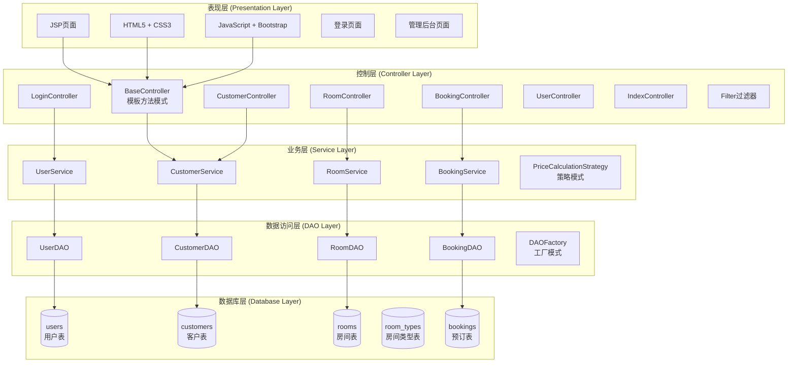
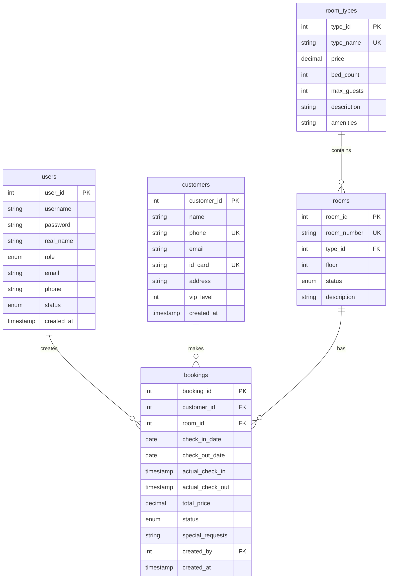

# 酒店管理系统 - 项目概览

## 1. 项目基本信息

### 1.1 项目简介
这是一个基于JavaWeb技术栈的酒店管理系统，实现了酒店日常运营的核心功能。系统采用经典的MVC三层架构，结合多种设计模式，提供了完整的客户管理、房间管理、预订管理等功能。

### 1.2 项目规模
- **代码文件**: 43个Java文件
- **代码行数**: 3000+ 行Java代码
- **JSP页面**: 20个页面
- **数据库表**: 5个核心表
- **WAR包大小**: 约12.6MB（包含所有依赖）

### 1.3 开发信息
- **开发时间**: 2025年9-10月
- **开发工具**: IntelliJ IDEA / Qoder IDE
- **版本控制**: Git
- **项目状态**: ✅ 开发完成，已通过测试

## 2. 技术架构

### 2.1 技术栈

#### 后端技术
- **Java**: JDK 8
- **Web框架**: Servlet 4.0 + JSP 2.3
- **数据库**: MySQL 8.0.33
- **连接池**: 自定义数据库连接池
- **日志框架**: Log4j2 2.20.0
- **JSON处理**: Jackson 2.15.2
- **工具库**: Apache Commons Lang3 3.12.0

#### 前端技术
- **HTML5**: 语义化标签
- **CSS3**: 现代化样式
- **JavaScript**: ES6标准
- **UI框架**: Bootstrap 5.3
- **AJAX**: 异步数据交互

#### 构建工具
- **Maven**: 3.6+
- **Tomcat**: 9.0

### 2.2 系统架构

## 3. 核心功能模块

### 3.1 用户管理模块
**功能清单**:
- ✅ 用户登录/登出
- ✅ 密码MD5加密存储
- ✅ Session会话管理
- ✅ 用户权限控制（管理员/员工）
- ✅ 用户信息CRUD

**技术要点**:
- 基于Session的身份认证
- Filter实现登录拦截
- 密码MD5+盐值加密

### 3.2 客户管理模块
**功能清单**:
- ✅ 客户信息注册
- ✅ 客户信息查询（分页、搜索）
- ✅ 客户信息编辑
- ✅ 客户信息删除
- ✅ VIP等级管理
- ✅ 身份证/手机号/邮箱验证

**技术要点**:
- 严格的数据验证（前后端双重）
- 身份证号格式验证
- 手机号唯一性校验
- VIP等级影响价格计算

### 3.3 房间管理模块
**功能清单**:
- ✅ 房间类型管理
- ✅ 房间信息CRUD
- ✅ 房间状态管理（空闲/已预订/入住中/维护中）
- ✅ 房间筛选（按类型、状态）
- ✅ 房间详情查看

**技术要点**:
- 枚举类型管理房间状态
- 观察者模式处理状态变更
- 房间与房间类型关联

### 3.4 预订管理模块
**功能清单**:
- ✅ 创建预订
- ✅ 预订查询（分页、筛选）
- ✅ 预订修改
- ✅ 预订取消
- ✅ 入住办理
- ✅ 退房结算
- ✅ 价格计算（策略模式）
- ✅ 今日入住/退房统计

**技术要点**:
- 策略模式实现价格计算
- 预订状态流转管理
- 房间冲突检测
- 自动计算总价

### 3.5 统计仪表板
**功能清单**:
- ✅ 今日入住/退房统计
- ✅ 房间入住率统计
- ✅ 客户总数统计
- ✅ 总收入统计
- ✅ 待入住订单统计

**技术要点**:
- SQL聚合查询
- 实时数据统计
- 数据可视化展示

## 4. 设计模式应用

### 4.1 单例模式 (Singleton)
**应用场景**:
- `ConnectionPool` - 数据库连接池
- `ConfigManager` - 配置管理器

**优势**: 确保全局唯一实例，节省资源

### 4.2 工厂模式 (Factory)
**应用场景**:
- `DAOFactory` - 创建DAO对象
- `ServiceFactory` - 创建Service对象

**优势**: 解耦对象创建和使用，便于扩展

### 4.3 策略模式 (Strategy)
**应用场景**:
- `PriceCalculationStrategy` - 价格计算策略
  - `RegularPriceStrategy` - 普通客户价格
  - `VIPPriceStrategy` - VIP客户价格

**优势**: 灵活切换算法，易于扩展新策略

### 4.4 模板方法模式 (Template Method)
**应用场景**:
- `BaseController` - 请求处理模板

**优势**: 统一请求处理流程，减少重复代码

### 4.5 观察者模式 (Observer)
**应用场景**:
- 房间状态变更通知

**优势**: 解耦事件发布和订阅，支持一对多通知

### 4.6 DAO模式 (Data Access Object)
**应用场景**:
- 所有DAO接口和实现类

**优势**: 分离业务逻辑和数据访问逻辑

## 5. 项目特色

### 5.1 代码质量
- ✅ **分层清晰**: 严格的MVC三层架构
- ✅ **注释完整**: 所有类和方法都有JavaDoc注释
- ✅ **命名规范**: 遵循Java命名规范
- ✅ **异常处理**: 完善的异常捕获和日志记录
- ✅ **代码复用**: 使用BaseController减少重复代码

### 5.2 安全性
- ✅ **SQL注入防护**: 全部使用PreparedStatement
- ✅ **XSS防护**: 输入输出转义
- ✅ **密码加密**: MD5加密存储
- ✅ **会话管理**: Session超时控制
- ✅ **权限控制**: 基于角色的访问控制

### 5.3 用户体验
- ✅ **响应式设计**: Bootstrap 5适配移动端
- ✅ **友好提示**: 成功/错误消息提示
- ✅ **数据验证**: 实时表单验证
- ✅ **分页查询**: 大数据量分页展示
- ✅ **搜索筛选**: 多条件查询

### 5.4 性能优化
- ✅ **连接池**: 自定义数据库连接池
- ✅ **PreparedStatement**: 预编译SQL，提高性能
- ✅ **分页加载**: 避免一次加载大量数据
- ✅ **延迟加载**: 按需加载关联数据
- ✅ **静态资源缓存**: CSS/JS文件缓存

## 6. 数据库设计

### 6.1 核心数据表

| 表名 | 说明 | 主要字段 |
|------|------|----------|
| users | 系统用户表 | user_id, username, password, role |
| customers | 客户信息表 | customer_id, name, phone, id_card, vip_level |
| room_types | 房间类型表 | type_id, type_name, price, bed_count |
| rooms | 房间信息表 | room_id, room_number, type_id, status |
| bookings | 预订记录表 | booking_id, customer_id, room_id, check_in_date |

### 6.2 数据库E-R关系图

## 7. 项目亮点总结

### 7.1 技术亮点
1. **设计模式丰富**: 6种设计模式的实际应用
2. **架构合理**: 清晰的MVC三层架构
3. **代码规范**: 遵循Java编码规范，注释完整
4. **测试完善**: 核心功能有单元测试覆盖

### 7.2 功能亮点
1. **业务完整**: 覆盖酒店管理核心流程
2. **权限控制**: 基于角色的访问控制
3. **数据验证**: 严格的前后端双重验证
4. **统计分析**: 实时数据统计和可视化

### 7.3 用户体验亮点
1. **界面美观**: Bootstrap 5现代化UI
2. **操作便捷**: 友好的交互提示
3. **响应式**: 支持移动端访问
4. **性能优良**: 连接池+分页优化

## 8. 适用场景

本系统适用于以下场景：
- ✅ 小型酒店/宾馆日常管理
- ✅ JavaWeb课程设计/毕业设计
- ✅ 学习MVC架构和设计模式
- ✅ 了解酒店业务流程

## 9. 后续扩展方向

如需进一步扩展，可以考虑：
- [ ] 移动端App开发
- [ ] 微信小程序对接
- [ ] 在线支付功能
- [ ] 会员积分系统
- [ ] 数据报表导出
- [ ] 短信/邮件通知
- [ ] 客房服务管理
- [ ] 财务结算模块
