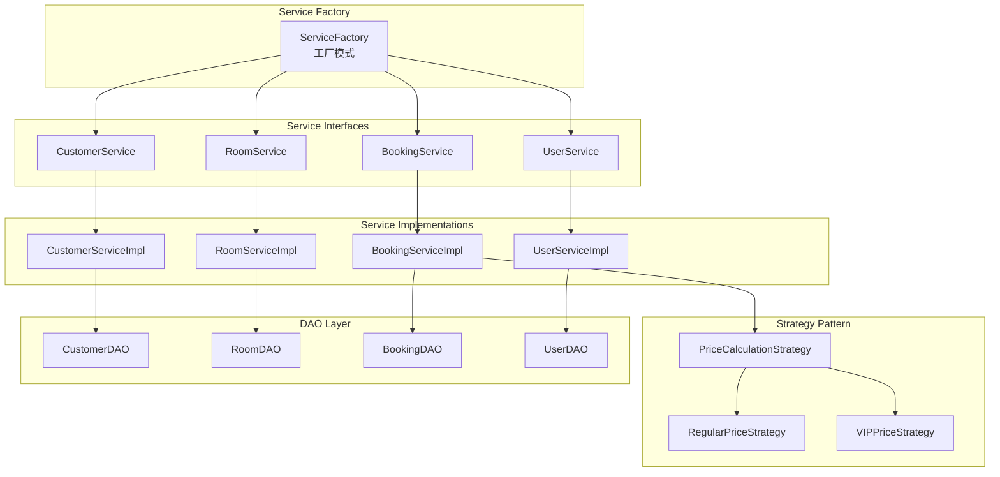
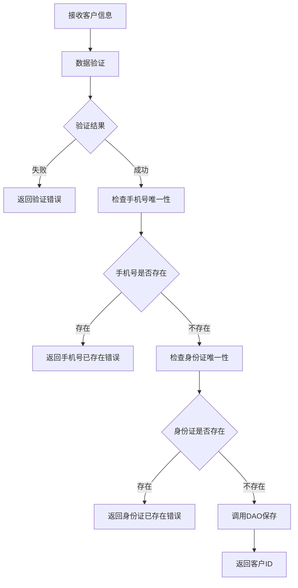
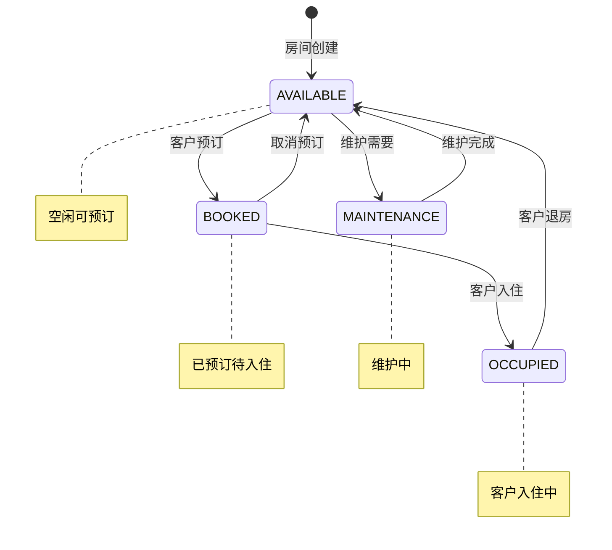
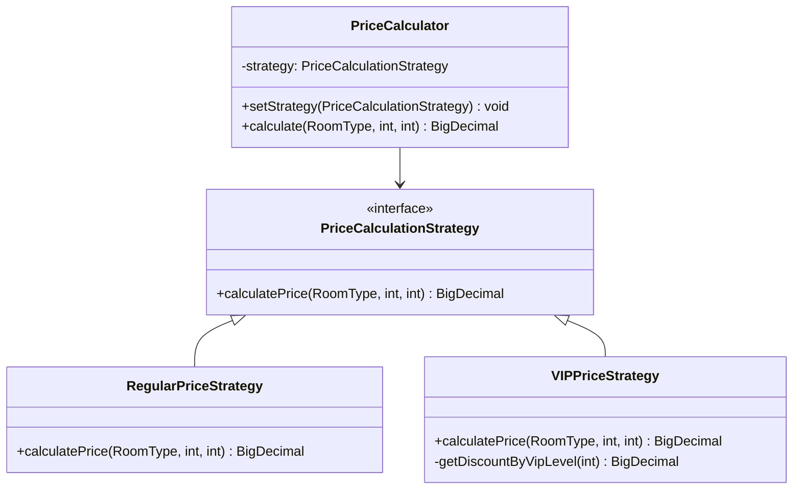
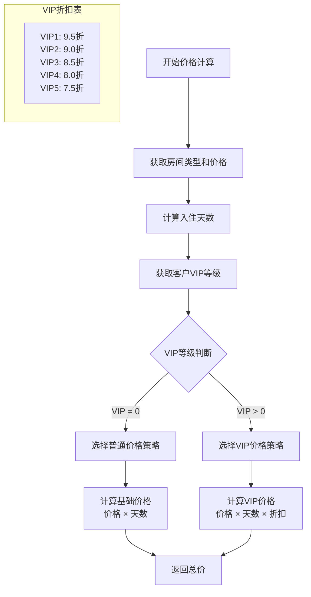
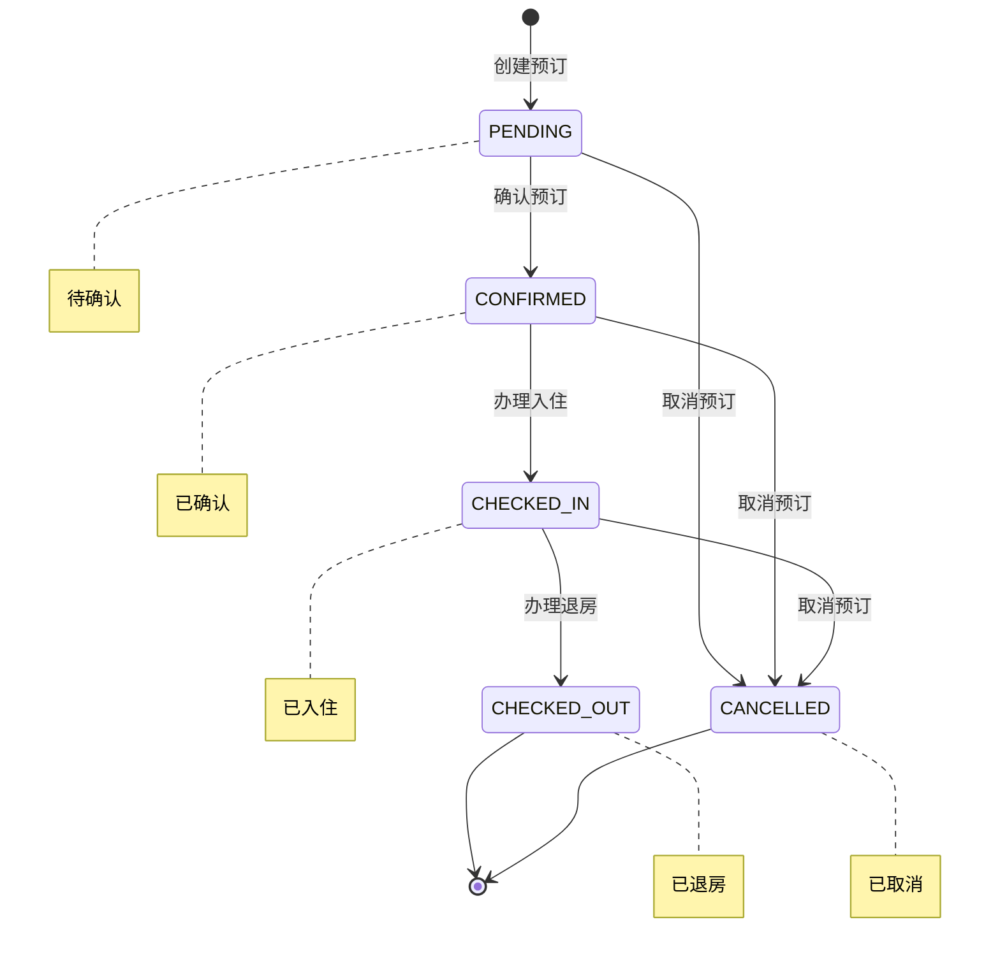
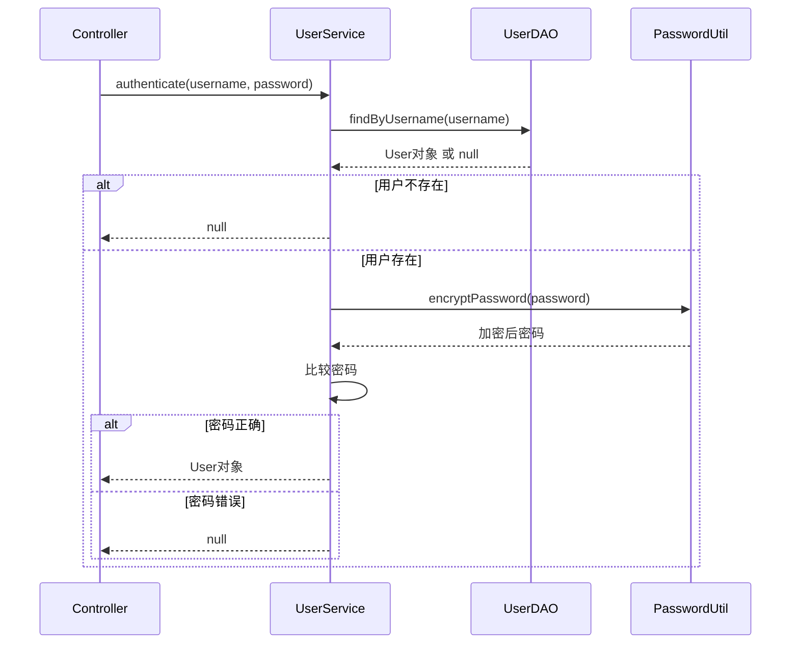
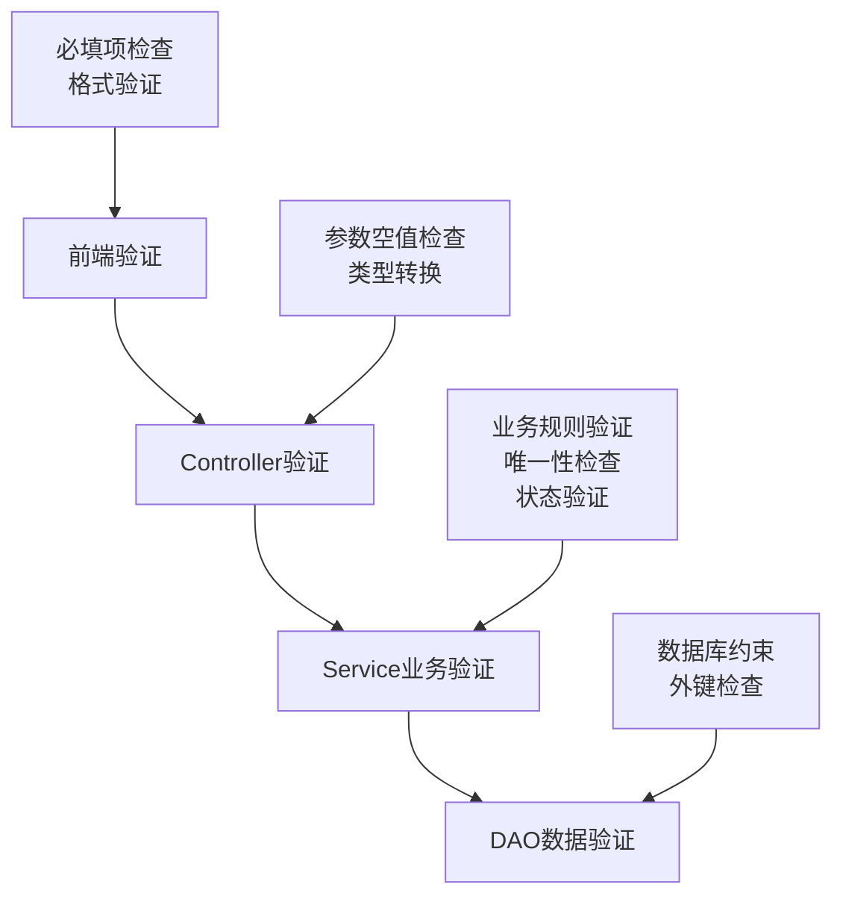

# Service层详解

## 1. Service层概述

### 1.1 层次定位
Service层位于Controller和DAO层之间，是业务逻辑的核心处理层，负责实现具体的业务规则、数据验证和事务控制。

### 1.2 设计原则
- **单一职责**: 每个Service只处理相关的业务逻辑
- **接口导向**: 面向接口编程，便于测试和扩展
- **事务管理**: 确保数据操作的一致性
- **业务封装**: 将复杂的业务逻辑封装在Service层

### 1.3 技术实现
- 接口与实现分离
- 工厂模式创建Service对象
- 策略模式处理复杂业务规则

## 2. Service架构图



## 3. CustomerService - 客户业务服务

### 3.1 接口定义
**文件位置**: `src/main/java/com/hotel/service/CustomerService.java`

```java
public interface CustomerService {
    // 基础CRUD操作
    Integer createCustomer(Customer customer);
    Customer findCustomerById(Integer customerId);
    List<Customer> findAllCustomers();
    boolean updateCustomer(Customer customer);
    boolean deleteCustomer(Integer customerId);
    
    // 业务查询
    List<Customer> searchCustomersByName(String name);
    List<Customer> findCustomersByVipLevel(Integer vipLevel);
    
    // 业务验证
    boolean isPhoneExists(String phone);
    boolean isIdCardExists(String idCard);
    String validateCustomer(Customer customer);
}
```

### 3.2 核心业务逻辑

#### 3.2.1 客户创建流程


#### 3.2.2 数据验证规则
```java
public String validateCustomer(Customer customer) {
    // 1. 基础字段验证
    if (Utils.isEmpty(customer.getName())) {
        return "客户姓名不能为空";
    }
    
    // 2. 手机号验证
    if (!Utils.validatePhone(customer.getPhone())) {
        return "手机号格式不正确";
    }
    
    // 3. 身份证验证
    if (!Utils.validateIdCard(customer.getIdCard())) {
        return "身份证号格式不正确";
    }
    
    // 4. 邮箱验证（可选）
    if (!Utils.isEmpty(customer.getEmail()) && 
        !Utils.validateEmail(customer.getEmail())) {
        return "邮箱格式不正确";
    }
    
    // 5. VIP等级验证
    if (customer.getVipLevel() < 0 || customer.getVipLevel() > 5) {
        return "VIP等级必须在0-5之间";
    }
    
    return null; // 验证通过
}
```

### 3.3 业务特性
- **唯一性保证**: 手机号和身份证号的唯一性验证
- **数据完整性**: 必填字段验证
- **格式验证**: 手机号、身份证、邮箱格式验证
- **VIP管理**: VIP等级的设置和维护

## 4. RoomService - 房间业务服务

### 4.1 接口定义
**文件位置**: `src/main/java/com/hotel/service/RoomService.java`

```java
public interface RoomService {
    // 房间CRUD
    Integer createRoom(Room room);
    Room getRoomById(Integer roomId);
    List<Room> getAllRooms();
    boolean updateRoom(Room room);
    boolean deleteRoom(Integer roomId);
    
    // 状态管理
    boolean updateRoomStatus(Integer roomId, Room.RoomStatus status);
    List<Room> getAvailableRooms();
    List<Room> getRoomsByStatus(Room.RoomStatus status);
    
    // 业务查询
    List<Room> getRoomsByType(Integer typeId);
    List<Room> getRoomsByFloor(Integer floor);
}
```

### 4.2 房间状态管理

#### 4.2.1 状态流转图


#### 4.2.2 状态验证规则
```java
public boolean canChangeStatus(Room.RoomStatus from, Room.RoomStatus to) {
    switch (from) {
        case AVAILABLE:
            return to == Room.RoomStatus.BOOKED || 
                   to == Room.RoomStatus.MAINTENANCE;
        case BOOKED:
            return to == Room.RoomStatus.OCCUPIED || 
                   to == Room.RoomStatus.AVAILABLE;
        case OCCUPIED:
            return to == Room.RoomStatus.AVAILABLE;
        case MAINTENANCE:
            return to == Room.RoomStatus.AVAILABLE;
        default:
            return false;
    }
}
```

### 4.3 业务特性
- **状态管理**: 严格的房间状态流转控制
- **类型关联**: 房间与房间类型的关联管理
- **可用性查询**: 快速查询可预订房间
- **楼层管理**: 按楼层组织房间

## 5. BookingService - 预订业务服务 ⭐

### 5.1 接口定义
**文件位置**: `src/main/java/com/hotel/service/BookingService.java`

```java
public interface BookingService {
    // 预订CRUD
    Integer createBooking(Booking booking);
    Booking getBookingById(Integer bookingId);
    List<Booking> getAllBookings();
    boolean updateBooking(Booking booking);
    boolean deleteBooking(Integer bookingId);
    
    // 状态操作
    boolean checkIn(Integer bookingId);
    boolean checkOut(Integer bookingId);
    boolean cancelBooking(Integer bookingId);
    
    // 业务查询
    List<Booking> getBookingsByCustomer(Integer customerId);
    List<Booking> getBookingsByStatus(Booking.BookingStatus status);
    List<Booking> getTodayCheckIns();
    List<Booking> getTodayCheckOuts();
    
    // 业务计算
    BigDecimal calculateTotalPrice(Booking booking);
    boolean isRoomAvailable(Integer roomId, Date checkIn, Date checkOut);
}
```

### 5.2 价格计算策略 (核心业务)

#### 5.2.1 策略模式架构


#### 5.2.2 价格计算流程


#### 5.2.3 代码实现
```java
public BigDecimal calculateTotalPrice(Booking booking) {
    // 1. 获取房间类型
    Room room = roomService.getRoomById(booking.getRoomId());
    RoomType roomType = roomTypeDAO.findById(room.getTypeId());
    
    // 2. 计算天数
    long diffTime = booking.getCheckOutDate().getTime() - 
                   booking.getCheckInDate().getTime();
    int days = (int) (diffTime / (1000 * 60 * 60 * 24));
    
    // 3. 获取VIP等级
    Customer customer = customerService.findCustomerById(booking.getCustomerId());
    int vipLevel = customer.getVipLevel();
    
    // 4. 选择策略
    PriceCalculationStrategy strategy;
    if (vipLevel > 0) {
        strategy = new VIPPriceStrategy();
    } else {
        strategy = new RegularPriceStrategy();
    }
    
    // 5. 计算价格
    return strategy.calculatePrice(roomType, days, vipLevel);
}
```

### 5.3 预订状态管理

#### 5.3.1 状态流转图


### 5.4 冲突检测算法
```java
public boolean isRoomAvailable(Integer roomId, Date checkIn, Date checkOut) {
    List<Booking> conflictBookings = bookingDAO.findConflictingBookings(
        roomId, checkIn, checkOut
    );
    
    return conflictBookings.isEmpty();
}

// DAO层实现
public List<Booking> findConflictingBookings(Integer roomId, Date checkIn, Date checkOut) {
    String sql = """
        SELECT * FROM bookings 
        WHERE room_id = ? 
        AND status IN ('CONFIRMED', 'CHECKED_IN')
        AND (
            (check_in_date <= ? AND check_out_date > ?) OR
            (check_in_date < ? AND check_out_date >= ?) OR
            (check_in_date >= ? AND check_out_date <= ?)
        )
    """;
    // 参数: roomId, checkIn, checkIn, checkOut, checkOut, checkIn, checkOut
}
```

## 6. UserService - 用户业务服务

### 6.1 接口定义
```java
public interface UserService {
    // 认证相关
    User authenticate(String username, String password);
    
    // 用户管理
    Integer createUser(User user);
    User findUserById(Integer userId);
    List<User> findAllUsers();
    boolean updateUser(User user);
    boolean deleteUser(Integer userId);
    
    // 业务验证
    boolean isUsernameExists(String username);
}
```

### 6.2 认证流程


### 6.3 安全特性
- **密码加密**: MD5加密存储
- **用户名唯一**: 确保用户名不重复
- **角色管理**: ADMIN/STAFF角色控制

## 7. ServiceFactory - 服务工厂

### 7.1 工厂模式实现
```java
public class ServiceFactory {
    public static CustomerService createCustomerService() {
        return new CustomerServiceImpl();
    }
    
    public static RoomService createRoomService() {
        return new RoomServiceImpl();
    }
    
    public static BookingService createBookingService() {
        return new BookingServiceImpl();
    }
    
    public static UserService createUserService() {
        return new UserServiceImpl();
    }
}
```

### 7.2 工厂模式优势
- **解耦**: 客户端无需知道具体实现类
- **统一**: 统一的对象创建入口
- **扩展**: 易于替换实现或添加新服务

## 8. 事务管理

### 8.1 事务控制策略
虽然项目使用原生JDBC，但在Service层实现了简单的事务控制：

```java
public Integer createBookingWithTransaction(Booking booking) {
    Connection conn = null;
    try {
        conn = ConnectionPool.getInstance().getConnection();
        conn.setAutoCommit(false); // 开启事务
        
        // 1. 创建预订
        Integer bookingId = bookingDAO.insert(booking);
        
        // 2. 更新房间状态
        roomService.updateRoomStatus(booking.getRoomId(), Room.RoomStatus.BOOKED);
        
        conn.commit(); // 提交事务
        return bookingId;
        
    } catch (Exception e) {
        if (conn != null) {
            conn.rollback(); // 回滚事务
        }
        throw new RuntimeException("预订创建失败", e);
    } finally {
        if (conn != null) {
            conn.setAutoCommit(true);
            ConnectionPool.getInstance().releaseConnection(conn);
        }
    }
}
```

## 9. 业务验证策略

### 9.1 验证层次


### 9.2 验证原则
- **前端验证**: 提升用户体验
- **后端验证**: 保证数据安全
- **多层验证**: 确保数据完整性
- **友好提示**: 清晰的错误信息

## 10. 性能优化

### 10.1 查询优化
- **分页查询**: Service层实现内存分页
- **条件查询**: 避免全表扫描
- **缓存策略**: 缓存常用数据

### 10.2 业务优化
- **延迟加载**: 按需加载关联数据
- **批量操作**: 减少数据库访问次数
- **异步处理**: 非关键业务异步执行

## 11. Service层最佳实践

### 11.1 设计原则
✅ **应该做**:
- 实现具体的业务逻辑
- 进行数据验证
- 处理业务异常
- 控制事务边界
- 调用DAO进行数据操作

❌ **不应该做**:
- 包含表现层逻辑
- 直接操作HTTP请求/响应
- 包含SQL语句
- 处理页面跳转

### 11.2 异常处理
```java
public class CustomerServiceImpl implements CustomerService {
    @Override
    public Integer createCustomer(Customer customer) {
        try {
            // 业务验证
            String validateResult = validateCustomer(customer);
            if (validateResult != null) {
                throw new BusinessException(validateResult);
            }
            
            // 唯一性检查
            if (isPhoneExists(customer.getPhone())) {
                throw new BusinessException("手机号已存在");
            }
            
            // 调用DAO
            return customerDAO.insert(customer);
            
        } catch (BusinessException e) {
            logger.warn("业务验证失败: {}", e.getMessage());
            throw e;
        } catch (Exception e) {
            logger.error("创建客户失败", e);
            throw new ServiceException("创建客户失败", e);
        }
    }
}
```

### 11.3 日志记录
```java
// 业务操作日志
logger.info("创建客户: 姓名={}, 手机号={}", customer.getName(), customer.getPhone());

// 业务验证日志
logger.warn("客户验证失败: {}", validateResult);

// 异常日志
logger.error("客户创建失败: customerId={}", customerId, e);
```

## 12. 总结

### 12.1 Service层价值
1. **业务封装**: 将复杂的业务逻辑封装在Service层
2. **数据验证**: 确保数据的完整性和有效性
3. **事务控制**: 保证操作的原子性
4. **代码复用**: 提供可复用的业务服务

### 12.2 技术亮点
- **策略模式**: 价格计算的灵活实现
- **工厂模式**: 统一的服务对象创建
- **事务管理**: 简单有效的事务控制
- **业务验证**: 多层次的数据验证

### 12.3 扩展性
- **接口导向**: 易于替换实现
- **策略模式**: 易于扩展新的业务规则
- **工厂模式**: 易于添加新的服务类型