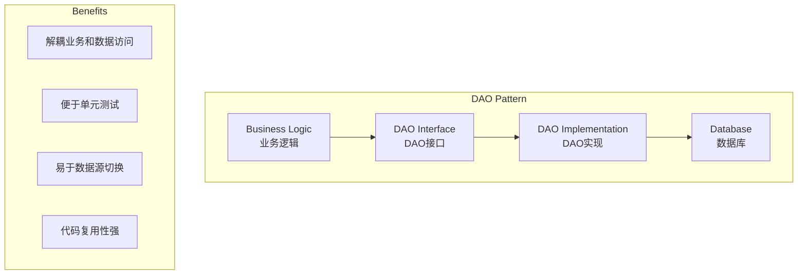
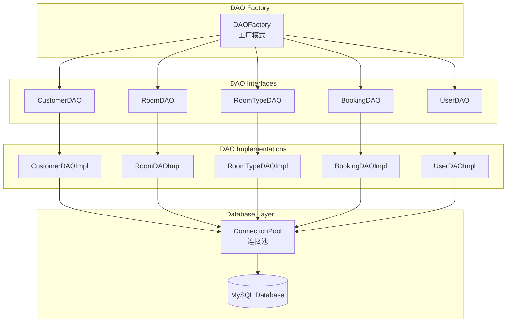
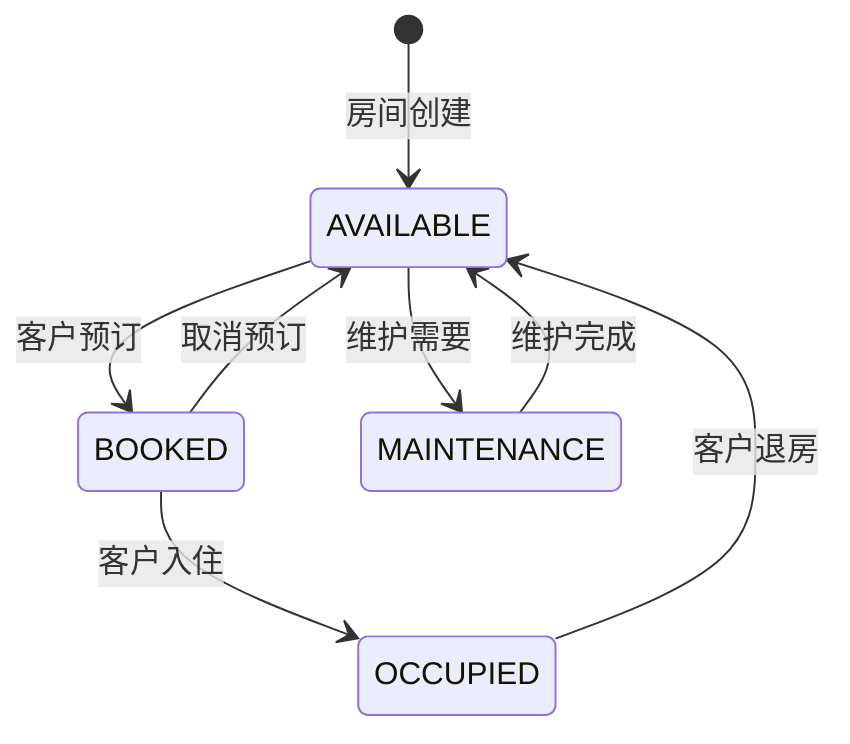

# DAO层详解

## 1. DAO层概述

### 1.1 层次定位
DAO (Data Access Object) 层是数据访问层，位于业务逻辑层和数据库之间，负责封装所有与数据库交互的操作，实现数据的持久化。

### 1.2 设计模式：DAO模式
DAO模式将业务逻辑和数据访问逻辑分离，提供统一的数据访问接口。



### 1.3 技术实现
- **JDBC**: 原生JDBC操作数据库
- **PreparedStatement**: 预编译SQL，防止SQL注入
- **连接池**: 自定义连接池管理数据库连接
- **工厂模式**: DAOFactory统一创建DAO对象

## 2. DAO架构图



## 3. CustomerDAO - 客户数据访问

### 3.1 接口定义
**文件位置**: `src/main/java/com/hotel/dao/CustomerDAO.java`

### 3.2 核心实现
- 基础CRUD操作
- 业务查询功能
- 唯一性检查
- 统计查询

### 3.3 关键方法
- insert(): 插入新客户，返回生成的ID
- findById(): 根据ID查询客户
- findByName(): 按姓名模糊查询
- existsByPhone(): 检查手机号唯一性

## 4. RoomDAO - 房间数据访问

### 4.1 功能特点
- 房间状态管理
- 按类型查询
- 可用房间查询
- 楼层管理

### 4.2 状态管理流程


## 5. BookingDAO - 预订数据访问

### 5.1 复杂查询
- 冲突检测查询
- 今日入住/退房查询
- 收入统计查询
- 按状态查询

### 5.2 冲突检测算法
复杂的日期范围重叠查询，确保房间预订无冲突。

## 6. UserDAO - 用户数据访问

### 6.1 认证支持
- 用户名查询
- 密码验证支持
- 角色管理
- 状态控制

## 7. DAOFactory - 工厂模式

### 7.1 统一创建入口
```java
public class DAOFactory {
    public static CustomerDAO createCustomerDAO() {
        return new CustomerDAOImpl();
    }
    // 其他工厂方法...
}
```

### 7.2 工厂模式优势
- 解耦客户端和实现
- 便于切换实现
- 易于添加新DAO

## 8. 技术特性

### 8.1 SQL注入防护
- 全部使用PreparedStatement
- 参数化查询
- 安全的动态SQL构建

### 8.2 连接池集成
- 统一的连接获取模式
- 自动资源释放
- 连接复用优化

### 8.3 异常处理
- 统一的异常处理机制
- 详细的错误日志
- 业务友好的错误信息

### 8.4 性能优化
- 批量查询支持
- 分页查询实现
- 索引优化配合

## 9. 事务支持

### 9.1 事务控制
支持跨多个DAO操作的事务管理，确保数据一致性。

## 10. 最佳实践

### 10.1 设计原则
✅ **应该做**:
- 封装所有SQL操作
- 使用PreparedStatement
- 正确处理资源释放
- 记录详细的操作日志

❌ **不应该做**:
- 包含业务逻辑
- 直接抛出SQLException
- 忽略连接资源释放
- 使用字符串拼接SQL

### 10.2 资源管理
采用try-with-resources确保资源正确释放。

### 10.3 日志记录
详细记录操作日志、性能日志和错误日志。

## 11. 总结

### 11.1 DAO层价值
1. **数据访问封装**: 隐藏数据库操作细节
2. **SQL注入防护**: 确保数据安全
3. **资源管理**: 正确管理数据库连接
4. **异常处理**: 统一的异常处理机制

### 11.2 技术亮点
- **原生JDBC**: 直接控制SQL执行
- **连接池**: 高效的连接管理
- **PreparedStatement**: 性能和安全兼顾
- **工厂模式**: 统一的对象创建

### 11.3 架构优势
- **分层清晰**: 数据访问逻辑独立
- **易于测试**: 接口抽象便于Mock
- **便于维护**: SQL集中管理
- **可扩展性**: 易于添加新的数据访问功能