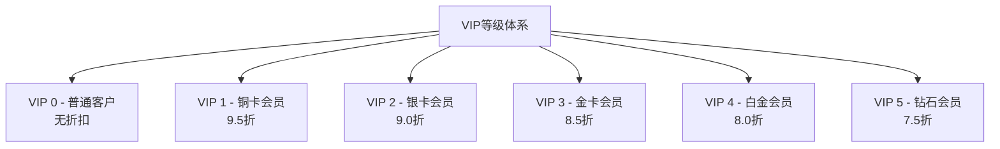
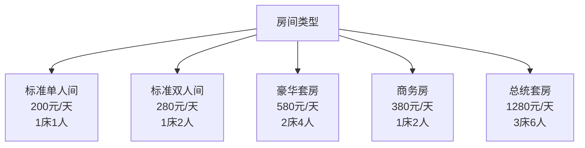
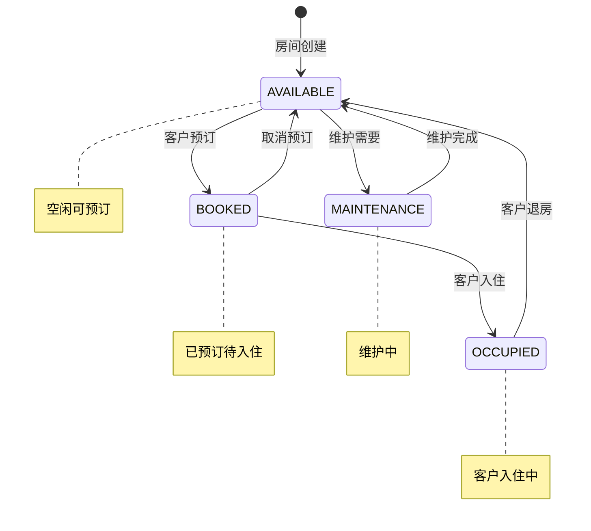
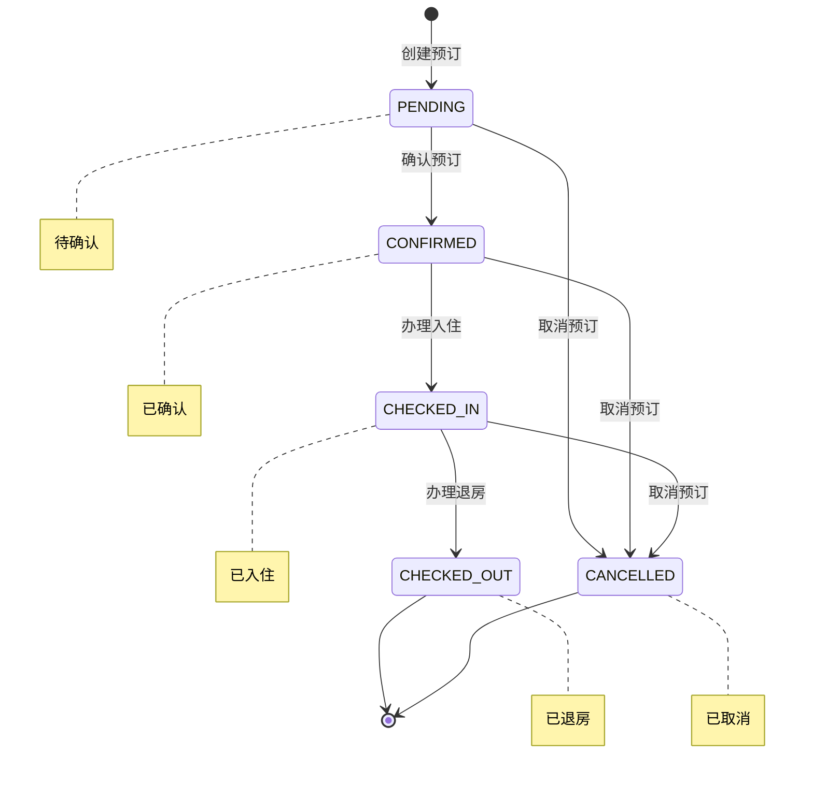
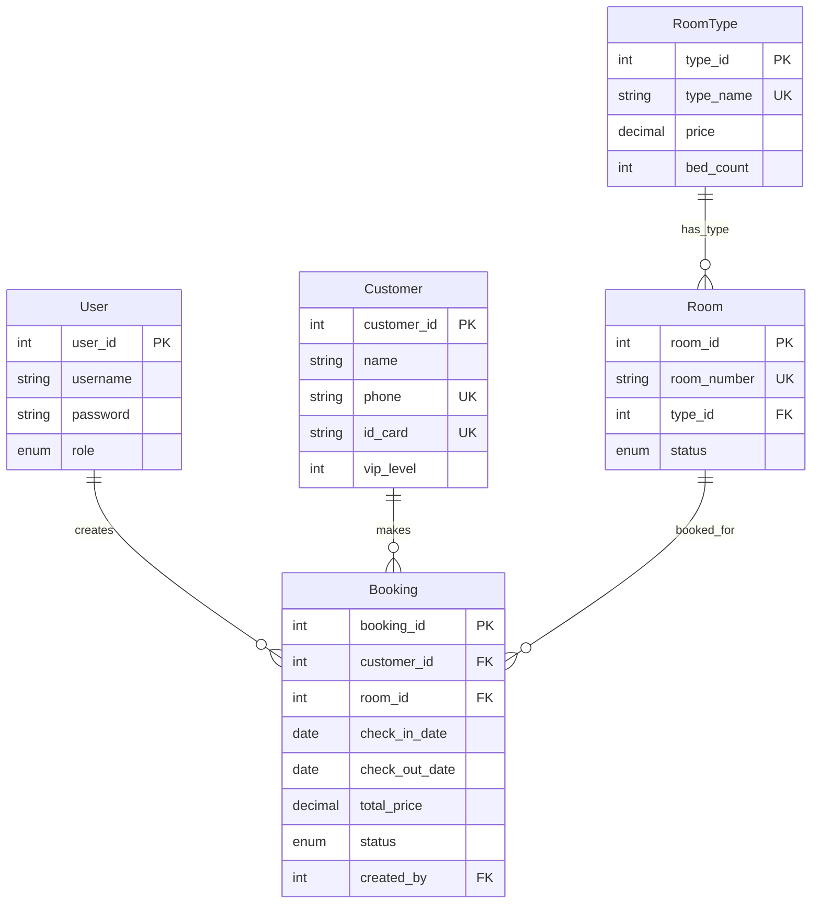

# Model层详解

## 1. Model层概述

### 1.1 层次定位
Model层是数据模型层，包含了系统中所有的实体类（Entity），负责封装业务数据和定义数据结构。这些实体类对应数据库中的表结构。

### 1.2 设计原则
- **数据封装**: 将数据和相关操作封装在一起
- **业务建模**: 反映真实的业务实体
- **数据完整性**: 通过验证确保数据正确性
- **关系映射**: 体现实体间的业务关系

### 1.3 技术实现
- **POJO设计**: 简单的Java对象
- **JavaBean规范**: 标准的getter/setter方法
- **枚举类型**: 表示固定的状态值
- **时间戳**: 记录数据的创建和更新时间

## 2. Model架构图

```mermaid
classDiagram
    class User {
        +Integer userId
        +String username
        +String password
        +String realName
        +UserRole role
        +String email
        +String phone
        +UserStatus status
        +Timestamp createdAt
        +Timestamp updatedAt
    }
    
    class Customer {
        +Integer customerId
        +String name
        +String phone
        +String email
        +String idCard
        +String address
        +Integer vipLevel
        +Timestamp createdAt
        +Timestamp updatedAt
    }
    
    class RoomType {
        +Integer typeId
        +String typeName
        +BigDecimal price
        +Integer bedCount
        +Integer maxGuests
        +String description
        +String amenities
        +Timestamp createdAt
        +Timestamp updatedAt
    }
    
    class Room {
        +Integer roomId
        +String roomNumber
        +Integer typeId
        +Integer floor
        +RoomStatus status
        +String description
        +Timestamp createdAt
        +Timestamp updatedAt
    }
    
    class Booking {
        +Integer bookingId
        +Integer customerId
        +Integer roomId
        +Date checkInDate
        +Date checkOutDate
        +Timestamp actualCheckIn
        +Timestamp actualCheckOut
        +BigDecimal totalPrice
        +BookingStatus status
        +String specialRequests
        +Integer createdBy
        +Timestamp createdAt
        +Timestamp updatedAt
    }
    
    User ||--o{ Booking : creates
    Customer ||--o{ Booking : makes
    Room ||--o{ Booking : booked_for
    RoomType ||--o{ Room : has_type
```

## 3. User - 用户实体

### 3.1 实体定义
**文件位置**: `src/main/java/com/hotel/model/User.java`

**业务说明**: 系统用户实体，包括管理员和普通员工。

### 3.2 字段详解

| 字段名 | 类型 | 说明 | 约束 |
|--------|------|------|------|
| userId | Integer | 用户ID | 主键，自增 |
| username | String | 用户名 | 非空，唯一，最长50字符 |
| password | String | 密码 | 非空，MD5加密存储 |
| realName | String | 真实姓名 | 可空，最长50字符 |
| role | UserRole | 角色 | 枚举值：ADMIN/STAFF |
| email | String | 邮箱 | 可空，邮箱格式 |
| phone | String | 联系电话 | 可空，手机号格式 |
| status | UserStatus | 状态 | 枚举值：ACTIVE/INACTIVE |
| createdAt | Timestamp | 创建时间 | 自动生成 |
| updatedAt | Timestamp | 更新时间 | 自动更新 |

### 3.3 枚举定义

#### 3.3.1 用户角色
```java
public enum UserRole {
    ADMIN("管理员"),
    STAFF("员工");
    
    private final String description;
    
    UserRole(String description) {
        this.description = description;
    }
    
    public String getDescription() {
        return description;
    }
}
```

#### 3.3.2 用户状态
```java
public enum UserStatus {
    ACTIVE("活跃"),
    INACTIVE("停用");
    
    private final String description;
    
    UserStatus(String description) {
        this.description = description;
    }
    
    public String getDescription() {
        return description;
    }
}
```

### 3.4 核心方法
```java
public class User {
    // 检查用户是否为管理员
    public boolean isAdmin() {
        return UserRole.ADMIN.equals(this.role);
    }
    
    // 检查用户是否活跃
    public boolean isActive() {
        return UserStatus.ACTIVE.equals(this.status);
    }
    
    // 重写toString方法（密码脱敏）
    @Override
    public String toString() {
        return "User{" +
                "userId=" + userId +
                ", username='" + username + '\'' +
                ", realName='" + realName + '\'' +
                ", role=" + role +
                ", status=" + status +
                '}';
    }
}
```

## 4. Customer - 客户实体

### 4.1 实体定义
**文件位置**: `src/main/java/com/hotel/model/Customer.java`

**业务说明**: 酒店客户信息，支持VIP等级管理。

### 4.2 字段详解

| 字段名 | 类型 | 说明 | 约束 |
|--------|------|------|------|
| customerId | Integer | 客户ID | 主键，自增 |
| name | String | 客户姓名 | 非空，最长100字符 |
| phone | String | 手机号 | 非空，唯一，11位数字 |
| email | String | 邮箱 | 可空，邮箱格式 |
| idCard | String | 身份证号 | 非空，唯一，18位 |
| address | String | 联系地址 | 可空，最长200字符 |
| vipLevel | Integer | VIP等级 | 0-5，默认0 |
| createdAt | Timestamp | 创建时间 | 自动生成 |
| updatedAt | Timestamp | 更新时间 | 自动更新 |

### 4.3 VIP等级体系


### 4.4 核心方法
```java
public class Customer {
    // 获取VIP折扣
    public BigDecimal getVipDiscount() {
        switch (this.vipLevel) {
            case 1: return new BigDecimal("0.95"); // 9.5折
            case 2: return new BigDecimal("0.90"); // 9.0折
            case 3: return new BigDecimal("0.85"); // 8.5折
            case 4: return new BigDecimal("0.80"); // 8.0折
            case 5: return new BigDecimal("0.75"); // 7.5折
            default: return BigDecimal.ONE;        // 无折扣
        }
    }
    
    // 获取VIP等级描述
    public String getVipLevelDescription() {
        switch (this.vipLevel) {
            case 0: return "普通客户";
            case 1: return "铜卡会员";
            case 2: return "银卡会员";
            case 3: return "金卡会员";
            case 4: return "白金会员";
            case 5: return "钻石会员";
            default: return "未知等级";
        }
    }
    
    // 检查是否为VIP客户
    public boolean isVip() {
        return this.vipLevel != null && this.vipLevel > 0;
    }
}
```

## 5. RoomType - 房间类型实体

### 5.1 实体定义
**文件位置**: `src/main/java/com/hotel/model/RoomType.java`

**业务说明**: 房间类型信息，定义房间的基础属性和价格。

### 5.2 字段详解

| 字段名 | 类型 | 说明 | 约束 |
|--------|------|------|------|
| typeId | Integer | 类型ID | 主键，自增 |
| typeName | String | 类型名称 | 非空，唯一，最长50字符 |
| price | BigDecimal | 基础价格 | 非空，单位：元/天 |
| bedCount | Integer | 床位数 | 非空，默认1 |
| maxGuests | Integer | 最大容纳人数 | 非空，默认1 |
| description | String | 类型描述 | 可空，详细说明 |
| amenities | String | 设施列表 | 可空，逗号分隔 |
| createdAt | Timestamp | 创建时间 | 自动生成 |
| updatedAt | Timestamp | 更新时间 | 自动更新 |

### 5.3 常见房间类型


### 5.4 核心方法
```java
public class RoomType {
    // 获取设施列表
    public List<String> getAmenitiesList() {
        if (amenities == null || amenities.trim().isEmpty()) {
            return new ArrayList<>();
        }
        return Arrays.asList(amenities.split(","))
                     .stream()
                     .map(String::trim)
                     .collect(Collectors.toList());
    }
    
    // 设置设施列表
    public void setAmenitiesList(List<String> amenitiesList) {
        if (amenitiesList == null || amenitiesList.isEmpty()) {
            this.amenities = null;
        } else {
            this.amenities = String.join(",", amenitiesList);
        }
    }
    
    // 计算指定天数的基础价格
    public BigDecimal calculateBasePrice(int days) {
        return this.price.multiply(new BigDecimal(days));
    }
}
```

## 6. Room - 房间实体

### 6.1 实体定义
**文件位置**: `src/main/java/com/hotel/model/Room.java`

**业务说明**: 具体房间信息，包含状态管理。

### 6.2 字段详解

| 字段名 | 类型 | 说明 | 约束 |
|--------|------|------|------|
| roomId | Integer | 房间ID | 主键，自增 |
| roomNumber | String | 房间号 | 非空，唯一，最长10字符 |
| typeId | Integer | 房间类型ID | 外键，非空 |
| floor | Integer | 楼层 | 非空，默认1 |
| status | RoomStatus | 房间状态 | 枚举值，默认AVAILABLE |
| description | String | 房间描述 | 可空，特殊说明 |
| createdAt | Timestamp | 创建时间 | 自动生成 |
| updatedAt | Timestamp | 更新时间 | 自动更新 |

### 6.3 房间状态枚举
```java
public enum RoomStatus {
    AVAILABLE("空闲"),
    BOOKED("已预订"),
    OCCUPIED("入住中"),
    MAINTENANCE("维护中");
    
    private final String description;
    
    RoomStatus(String description) {
        this.description = description;
    }
    
    public String getDescription() {
        return description;
    }
}
```

### 6.4 状态流转图


### 6.5 核心方法
```java
public class Room {
    // 检查房间是否可预订
    public boolean isAvailable() {
        return RoomStatus.AVAILABLE.equals(this.status);
    }
    
    // 检查房间是否入住中
    public boolean isOccupied() {
        return RoomStatus.OCCUPIED.equals(this.status);
    }
    
    // 检查状态变更是否合法
    public boolean canChangeStatusTo(RoomStatus newStatus) {
        switch (this.status) {
            case AVAILABLE:
                return newStatus == RoomStatus.BOOKED || 
                       newStatus == RoomStatus.MAINTENANCE;
            case BOOKED:
                return newStatus == RoomStatus.OCCUPIED || 
                       newStatus == RoomStatus.AVAILABLE;
            case OCCUPIED:
                return newStatus == RoomStatus.AVAILABLE;
            case MAINTENANCE:
                return newStatus == RoomStatus.AVAILABLE;
            default:
                return false;
        }
    }
    
    // 获取楼层描述
    public String getFloorDescription() {
        if (floor <= 0) {
            return "地下" + Math.abs(floor) + "层";
        } else {
            return floor + "层";
        }
    }
}
```

## 7. Booking - 预订实体

### 7.1 实体定义
**文件位置**: `src/main/java/com/hotel/model/Booking.java`

**业务说明**: 客户预订信息，是系统的核心业务实体。

### 7.2 字段详解

| 字段名 | 类型 | 说明 | 约束 |
|--------|------|------|------|
| bookingId | Integer | 预订ID | 主键，自增 |
| customerId | Integer | 客户ID | 外键，非空 |
| roomId | Integer | 房间ID | 外键，非空 |
| checkInDate | Date | 计划入住日期 | 非空 |
| checkOutDate | Date | 计划退房日期 | 非空，必须晚于入住日期 |
| actualCheckIn | Timestamp | 实际入住时间 | 可空，入住时记录 |
| actualCheckOut | Timestamp | 实际退房时间 | 可空，退房时记录 |
| totalPrice | BigDecimal | 总价 | 非空，自动计算 |
| status | BookingStatus | 预订状态 | 枚举值，默认PENDING |
| specialRequests | String | 特殊要求 | 可空，客户备注 |
| createdBy | Integer | 创建人ID | 外键，非空 |
| createdAt | Timestamp | 创建时间 | 自动生成 |
| updatedAt | Timestamp | 更新时间 | 自动更新 |

### 7.3 预订状态枚举
```java
public enum BookingStatus {
    PENDING("待确认"),
    CONFIRMED("已确认"),
    CHECKED_IN("已入住"),
    CHECKED_OUT("已退房"),
    CANCELLED("已取消");
    
    private final String description;
    
    BookingStatus(String description) {
        this.description = description;
    }
    
    public String getDescription() {
        return description;
    }
}
```

### 7.4 状态流转图


### 7.5 核心方法
```java
public class Booking {
    // 计算入住天数
    public int getStayDays() {
        if (checkInDate == null || checkOutDate == null) {
            return 0;
        }
        long diffTime = checkOutDate.getTime() - checkInDate.getTime();
        return (int) Math.ceil(diffTime / (1000.0 * 60 * 60 * 24));
    }
    
    // 检查是否可以入住
    public boolean canCheckIn() {
        return BookingStatus.CONFIRMED.equals(this.status);
    }
    
    // 检查是否可以退房
    public boolean canCheckOut() {
        return BookingStatus.CHECKED_IN.equals(this.status);
    }
    
    // 检查是否可以取消
    public boolean canCancel() {
        return this.status == BookingStatus.PENDING || 
               this.status == BookingStatus.CONFIRMED ||
               this.status == BookingStatus.CHECKED_IN;
    }
    
    // 检查预订是否已完成
    public boolean isCompleted() {
        return BookingStatus.CHECKED_OUT.equals(this.status);
    }
    
    // 检查预订是否活跃（未取消且未完成）
    public boolean isActive() {
        return !BookingStatus.CANCELLED.equals(this.status) && 
               !BookingStatus.CHECKED_OUT.equals(this.status);
    }
    
    // 获取预订时长描述
    public String getStayDescription() {
        int days = getStayDays();
        if (days == 1) {
            return "1天";
        } else {
            return days + "天";
        }
    }
}
```

## 8. 实体关系映射

### 8.1 关联关系


### 8.2 业务关系说明
1. **用户创建预订**: 一个用户可以创建多个预订
2. **客户预订房间**: 一个客户可以有多个预订
3. **房间被预订**: 一个房间可以有多个预订（不同时间）
4. **房间类型**: 一个房间类型可以有多个房间

## 9. 数据验证

### 9.1 注解验证（如果使用）
```java
public class Customer {
    @NotNull(message = "客户姓名不能为空")
    @Size(max = 100, message = "客户姓名长度不能超过100个字符")
    private String name;
    
    @NotNull(message = "手机号不能为空")
    @Pattern(regexp = "^1[3-9]\\d{9}$", message = "手机号格式不正确")
    private String phone;
    
    @Email(message = "邮箱格式不正确")
    private String email;
    
    @Pattern(regexp = "^\\d{17}[\\dXx]$", message = "身份证号格式不正确")
    private String idCard;
    
    @Min(value = 0, message = "VIP等级不能小于0")
    @Max(value = 5, message = "VIP等级不能大于5")
    private Integer vipLevel;
}
```

### 9.2 业务验证方法
```java
public class Booking {
    // 验证预订日期的合法性
    public String validateDates() {
        if (checkInDate == null) {
            return "入住日期不能为空";
        }
        if (checkOutDate == null) {
            return "退房日期不能为空";
        }
        if (checkOutDate.before(checkInDate) || checkOutDate.equals(checkInDate)) {
            return "退房日期必须晚于入住日期";
        }
        
        // 检查是否为过去的日期
        Date today = new Date();
        if (checkInDate.before(today)) {
            return "入住日期不能早于今天";
        }
        
        // 检查预订时长（例如最长30天）
        if (getStayDays() > 30) {
            return "预订时长不能超过30天";
        }
        
        return null; // 验证通过
    }
}
```

## 10. 辅助功能

### 10.1 时间处理工具
```java
public class DateUtils {
    private static final SimpleDateFormat DATE_FORMAT = new SimpleDateFormat("yyyy-MM-dd");
    private static final SimpleDateFormat DATETIME_FORMAT = new SimpleDateFormat("yyyy-MM-dd HH:mm:ss");
    
    public static String formatDate(Date date) {
        return date != null ? DATE_FORMAT.format(date) : "";
    }
    
    public static String formatDateTime(Timestamp timestamp) {
        return timestamp != null ? DATETIME_FORMAT.format(timestamp) : "";
    }
    
    public static boolean isSameDay(Date date1, Date date2) {
        if (date1 == null || date2 == null) {
            return false;
        }
        return DATE_FORMAT.format(date1).equals(DATE_FORMAT.format(date2));
    }
}
```

### 10.2 JSON序列化支持
```java
// 为了支持JSON序列化，可以添加Jackson注解
public class Booking {
    @JsonFormat(pattern = "yyyy-MM-dd")
    private Date checkInDate;
    
    @JsonFormat(pattern = "yyyy-MM-dd")
    private Date checkOutDate;
    
    @JsonFormat(pattern = "yyyy-MM-dd HH:mm:ss")
    private Timestamp actualCheckIn;
    
    @JsonFormat(pattern = "yyyy-MM-dd HH:mm:ss")
    private Timestamp actualCheckOut;
}
```

## 11. Model层最佳实践

### 11.1 设计原则
✅ **应该做**:
- 遵循JavaBean规范
- 提供有意义的业务方法
- 使用枚举类型表示固定值
- 添加适当的数据验证
- 重写toString方法（注意敏感信息）

❌ **不应该做**:
- 包含业务逻辑（复杂计算除外）
- 直接操作数据库
- 包含UI相关代码
- 暴露敏感信息（如密码）

### 11.2 命名规范
- **类名**: 使用名词，首字母大写（如User、Customer）
- **字段名**: 使用驼峰命名（如customerId、checkInDate）
- **方法名**: 动词开头（如getName、setEmail）
- **常量**: 全大写，下划线分隔（如MAX_VIP_LEVEL）

### 11.3 注释规范
```java
/**
 * 酒店客户实体类
 * 
 * 该类封装了客户的基本信息，包括个人信息和VIP等级。
 * 支持VIP等级的折扣计算功能。
 * 
 * @author Hotel Management System
 * @version 1.0
 * @since 2025-10-12
 */
public class Customer {
    /**
     * 客户ID，主键，自动生成
     */
    private Integer customerId;
    
    /**
     * VIP等级，取值范围0-5
     * 0: 普通客户, 1-5: 不同等级的VIP客户
     */
    private Integer vipLevel;
}
```

## 12. 总结

### 12.1 Model层价值
1. **数据封装**: 将数据和相关操作封装在一起
2. **业务建模**: 真实反映业务实体和关系
3. **类型安全**: 使用强类型和枚举保证数据安全
4. **验证支持**: 内置数据验证机制

### 12.2 技术特点
- **简洁设计**: POJO设计，简单易用
- **类型安全**: 使用枚举类型和泛型
- **业务相关**: 提供业务相关的辅助方法
- **扩展性**: 易于添加新字段和方法

### 12.3 业务价值
- **数据完整性**: 通过验证确保数据正确
- **业务规则**: 封装业务规则和约束
- **开发效率**: 标准化的数据结构
- **维护性**: 清晰的实体关系和职责划分