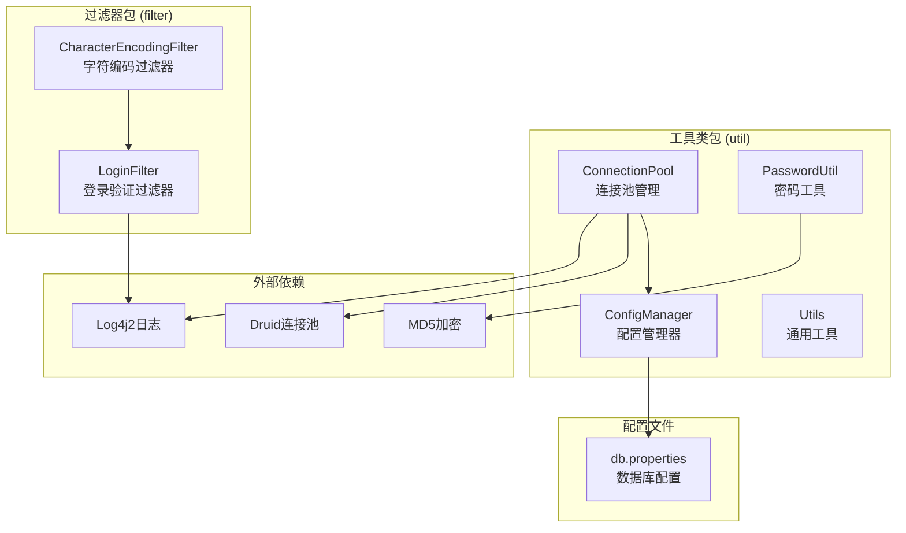
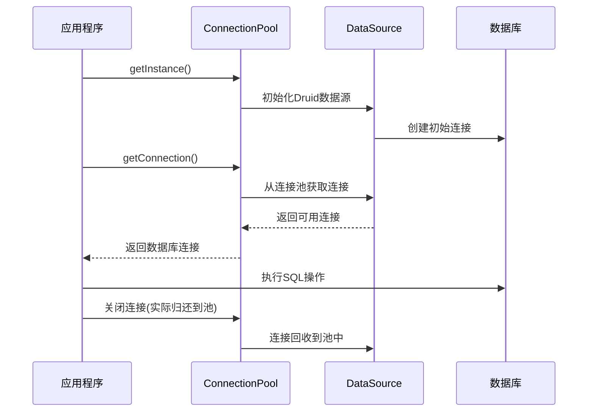
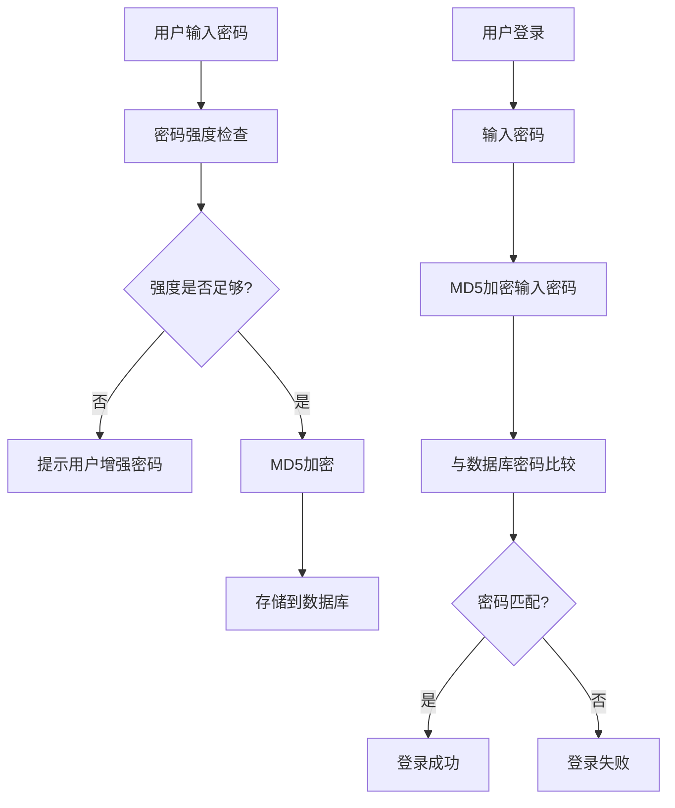
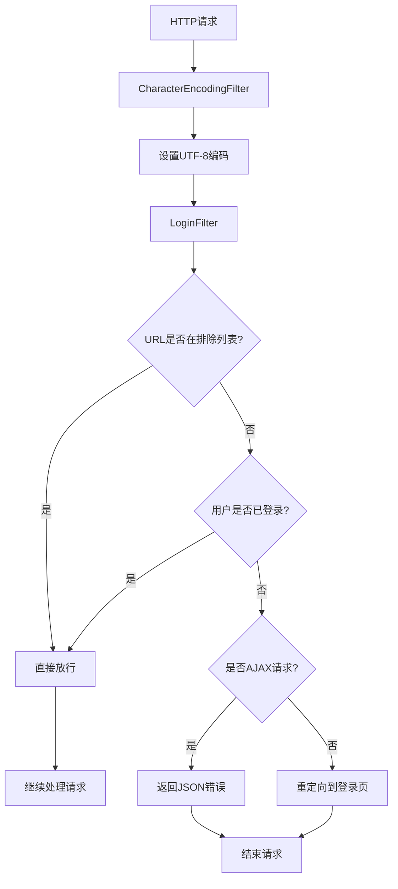
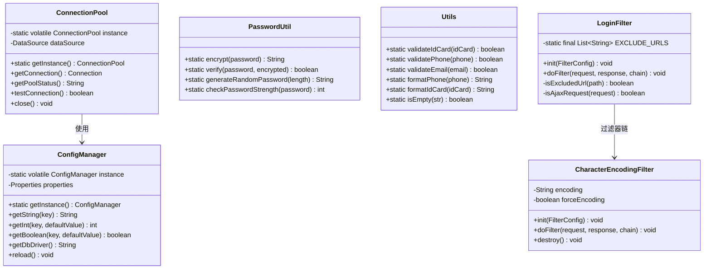

# 酒店管理系统 - 工具类详解

## 📋 目录
1. [概述](#概述)
2. [工具类架构](#工具类架构)
3. [核心工具类详解](#核心工具类详解)
4. [过滤器详解](#过滤器详解)
5. [设计模式应用](#设计模式应用)
6. [工具类UML图](#工具类uml图)

---

## 📖 概述

本系统的工具类(`util`包)和过滤器(`filter`包)提供了系统基础功能支持，包括配置管理、数据库连接池、密码加密、数据验证、字符编码处理和登录验证等核心功能。

### 技术特点
- **单例模式**：配置管理器和连接池管理
- **工厂模式**：连接池创建
- **加密安全**：MD5密码加密
- **数据验证**：身份证、手机号、邮箱格式验证
- **过滤器链**：统一的请求处理

---

## 🏗️ 工具类架构



---

## 🔧 核心工具类详解

### 1. ConfigManager - 配置管理器

**作用**：使用单例模式管理应用程序配置，支持多种数据类型的配置读取。

**设计模式**：单例模式（双重锁定检查）

#### 关键特性

```java
public class ConfigManager {
    private static volatile ConfigManager instance;
    private Properties properties;
    
    // 双重锁定检查的单例实现
    public static ConfigManager getInstance() {
        if (instance == null) {
            synchronized (ConfigManager.class) {
                if (instance == null) {
                    instance = new ConfigManager();
                }
            }
        }
        return instance;
    }
}
```

#### 核心功能

1. **配置文件加载**
   ```java
   private void loadPropertiesFile(String fileName) {
       InputStream inputStream = ConfigManager.class.getClassLoader()
           .getResourceAsStream(fileName);
       if (inputStream != null) {
           Properties tempProps = new Properties();
           tempProps.load(inputStream);
           properties.putAll(tempProps);
       }
   }
   ```

2. **类型安全的配置读取**
   ```java
   public int getInt(String key, int defaultValue) {
       String value = properties.getProperty(key);
       if (value != null) {
           try {
               return Integer.parseInt(value.trim());
           } catch (NumberFormatException e) {
               logger.warn("Invalid integer value for key {}: {}", key, value);
           }
       }
       return defaultValue;
   }
   ```

3. **数据库配置便捷方法**
   ```java
   public String getDbDriver() { return getString("db.driver"); }
   public String getDbUrl() { return getString("db.url"); }
   public int getDbMaxActive() { return getInt("db.maxActive", 20); }
   ```

#### 配置管理流程

```mermaid
flowchart TD
    A[应用启动] --> B[ConfigManager.getInstance()]
    B --> C{实例是否存在?}
    C -->|否| D[创建新实例]
    C -->|是| E[返回现有实例]
    D --> F[加载db.properties]
    F --> G[初始化Properties]
    G --> H[记录日志]
    H --> E
    E --> I[提供配置访问方法]
```

---

### 2. ConnectionPool - 数据库连接池

**作用**：使用Druid连接池管理数据库连接，提供高性能的连接复用。

**设计模式**：单例模式 + 工厂模式

#### 关键特性

```java
public class ConnectionPool {
    private static volatile ConnectionPool instance;
    private DataSource dataSource;
    
    private void initDataSource() {
        Properties properties = new Properties();
        // 读取配置文件
        inputStream = ConnectionPool.class.getClassLoader()
                .getResourceAsStream("db.properties");
        properties.load(inputStream);
        
        // 使用工厂模式创建数据源
        dataSource = DruidDataSourceFactory.createDataSource(properties);
    }
}
```

#### 核心功能

1. **连接获取**
   ```java
   public Connection getConnection() throws SQLException {
       try {
           Connection connection = dataSource.getConnection();
           logger.debug("Database connection obtained");
           return connection;
       } catch (SQLException e) {
           logger.error("Failed to get database connection", e);
           throw e;
       }
   }
   ```

2. **连接池监控**
   ```java
   public String getPoolStatus() {
       if (dataSource instanceof DruidDataSource) {
           DruidDataSource druidDataSource = (DruidDataSource) dataSource;
           StringBuilder status = new StringBuilder();
           status.append("Active Connections: ").append(druidDataSource.getActiveCount());
           status.append("Pool Size: ").append(druidDataSource.getPoolingCount());
           return status.toString();
       }
       return "Connection pool status not available";
   }
   ```

3. **连接测试**
   ```java
   public boolean testConnection() {
       try (Connection connection = getConnection()) {
           boolean isValid = connection.isValid(5); // 5秒超时
           return isValid;
       } catch (SQLException e) {
           logger.error("Database connection test failed", e);
           return false;
       }
   }
   ```

#### 连接池工作流程



---

### 3. PasswordUtil - 密码工具类

**作用**：提供密码加密、验证、强度检查和随机密码生成功能。

#### 核心功能

1. **MD5密码加密**
   ```java
   public static String encrypt(String password) {
       try {
           MessageDigest md = MessageDigest.getInstance("MD5");
           byte[] bytes = md.digest(password.getBytes("UTF-8"));
           return bytesToHex(bytes);
       } catch (Exception e) {
           throw new RuntimeException("Password encryption failed", e);
       }
   }
   ```

2. **密码验证**
   ```java
   public static boolean verify(String password, String encryptedPassword) {
       if (password == null || encryptedPassword == null) {
           return false;
       }
       String encrypted = encrypt(password);
       return encrypted.equals(encryptedPassword);
   }
   ```

3. **密码强度检查**
   ```java
   public static int checkPasswordStrength(String password) {
       boolean hasLower = password.matches(".*[a-z].*");
       boolean hasUpper = password.matches(".*[A-Z].*");
       boolean hasDigit = password.matches(".*[0-9].*");
       boolean hasSpecial = password.matches(".*[!@#$%^&*()_+...].*");
       
       int score = 1; // 基础分数
       if (password.length() >= 8) score++;
       if (hasUpper) score++;
       if (hasDigit) score++;
       if (hasSpecial) score++;
       
       return Math.min(score, 5);
   }
   ```

4. **随机密码生成**
   ```java
   public static String generateRandomPassword(int length) {
       String chars = "ABCDEFGHIJKLMNOPQRSTUVWXYZabcdefghijklmnopqrstuvwxyz0123456789";
       SecureRandom random = new SecureRandom();
       StringBuilder sb = new StringBuilder();
       
       for (int i = 0; i < length; i++) {
           sb.append(chars.charAt(random.nextInt(chars.length())));
       }
       return sb.toString();
   }
   ```

#### 密码处理流程



---

### 4. Utils - 通用工具类

**作用**：提供数据验证、格式化等通用功能。

#### 核心功能

1. **身份证号验证**
   ```java
   public static boolean validateIdCard(String idCard) {
       // 基本格式验证
       if (!ID_CARD_PATTERN.matcher(trimmedIdCard).matches()) {
           return false;
       }
       // 校验码验证
       return validateIdCardChecksum(trimmedIdCard);
   }
   
   private static boolean validateIdCardChecksum(String idCard) {
       int[] weights = {7, 9, 10, 5, 8, 4, 2, 1, 6, 3, 7, 9, 10, 5, 8, 4, 2};
       char[] checkCodes = {'1', '0', 'X', '9', '8', '7', '6', '5', '4', '3', '2'};
       
       int sum = 0;
       for (int i = 0; i < 17; i++) {
           sum += (idCard.charAt(i) - '0') * weights[i];
       }
       
       int remainder = sum % 11;
       char expectedCheckCode = checkCodes[remainder];
       char actualCheckCode = Character.toUpperCase(idCard.charAt(17));
       
       return expectedCheckCode == actualCheckCode;
   }
   ```

2. **手机号和邮箱验证**
   ```java
   private static final Pattern PHONE_PATTERN = 
       Pattern.compile("^1[3-9]\\d{9}$");
   
   private static final Pattern EMAIL_PATTERN = 
       Pattern.compile("^[a-zA-Z0-9._%+-]+@[a-zA-Z0-9.-]+\\.[a-zA-Z]{2,}$");
   
   public static boolean validatePhone(String phone) {
       return phone != null && PHONE_PATTERN.matcher(phone.trim()).matches();
   }
   ```

3. **数据格式化**
   ```java
   public static String formatPhone(String phone) {
       if (validatePhone(phone) && phone.trim().length() == 11) {
           String trimmedPhone = phone.trim();
           return trimmedPhone.substring(0, 3) + "****" + trimmedPhone.substring(7);
       }
       return phone;
   }
   
   public static String formatIdCard(String idCard) {
       if (validateIdCard(idCard) && idCard.trim().length() == 18) {
           String trimmedIdCard = idCard.trim();
           return trimmedIdCard.substring(0, 6) + "********" + trimmedIdCard.substring(14);
       }
       return idCard;
   }
   ```

---

## 🔍 过滤器详解

### 1. CharacterEncodingFilter - 字符编码过滤器

**作用**：统一设置请求和响应的字符编码为UTF-8，解决中文乱码问题。

#### 核心实现

```java
@Override
public void doFilter(ServletRequest request, ServletResponse response, FilterChain chain)
        throws IOException, ServletException {
    
    HttpServletRequest httpRequest = (HttpServletRequest) request;
    HttpServletResponse httpResponse = (HttpServletResponse) response;
    
    // 设置请求编码
    if (forceEncoding || httpRequest.getCharacterEncoding() == null) {
        httpRequest.setCharacterEncoding(encoding);
    }
    
    // 设置响应编码
    if (forceEncoding || httpResponse.getCharacterEncoding() == null || 
        "ISO-8859-1".equals(httpResponse.getCharacterEncoding())) {
        httpResponse.setCharacterEncoding(encoding);
    }
    
    chain.doFilter(request, response);
}
```

### 2. LoginFilter - 登录验证过滤器

**作用**：检查用户登录状态，未登录用户重定向到登录页面。

#### 核心功能

1. **URL排除机制**
   ```java
   private static final List<String> EXCLUDE_URLS = Arrays.asList(
       "/login.jsp", "/login", "/css/", "/js/", "/images/", "/favicon.ico"
   );
   
   private boolean isExcludedUrl(String path) {
       for (String excludeUrl : EXCLUDE_URLS) {
           if (path.startsWith(excludeUrl)) {
               return true;
           }
       }
       return false;
   }
   ```

2. **登录状态检查**
   ```java
   HttpSession session = httpRequest.getSession(false);
   User user = null;
   if (session != null) {
       user = (User) session.getAttribute("user");
   }
   
   if (user == null) {
       // 用户未登录，处理重定向
       handleUnauthorizedAccess(httpRequest, httpResponse);
       return;
   }
   ```

3. **AJAX请求支持**
   ```java
   private boolean isAjaxRequest(HttpServletRequest request) {
       String requestedWith = request.getHeader("X-Requested-With");
       return "XMLHttpRequest".equals(requestedWith);
   }
   
   if (isAjaxRequest(httpRequest)) {
       httpResponse.setStatus(HttpServletResponse.SC_UNAUTHORIZED);
       httpResponse.setContentType("application/json;charset=UTF-8");
       httpResponse.getWriter().write(
           "{\"success\":false,\"message\":\"用户未登录\",\"code\":401}"
       );
       return;
   }
   ```

#### 过滤器执行流程



---

## 🎯 设计模式应用

### 1. 单例模式
- **ConfigManager**：全局唯一的配置管理器
- **ConnectionPool**：全局唯一的连接池管理器
- **实现方式**：双重锁定检查，保证线程安全

### 2. 工厂模式
- **DruidDataSourceFactory**：创建数据源对象
- **好处**：解耦对象创建和使用

### 3. 过滤器模式
- **CharacterEncodingFilter + LoginFilter**：形成过滤器链
- **好处**：统一的请求预处理

---

## 📊 工具类UML图



---

## 🔚 总结

工具类和过滤器是系统的基础设施，提供了：

1. **配置管理**：统一的配置读取和管理
2. **连接池管理**：高效的数据库连接复用
3. **安全支持**：密码加密和数据验证
4. **通用工具**：数据格式化和验证
5. **请求过滤**：编码统一和登录验证

这些组件采用了单例模式、工厂模式等设计模式，确保了系统的稳定性、安全性和可维护性。