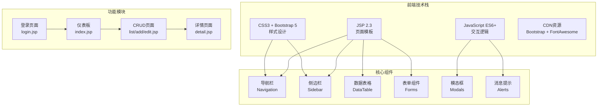
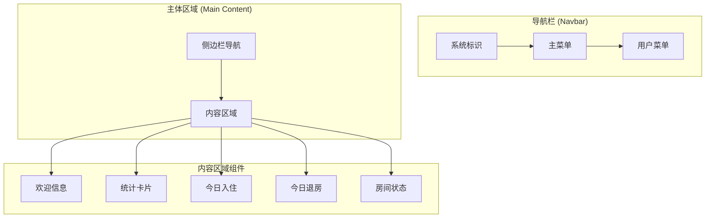
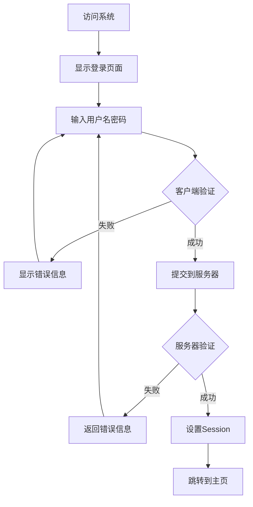
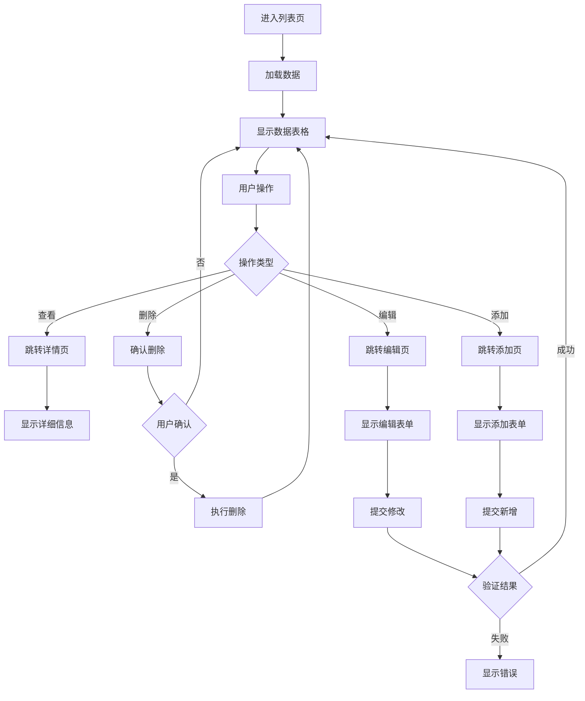

# 酒店管理系统 - 前端界面详解

## 📋 目录
1. [概述](#概述)
2. [前端技术架构](#前端技术架构)
3. [JSP页面结构](#jsp页面结构)
4. [JavaScript模块](#javascript模块)
5. [CSS样式设计](#css样式设计)
6. [用户界面流程](#用户界面流程)
7. [响应式设计](#响应式设计)
8. [前端安全性](#前端安全性)

---

## 📖 概述

本系统采用传统的JSP + JavaScript + CSS的前端架构，使用Bootstrap 5框架实现响应式设计，Font Awesome图标库提供丰富的图标支持，确保在不同设备上都有良好的用户体验。

### 前端特色
- **响应式设计**：适配桌面、平板、手机等设备
- **Bootstrap 5**：现代化UI组件库
- **Font Awesome 6**：丰富的图标系统
- **AJAX交互**：无刷新数据交互
- **表单验证**：客户端和服务端双重验证
- **用户友好**：直观的操作界面和反馈

---

## 🏗️ 前端技术架构



---

## 📄 JSP页面结构

### 1. 登录页面 - login.jsp

**设计理念**：简洁、安全、用户友好的登录界面

#### 页面结构
```jsp
<%@ page contentType="text/html;charset=UTF-8" language="java" %>
<%@ taglib prefix="c" uri="http://java.sun.com/jsp/jstl/core" %>
<!DOCTYPE html>
<html lang="zh-CN">
<head>
    <meta charset="UTF-8">
    <meta name="viewport" content="width=device-width, initial-scale=1.0">
    <title>酒店管理系统 - 登录</title>
    <link href="https://cdn.jsdelivr.net/npm/bootstrap@5.1.3/dist/css/bootstrap.min.css" rel="stylesheet">
    <link href="${pageContext.request.contextPath}/css/login.css" rel="stylesheet">
</head>
```

#### 核心功能特性
1. **响应式布局**
   ```html
   <div class="container">
       <div class="row justify-content-center">
           <div class="col-md-6 col-lg-4">
               <div class="login-container">
                   <!-- 登录表单 -->
               </div>
           </div>
       </div>
   </div>
   ```

2. **错误消息显示**
   ```jsp
   <c:if test="${not empty error}">
       <div class="alert alert-danger" role="alert">
           <i class="fas fa-exclamation-triangle"></i> ${error}
       </div>
   </c:if>
   ```

3. **密码可见性切换**
   ```html
   <div class="input-group">
       <input type="password" class="form-control" id="password" name="password">
       <button class="btn btn-outline-secondary" type="button" id="togglePassword">
           <i class="fas fa-eye"></i>
       </button>
   </div>
   ```

4. **演示账号信息**
   ```jsp
   <div class="card">
       <div class="card-header">
           <small class="text-muted">演示账号</small>
       </div>
       <div class="card-body py-2">
           <small>
               <strong>管理员:</strong> admin / admin<br>
               <strong>员工:</strong> staff001 / hello
           </small>
       </div>
   </div>
   ```

### 2. 主页面 - admin/index.jsp

**设计理念**：信息丰富、操作便捷的管理仪表板

#### 页面架构


#### 统计卡片组件
```jsp
<div class="row mb-4">
    <div class="col-md-3 mb-3">
        <div class="card text-white bg-primary">
            <div class="card-body">
                <div class="d-flex justify-content-between">
                    <div>
                        <h4 class="card-title">${statistics.totalRooms}</h4>
                        <p class="card-text">总房间数</p>
                    </div>
                    <div class="align-self-center">
                        <i class="fas fa-bed fa-2x"></i>
                    </div>
                </div>
            </div>
        </div>
    </div>
    <!-- 其他统计卡片... -->
</div>
```

#### 实时数据更新
```javascript
// 实时时钟
function updateTime() {
    const now = new Date();
    const timeString = now.toLocaleTimeString('zh-CN', {
        hour12: false,
        hour: '2-digit',
        minute: '2-digit',
        second: '2-digit'
    });
    document.getElementById('currentTime').textContent = timeString;
}

// 每秒更新时间
updateTime();
setInterval(updateTime, 1000);
```

### 3. 列表页面 - *-list.jsp

**设计理念**：数据展示、筛选、操作的统一界面

#### 通用列表页面结构
```jsp
<!-- 筛选和搜索栏 -->
<div class="row mb-3">
    <div class="col-md-8">
        <form method="get" action="${pageContext.request.contextPath}/booking/search">
            <div class="row">
                <div class="col-md-4">
                    <input type="date" class="form-control" name="dateFrom" placeholder="开始日期">
                </div>
                <div class="col-md-4">
                    <input type="date" class="form-control" name="dateTo" placeholder="结束日期">
                </div>
                <div class="col-md-4">
                    <button class="btn btn-outline-secondary" type="submit">
                        <i class="fas fa-search"></i> 搜索
                    </button>
                </div>
            </div>
        </form>
    </div>
</div>

<!-- 数据表格 -->
<div class="table-responsive">
    <table class="table table-striped table-hover">
        <thead class="table-dark">
            <tr>
                <th>ID</th>
                <th>客户姓名</th>
                <th>房间号</th>
                <th>入住日期</th>
                <th>状态</th>
                <th>操作</th>
            </tr>
        </thead>
        <tbody>
            <c:forEach var="booking" items="${bookings}">
                <tr>
                    <td>${booking.bookingId}</td>
                    <td>${booking.customer.name}</td>
                    <td>${booking.room.roomNumber}</td>
                    <td><fmt:formatDate value="${booking.checkInDate}" pattern="yyyy-MM-dd"/></td>
                    <td>
                        <span class="badge bg-${booking.statusColor}">${booking.statusText}</span>
                    </td>
                    <td>
                        <a href="detail?id=${booking.bookingId}" class="btn btn-sm btn-info">
                            <i class="fas fa-eye"></i>
                        </a>
                        <a href="edit?id=${booking.bookingId}" class="btn btn-sm btn-warning">
                            <i class="fas fa-edit"></i>
                        </a>
                    </td>
                </tr>
            </c:forEach>
        </tbody>
    </table>
</div>
```

---

## 💻 JavaScript模块

### 1. 登录页面脚本 - login.js

**核心功能**：表单验证、密码切换、演示账号快填、防重复提交

#### 主要功能模块

1. **页面初始化**
   ```javascript
   function initLoginPage() {
       const loginForm = document.getElementById('loginForm');
       const usernameInput = document.getElementById('username');
       const passwordInput = document.getElementById('password');
       
       // 自动聚焦到用户名输入框
       if (usernameInput && !usernameInput.value) {
           usernameInput.focus();
       }
       
       // 从本地存储恢复用户名
       if (localStorage.getItem('rememberedUsername')) {
           usernameInput.value = localStorage.getItem('rememberedUsername');
           rememberMeCheckbox.checked = true;
           passwordInput.focus();
       }
   }
   ```

2. **表单验证**
   ```javascript
   function validateForm(username, password) {
       const errors = [];
       
       if (!username) {
           errors.push('请输入用户名');
       } else if (username.length < 2) {
           errors.push('用户名长度至少2个字符');
       }
       
       if (!password) {
           errors.push('请输入密码');
       } else if (password.length < 3) {
           errors.push('密码长度至少3个字符');
       }
       
       if (errors.length > 0) {
           showError(errors.join('<br>'));
           return false;
       }
       return true;
   }
   ```

3. **防重复提交**
   ```javascript
   function showLoadingState(button) {
       if (button) {
           button.disabled = true;
           button.innerHTML = '<i class="fas fa-spinner fa-spin"></i> 登录中...';
           button.classList.add('loading');
       }
   }
   ```

4. **演示账号快填**
   ```javascript
   function addDemoAccountButtons() {
       const demoCard = document.querySelector('.card .card-body');
       if (demoCard) {
           const adminText = demoCard.querySelector('small');
           adminText.addEventListener('click', function(e) {
               const text = e.target.textContent;
               if (text.includes('admin')) {
                   fillLoginForm('admin', 'admin');
               } else if (text.includes('staff001')) {
                   fillLoginForm('staff001', 'hello');
               }
           });
       }
   }
   ```

### 2. 主系统脚本 - main.js

**核心功能**：AJAX封装、会话管理、通用工具函数

#### 系统初始化
```javascript
const HotelManagement = {
    contextPath: '',
    currentUser: null,
    
    init: function(contextPath) {
        this.contextPath = contextPath;
        this.initEventListeners();
        this.checkSession();
    },
    
    initEventListeners: function() {
        // 自动关闭警告消息
        setTimeout(function() {
            $('.alert').fadeOut();
        }, 5000);
        
        // 确认删除对话框
        $('.btn-delete').click(function(e) {
            e.preventDefault();
            const url = $(this).attr('href');
            const name = $(this).data('name') || '此项目';
            
            if (confirm(`确定要删除 ${name} 吗？此操作不可撤销。`)) {
                window.location.href = url;
            }
        });
    }
};
```

#### AJAX请求封装
```javascript
ajax: function(options) {
    const defaults = {
        method: 'GET',
        dataType: 'json',
        timeout: 30000,
        beforeSend: function() {
            if (options.showLoading !== false) {
                HotelManagement.showLoading();
            }
        },
        error: function(xhr, status, error) {
            if (xhr.status === 401) {
                alert('会话已过期，请重新登录');
                window.location.href = HotelManagement.contextPath + '/login.jsp';
            } else if (xhr.status === 403) {
                HotelManagement.showAlert('权限不足', 'danger');
            }
        }
    };
    
    const config = Object.assign({}, defaults, options);
    config.url = this.contextPath + config.url;
    
    return $.ajax(config);
}
```

#### 工具函数
```javascript
const Utils = {
    validateIdCard: function(idCard) {
        const reg = /(^\d{15}$)|(^\d{18}$)|(^\d{17}(\d|X|x)$)/;
        return reg.test(idCard);
    },
    
    validatePhone: function(phone) {
        const reg = /^1[3-9]\d{9}$/;
        return reg.test(phone);
    },
    
    validateEmail: function(email) {
        const reg = /^[^\s@]+@[^\s@]+\.[^\s@]+$/;
        return reg.test(email);
    }
};
```

---

## 🎨 CSS样式设计

### 1. 登录页面样式 - login.css

**设计目标**：简洁美观、专业可信的登录界面

#### 主要样式特性
```css
/* 页面背景 */
body.bg-light {
    background: linear-gradient(135deg, #667eea 0%, #764ba2 100%);
    min-height: 100vh;
}

/* 登录容器 */
.login-container {
    background: white;
    border-radius: 15px;
    box-shadow: 0 15px 35px rgba(0, 0, 0, 0.1);
    padding: 2rem;
    margin-top: 2rem;
}

/* 输入框样式 */
.form-control:focus {
    border-color: #667eea;
    box-shadow: 0 0 0 0.2rem rgba(102, 126, 234, 0.25);
}

/* 按钮样式 */
.btn-primary {
    background: linear-gradient(135deg, #667eea 0%, #764ba2 100%);
    border: none;
    border-radius: 25px;
    padding: 12px 30px;
    font-weight: 600;
    transition: all 0.3s ease;
}

.btn-primary:hover {
    transform: translateY(-2px);
    box-shadow: 0 5px 15px rgba(102, 126, 234, 0.4);
}
```

### 2. 主系统样式 - main.css

**设计目标**：统一的管理界面风格、良好的可读性

#### 导航栏样式
```css
.navbar {
    background: linear-gradient(135deg, #667eea 0%, #764ba2 100%);
    box-shadow: 0 2px 10px rgba(0, 0, 0, 0.1);
}

.navbar-brand {
    font-weight: 700;
    font-size: 1.3rem;
}

.nav-link {
    font-weight: 500;
    transition: all 0.3s ease;
}

.nav-link:hover {
    background-color: rgba(255, 255, 255, 0.1);
    border-radius: 5px;
}
```

#### 侧边栏样式
```css
.sidebar {
    background-color: #f8f9fa;
    border-right: 1px solid #dee2e6;
    min-height: calc(100vh - 56px);
    padding-top: 1rem;
}

.sidebar .nav-link {
    color: #495057;
    padding: 0.75rem 1rem;
    margin-bottom: 0.25rem;
    border-radius: 5px;
    transition: all 0.3s ease;
}

.sidebar .nav-link:hover,
.sidebar .nav-link.active {
    background-color: #667eea;
    color: white;
}
```

#### 卡片和表格样式
```css
.card {
    border: none;
    border-radius: 10px;
    box-shadow: 0 2px 10px rgba(0, 0, 0, 0.1);
    transition: all 0.3s ease;
}

.card:hover {
    transform: translateY(-2px);
    box-shadow: 0 5px 20px rgba(0, 0, 0, 0.15);
}

.table {
    border-collapse: separate;
    border-spacing: 0;
}

.table th {
    background-color: #f8f9fa;
    border-bottom: 2px solid #dee2e6;
    font-weight: 600;
}

.table tbody tr:hover {
    background-color: #f5f5f5;
}
```

---

## 🔄 用户界面流程

### 登录流程


### 数据管理流程


---

## 📱 响应式设计

### Bootstrap Grid系统应用

#### 桌面端布局
```html
<div class="row">
    <div class="col-md-2">侧边栏</div>
    <div class="col-md-10">主内容</div>
</div>
```

#### 移动端适配
```html
<div class="row">
    <div class="col-12 d-md-none">移动端导航</div>
    <div class="col-md-2 d-none d-md-block">桌面端侧边栏</div>
    <div class="col-12 col-md-10">主内容</div>
</div>
```

#### 响应式表格
```html
<div class="table-responsive">
    <table class="table">
        <!-- 表格内容 -->
    </table>
</div>
```

### 断点设计策略

```css
/* 超小设备 (小于576px) */
@media (max-width: 575.98px) {
    .sidebar {
        display: none;
    }
    
    .navbar-nav {
        flex-direction: column;
    }
}

/* 小设备 (576px及以上) */
@media (min-width: 576px) {
    .login-container {
        max-width: 400px;
    }
}

/* 中等设备 (768px及以上) */
@media (min-width: 768px) {
    .sidebar {
        display: block;
    }
}
```

---

## 🔒 前端安全性

### 1. XSS防护
```jsp
<!-- 使用JSTL的c:out标签防止XSS -->
<td><c:out value="${booking.customer.name}" /></td>

<!-- 避免直接输出用户输入 -->
<script>
    // 错误示例：var userName = "${user.name}";
    // 正确示例：
    var userName = '<c:out value="${user.name}" escapeXml="true" />';
</script>
```

### 2. CSRF防护
```jsp
<!-- 在表单中包含CSRF Token -->
<form method="post">
    <input type="hidden" name="csrfToken" value="${sessionScope.csrfToken}" />
    <!-- 其他表单字段 -->
</form>
```

### 3. 会话验证
```javascript
// 定期检查会话状态
setInterval(() => {
    HotelManagement.ajax({
        url: '/admin/user/check-session',
        method: 'GET',
        success: function(response) {
            if (!response.success) {
                alert('会话已过期，请重新登录');
                window.location.href = HotelManagement.contextPath + '/login.jsp';
            }
        }
    });
}, 300000); // 5分钟检查一次
```

### 4. 输入验证
```javascript
function validateForm(data) {
    // 客户端验证（补充，不替代服务端验证）
    const errors = [];
    
    if (!data.username || data.username.length < 2) {
        errors.push('用户名不能少于2个字符');
    }
    
    if (!Utils.validateEmail(data.email)) {
        errors.push('邮箱格式不正确');
    }
    
    return errors.length === 0;
}
```

---

## 🔚 总结

前端界面设计遵循以下原则：

1. **用户体验优先**：直观的操作流程和即时反馈
2. **响应式设计**：适配各种设备和屏幕尺寸
3. **安全性保障**：多层防护措施防止常见攻击
4. **性能优化**：CDN加速、图片优化、代码压缩
5. **可维护性**：模块化设计、注释完整、代码规范

前端系统为用户提供了现代化、易用的管理界面，配合后端强大的业务逻辑，共同构成了完整的酒店管理解决方案。