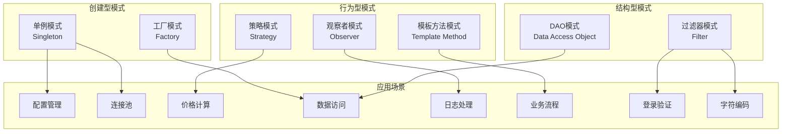
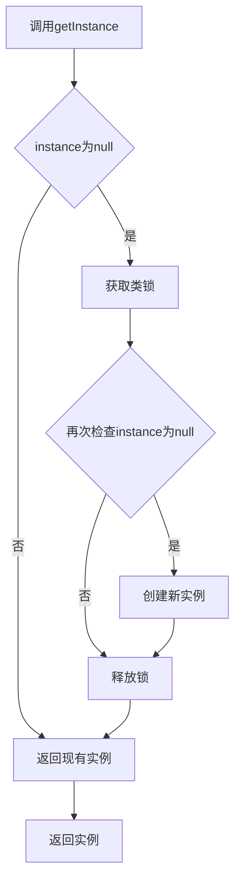
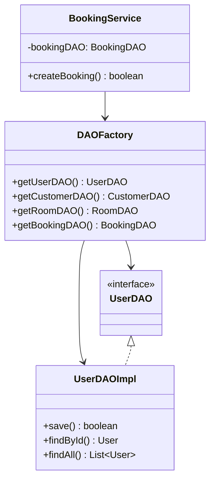
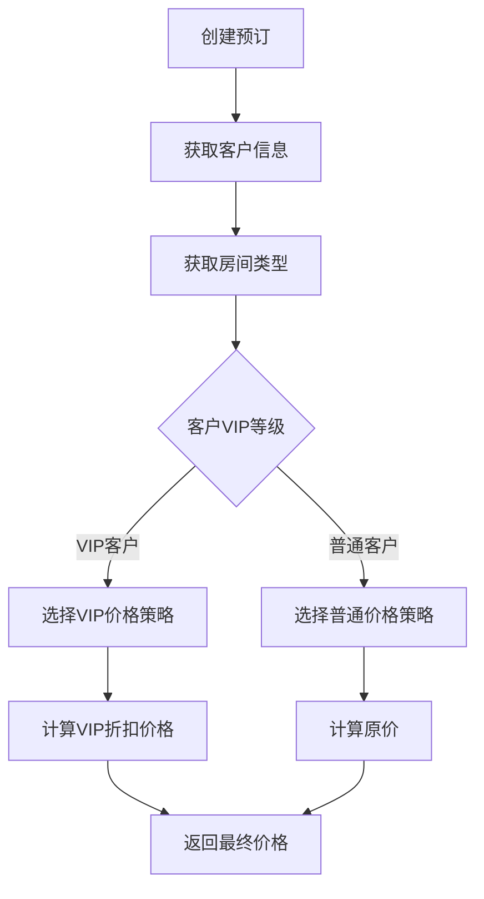
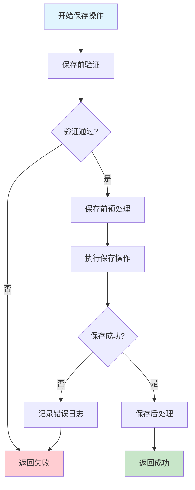
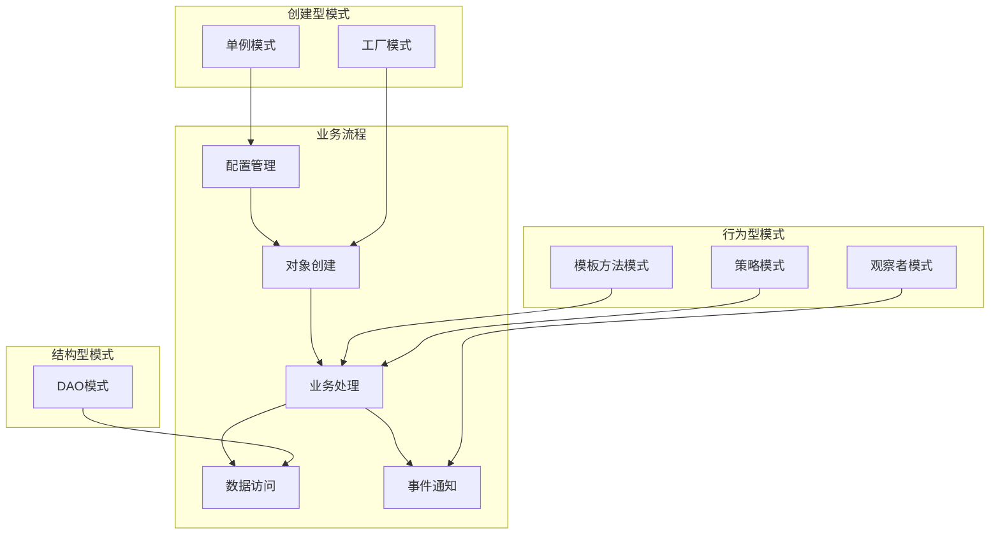

# 酒店管理系统 - 设计模式应用详解

## 📋 目录
1. [概述](#概述)
2. [设计模式总览](#设计模式总览)
3. [单例模式](#单例模式)
4. [工厂模式](#工厂模式)
5. [策略模式](#策略模式)
6. [模板方法模式](#模板方法模式)
7. [DAO模式](#dao模式)
8. [观察者模式](#观察者模式)
9. [设计模式协作](#设计模式协作)

---

## 📖 概述

本酒店管理系统采用了6种经典设计模式，这些模式的合理运用不仅提高了代码的可维护性和扩展性，还体现了面向对象设计的核心思想。每个设计模式都解决了特定的设计问题，共同构建了一个灵活、健壮的系统架构。

### 应用的设计模式
1. **单例模式** (Singleton) - 配置管理和连接池
2. **工厂模式** (Factory) - DAO对象创建
3. **策略模式** (Strategy) - 价格计算策略
4. **模板方法模式** (Template Method) - 通用业务流程
5. **DAO模式** (Data Access Object) - 数据访问封装
6. **观察者模式** (Observer) - 日志和事件处理

---

## 🎯 设计模式总览



---

## 🔧 单例模式 (Singleton Pattern)

### 设计目的
确保一个类只有一个实例，并提供全局访问点，节约系统资源。

### 应用场景
1. **ConfigManager** - 配置管理器
2. **ConnectionPool** - 数据库连接池

### 实现方式：双重锁定检查 (Double-Checked Locking)

#### ConfigManager实现
```java
public class ConfigManager {
    // volatile关键字确保多线程环境下的可见性
    private static volatile ConfigManager instance;
    private Properties properties;
    
    // 私有构造函数，防止外部实例化
    private ConfigManager() {
        loadConfiguration();
    }
    
    /**
     * 获取单例实例（双重锁定检查）
     * @return ConfigManager实例
     */
    public static ConfigManager getInstance() {
        if (instance == null) {  // 第一次检查
            synchronized (ConfigManager.class) {
                if (instance == null) {  // 第二次检查
                    instance = new ConfigManager();
                }
            }
        }
        return instance;
    }
    
    // 配置访问方法
    public String getString(String key) {
        return properties.getProperty(key);
    }
    
    public int getInt(String key, int defaultValue) {
        String value = properties.getProperty(key);
        try {
            return value != null ? Integer.parseInt(value.trim()) : defaultValue;
        } catch (NumberFormatException e) {
            return defaultValue;
        }
    }
}
```

#### ConnectionPool实现
```java
public class ConnectionPool {
    private static volatile ConnectionPool instance;
    private DataSource dataSource;
    
    private ConnectionPool() {
        initDataSource();
    }
    
    public static ConnectionPool getInstance() {
        if (instance == null) {
            synchronized (ConnectionPool.class) {
                if (instance == null) {
                    instance = new ConnectionPool();
                }
            }
        }
        return instance;
    }
    
    public Connection getConnection() throws SQLException {
        return dataSource.getConnection();
    }
}
```

### 单例模式的优势
1. **内存优化**：只创建一个实例，节约内存
2. **资源控制**：统一管理共享资源
3. **线程安全**：双重锁定检查确保线程安全
4. **延迟初始化**：只有在需要时才创建实例

### 单例模式流程图


---

## 🏭 工厂模式 (Factory Pattern)

### 设计目的
创建对象时不必指定创建对象的具体类，将对象的创建和使用分离。

### 应用场景
**DAOFactory** - 统一创建各种DAO实现

### 实现方式

#### DAOFactory实现
```java
public class DAOFactory {
    
    /**
     * 获取UserDAO实例
     * @return UserDAO实例
     */
    public static UserDAO getUserDAO() {
        return new UserDAOImpl();
    }
    
    /**
     * 获取CustomerDAO实例
     * @return CustomerDAO实例
     */
    public static CustomerDAO getCustomerDAO() {
        return new CustomerDAOImpl();
    }
    
    /**
     * 获取RoomDAO实例
     * @return RoomDAO实例
     */
    public static RoomDAO getRoomDAO() {
        return new RoomDAOImpl();
    }
    
    /**
     * 获取RoomTypeDAO实例
     * @return RoomTypeDAO实例
     */
    public static RoomTypeDAO getRoomTypeDAO() {
        return new RoomTypeDAOImpl();
    }
    
    /**
     * 获取BookingDAO实例
     * @return BookingDAO实例
     */
    public static BookingDAO getBookingDAO() {
        return new BookingDAOImpl();
    }
}
```

#### Service层中的使用
```java
public class BookingService {
    private BookingDAO bookingDAO;
    private CustomerDAO customerDAO;
    private RoomDAO roomDAO;
    
    public BookingService() {
        // 使用工厂模式创建DAO实例
        this.bookingDAO = DAOFactory.getBookingDAO();
        this.customerDAO = DAOFactory.getCustomerDAO();
        this.roomDAO = DAOFactory.getRoomDAO();
    }
    
    public boolean createBooking(Booking booking) {
        // 业务逻辑实现
        return bookingDAO.save(booking);
    }
}
```

### 工厂模式的优势
1. **解耦合**：客户端代码与具体实现分离
2. **扩展性**：新增DAO实现无需修改现有代码
3. **统一管理**：集中管理对象创建逻辑
4. **代码复用**：避免重复的对象创建代码

### 工厂模式UML图


---

## 💰 策略模式 (Strategy Pattern)

### 设计目的
定义算法族，分别封装起来，让它们之间可以相互替换。策略模式让算法的变化独立于使用算法的客户。

### 应用场景
**价格计算策略** - 根据客户VIP等级采用不同的价格计算方式

### 实现方式

#### 策略接口定义
```java
/**
 * 价格计算策略接口
 */
public interface PriceCalculationStrategy {
    /**
     * 计算价格
     * @param roomType 房间类型
     * @param days 入住天数
     * @param vipLevel VIP等级
     * @return 计算后的价格
     */
    BigDecimal calculatePrice(RoomType roomType, int days, int vipLevel);
}
```

#### 具体策略实现

##### 普通客户价格策略
```java
public class RegularPriceStrategy implements PriceCalculationStrategy {
    
    @Override
    public BigDecimal calculatePrice(RoomType roomType, int days, int vipLevel) {
        BigDecimal basePrice = roomType.getBasePrice();
        BigDecimal totalPrice = basePrice.multiply(new BigDecimal(days));
        
        logger.info("普通客户价格计算: 基础价格={}, 天数={}, 总价={}", 
                   basePrice, days, totalPrice);
        
        return totalPrice;
    }
}
```

##### VIP客户价格策略
```java
public class VIPPriceStrategy implements PriceCalculationStrategy {
    
    @Override
    public BigDecimal calculatePrice(RoomType roomType, int days, int vipLevel) {
        BigDecimal basePrice = roomType.getBasePrice();
        BigDecimal totalPrice = basePrice.multiply(new BigDecimal(days));
        
        // 根据VIP等级应用折扣
        BigDecimal discount = getVipDiscount(vipLevel);
        BigDecimal finalPrice = totalPrice.multiply(discount);
        
        logger.info("VIP客户价格计算: 基础价格={}, 天数={}, VIP等级={}, 折扣={}, 最终价格={}", 
                   basePrice, days, vipLevel, discount, finalPrice);
        
        return finalPrice;
    }
    
    private BigDecimal getVipDiscount(int vipLevel) {
        switch (vipLevel) {
            case 1: return new BigDecimal("0.95"); // 5%折扣
            case 2: return new BigDecimal("0.90"); // 10%折扣
            case 3: return new BigDecimal("0.85"); // 15%折扣
            case 4: return new BigDecimal("0.80"); // 20%折扣
            case 5: return new BigDecimal("0.75"); // 25%折扣
            default: return BigDecimal.ONE;        // 无折扣
        }
    }
}
```

#### 策略上下文（Context）
```java
public class PriceCalculator {
    private PriceCalculationStrategy strategy;
    
    public void setStrategy(PriceCalculationStrategy strategy) {
        this.strategy = strategy;
    }
    
    public BigDecimal calculatePrice(RoomType roomType, int days, int vipLevel) {
        if (strategy == null) {
            throw new IllegalStateException("价格计算策略未设置");
        }
        return strategy.calculatePrice(roomType, days, vipLevel);
    }
}
```

#### 在Service层中的使用
```java
public class BookingService {
    
    public BigDecimal calculateTotalPrice(Booking booking) {
        Customer customer = booking.getCustomer();
        RoomType roomType = booking.getRoom().getRoomType();
        int days = (int) ChronoUnit.DAYS.between(
            booking.getCheckInDate().toInstant(), 
            booking.getCheckOutDate().toInstant()
        );
        
        // 创建价格计算器
        PriceCalculator calculator = new PriceCalculator();
        
        // 4. 选择策略
        PriceCalculationStrategy strategy;
        if (customer.getVipLevel() > 0) {
            strategy = new VIPPriceStrategy();
        } else {
            strategy = new RegularPriceStrategy();
        }
        
        calculator.setStrategy(strategy);
        return calculator.calculatePrice(roomType, days, customer.getVipLevel());
    }
}
```

### 策略模式的优势
1. **算法独立**：算法可以独立于客户变化
2. **运行时切换**：可以在运行时选择算法
3. **开闭原则**：对扩展开放，对修改关闭
4. **消除条件语句**：避免大量if-else或switch语句

### 策略模式流程图


---

## 📝 模板方法模式 (Template Method Pattern)

### 设计目的
定义一个算法的骨架，而将一些步骤延迟到子类中。模板方法使得子类可以不改变算法的结构即可重定义算法的某些特定步骤。

### 应用场景
**通用业务流程处理** - 标准化的CRUD操作流程

### 实现方式

#### 抽象模板类
```java
public abstract class BaseService<T> {
    protected static final Logger logger = LogManager.getLogger();
    
    /**
     * 模板方法：标准的保存流程
     * @param entity 要保存的实体
     * @return 保存是否成功
     */
    public final boolean save(T entity) {
        try {
            // 1. 保存前验证
            if (!validateBeforeSave(entity)) {
                logger.warn("保存前验证失败");
                return false;
            }
            
            // 2. 保存前预处理
            preprocessBeforeSave(entity);
            
            // 3. 执行保存操作（具体实现由子类完成）
            boolean result = doSave(entity);
            
            if (result) {
                // 4. 保存后处理
                postprocessAfterSave(entity);
                logger.info("实体保存成功: {}", entity.getClass().getSimpleName());
            } else {
                logger.error("实体保存失败: {}", entity.getClass().getSimpleName());
            }
            
            return result;
            
        } catch (Exception e) {
            logger.error("保存实体时发生异常", e);
            handleSaveException(entity, e);
            return false;
        }
    }
    
    /**
     * 模板方法：标准的删除流程
     * @param id 要删除的实体ID
     * @return 删除是否成功
     */
    public final boolean delete(Long id) {
        try {
            // 1. 删除前验证
            if (!validateBeforeDelete(id)) {
                logger.warn("删除前验证失败，ID: {}", id);
                return false;
            }
            
            // 2. 获取要删除的实体
            T entity = findById(id);
            if (entity == null) {
                logger.warn("要删除的实体不存在，ID: {}", id);
                return false;
            }
            
            // 3. 删除前预处理
            preprocessBeforeDelete(entity);
            
            // 4. 执行删除操作
            boolean result = doDelete(id);
            
            if (result) {
                // 5. 删除后处理
                postprocessAfterDelete(entity);
                logger.info("实体删除成功，ID: {}", id);
            } else {
                logger.error("实体删除失败，ID: {}", id);
            }
            
            return result;
            
        } catch (Exception e) {
            logger.error("删除实体时发生异常，ID: " + id, e);
            handleDeleteException(id, e);
            return false;
        }
    }
    
    // 抽象方法，由子类实现
    protected abstract boolean doSave(T entity);
    protected abstract boolean doDelete(Long id);
    protected abstract T findById(Long id);
    
    // 钩子方法，子类可以覆盖
    protected boolean validateBeforeSave(T entity) {
        return entity != null;
    }
    
    protected boolean validateBeforeDelete(Long id) {
        return id != null && id > 0;
    }
    
    protected void preprocessBeforeSave(T entity) {
        // 默认实现为空，子类可以覆盖
    }
    
    protected void postprocessAfterSave(T entity) {
        // 默认实现为空，子类可以覆盖
    }
    
    protected void preprocessBeforeDelete(T entity) {
        // 默认实现为空，子类可以覆盖
    }
    
    protected void postprocessAfterDelete(T entity) {
        // 默认实现为空，子类可以覆盖
    }
    
    protected void handleSaveException(T entity, Exception e) {
        // 默认实现：记录错误日志
        logger.error("保存实体异常处理: {}", entity.getClass().getSimpleName(), e);
    }
    
    protected void handleDeleteException(Long id, Exception e) {
        // 默认实现：记录错误日志
        logger.error("删除实体异常处理，ID: {}", id, e);
    }
}
```

#### 具体实现类
```java
public class BookingService extends BaseService<Booking> {
    private BookingDAO bookingDAO;
    private CustomerService customerService;
    private RoomService roomService;
    
    public BookingService() {
        this.bookingDAO = DAOFactory.getBookingDAO();
        this.customerService = new CustomerService();
        this.roomService = new RoomService();
    }
    
    @Override
    protected boolean doSave(Booking booking) {
        return bookingDAO.save(booking);
    }
    
    @Override
    protected boolean doDelete(Long id) {
        return bookingDAO.deleteById(id);
    }
    
    @Override
    protected Booking findById(Long id) {
        return bookingDAO.findById(id);
    }
    
    // 覆盖钩子方法，添加特定的验证逻辑
    @Override
    protected boolean validateBeforeSave(Booking booking) {
        if (!super.validateBeforeSave(booking)) {
            return false;
        }
        
        // 预订特定的验证
        if (booking.getCustomerId() == null) {
            logger.warn("客户ID不能为空");
            return false;
        }
        
        if (booking.getRoomId() == null) {
            logger.warn("房间ID不能为空");
            return false;
        }
        
        if (booking.getCheckInDate() == null || booking.getCheckOutDate() == null) {
            logger.warn("入住和退房日期不能为空");
            return false;
        }
        
        if (booking.getCheckInDate().after(booking.getCheckOutDate())) {
            logger.warn("入住日期不能晚于退房日期");
            return false;
        }
        
        return true;
    }
    
    @Override
    protected void preprocessBeforeSave(Booking booking) {
        // 设置创建时间
        if (booking.getCreateTime() == null) {
            booking.setCreateTime(new Date());
        }
        
        // 计算总价格
        BigDecimal totalPrice = calculateTotalPrice(booking);
        booking.setTotalPrice(totalPrice);
        
        // 如果是新预订，设置状态为待确认
        if (booking.getBookingId() == null) {
            booking.setStatus(BookingStatus.PENDING);
        }
    }
    
    @Override
    protected void postprocessAfterSave(Booking booking) {
        // 发送确认邮件（如果有邮件服务）
        sendConfirmationEmail(booking);
        
        // 更新房间状态
        if (booking.getStatus() == BookingStatus.CONFIRMED) {
            roomService.updateRoomStatus(booking.getRoomId(), RoomStatus.OCCUPIED);
        }
    }
    
    @Override
    protected boolean validateBeforeDelete(Long id) {
        if (!super.validateBeforeDelete(id)) {
            return false;
        }
        
        // 检查预订是否可以删除
        Booking booking = findById(id);
        if (booking != null && booking.getStatus() == BookingStatus.CHECKED_IN) {
            logger.warn("已入住的预订不能删除，ID: {}", id);
            return false;
        }
        
        return true;
    }
    
    @Override
    protected void postprocessAfterDelete(Booking booking) {
        // 如果预订被删除，释放房间
        if (booking.getStatus() == BookingStatus.CONFIRMED) {
            roomService.updateRoomStatus(booking.getRoomId(), RoomStatus.AVAILABLE);
        }
    }
    
    // 私有辅助方法
    private BigDecimal calculateTotalPrice(Booking booking) {
        // 价格计算逻辑（使用策略模式）
        return new PriceCalculator().calculatePrice(
            booking.getRoom().getRoomType(),
            getDaysBetween(booking.getCheckInDate(), booking.getCheckOutDate()),
            booking.getCustomer().getVipLevel()
        );
    }
    
    private void sendConfirmationEmail(Booking booking) {
        // 发送确认邮件的逻辑
        logger.info("发送预订确认邮件给客户: {}", booking.getCustomer().getName());
    }
    
    private int getDaysBetween(Date checkIn, Date checkOut) {
        return (int) ((checkOut.getTime() - checkIn.getTime()) / (1000 * 60 * 60 * 24));
    }
}
```

### 模板方法模式的优势
1. **代码复用**：公共算法放在父类中
2. **控制扩展**：钩子方法控制算法的扩展点
3. **符合开闭原则**：对扩展开放，对修改关闭
4. **统一流程**：确保子类遵循相同的算法骨架

### 模板方法流程图


---

## 💾 DAO模式 (Data Access Object Pattern)

### 设计目的
将数据访问逻辑封装在单独的层中，为业务逻辑层提供统一的数据访问接口。

### 应用场景
**数据访问层的统一抽象** - 为所有实体提供标准的CRUD操作

### 实现方式

#### 通用DAO接口
```java
/**
 * 通用DAO接口，定义基本的CRUD操作
 * @param <T> 实体类型
 */
public interface BaseDAO<T> {
    
    /**
     * 保存实体
     * @param entity 要保存的实体
     * @return 保存是否成功
     */
    boolean save(T entity);
    
    /**
     * 根据ID查找实体
     * @param id 实体ID
     * @return 实体对象，如果不存在返回null
     */
    T findById(Long id);
    
    /**
     * 查找所有实体
     * @return 实体列表
     */
    List<T> findAll();
    
    /**
     * 更新实体
     * @param entity 要更新的实体
     * @return 更新是否成功
     */
    boolean update(T entity);
    
    /**
     * 根据ID删除实体
     * @param id 要删除的实体ID
     * @return 删除是否成功
     */
    boolean deleteById(Long id);
    
    /**
     * 获取实体总数
     * @return 实体总数
     */
    long count();
    
    /**
     * 分页查询
     * @param offset 偏移量
     * @param limit 限制数量
     * @return 实体列表
     */
    List<T> findByPage(int offset, int limit);
}
```

#### 具体DAO接口
```java
/**
 * 预订DAO接口
 */
public interface BookingDAO extends BaseDAO<Booking> {
    
    /**
     * 根据客户ID查找预订
     * @param customerId 客户ID
     * @return 预订列表
     */
    List<Booking> findByCustomerId(Long customerId);
    
    /**
     * 根据房间ID查找预订
     * @param roomId 房间ID
     * @return 预订列表
     */
    List<Booking> findByRoomId(Long roomId);
    
    /**
     * 根据状态查找预订
     * @param status 预订状态
     * @return 预订列表
     */
    List<Booking> findByStatus(BookingStatus status);
    
    /**
     * 查找指定日期范围内的预订
     * @param startDate 开始日期
     * @param endDate 结束日期
     * @return 预订列表
     */
    List<Booking> findByDateRange(Date startDate, Date endDate);
    
    /**
     * 查找今日入住的预订
     * @return 预订列表
     */
    List<Booking> findTodayCheckIns();
    
    /**
     * 查找今日退房的预订
     * @return 预订列表
     */
    List<Booking> findTodayCheckOuts();
    
    /**
     * 检查房间在指定时间段是否可用
     * @param roomId 房间ID
     * @param checkInDate 入住日期
     * @param checkOutDate 退房日期
     * @return 是否可用
     */
    boolean isRoomAvailable(Long roomId, Date checkInDate, Date checkOutDate);
}
```

#### DAO实现类
```java
public class BookingDAOImpl implements BookingDAO {
    private static final Logger logger = LogManager.getLogger(BookingDAOImpl.class);
    private ConnectionPool connectionPool;
    
    public BookingDAOImpl() {
        this.connectionPool = ConnectionPool.getInstance();
    }
    
    @Override
    public boolean save(Booking booking) {
        String sql = """
            INSERT INTO bookings (customer_id, room_id, check_in_date, check_out_date, 
                                total_price, status, special_requests, create_time, update_time)
            VALUES (?, ?, ?, ?, ?, ?, ?, ?, ?)
        """;
        
        try (Connection conn = connectionPool.getConnection();
             PreparedStatement stmt = conn.prepareStatement(sql, Statement.RETURN_GENERATED_KEYS)) {
            
            stmt.setLong(1, booking.getCustomerId());
            stmt.setLong(2, booking.getRoomId());
            stmt.setTimestamp(3, new Timestamp(booking.getCheckInDate().getTime()));
            stmt.setTimestamp(4, new Timestamp(booking.getCheckOutDate().getTime()));
            stmt.setBigDecimal(5, booking.getTotalPrice());
            stmt.setString(6, booking.getStatus().name());
            stmt.setString(7, booking.getSpecialRequests());
            stmt.setTimestamp(8, new Timestamp(booking.getCreateTime().getTime()));
            stmt.setTimestamp(9, new Timestamp(booking.getUpdateTime().getTime()));
            
            int result = stmt.executeUpdate();
            
            if (result > 0) {
                // 获取生成的ID
                try (ResultSet generatedKeys = stmt.getGeneratedKeys()) {
                    if (generatedKeys.next()) {
                        booking.setBookingId(generatedKeys.getLong(1));
                    }
                }
                logger.info("预订保存成功，ID: {}", booking.getBookingId());
                return true;
            }
            
        } catch (SQLException e) {
            logger.error("保存预订失败", e);
        }
        
        return false;
    }
    
    @Override
    public Booking findById(Long id) {
        String sql = """
            SELECT b.*, c.name as customer_name, c.phone as customer_phone,
                   r.room_number, rt.type_name, rt.base_price
            FROM bookings b
            JOIN customers c ON b.customer_id = c.customer_id
            JOIN rooms r ON b.room_id = r.room_id
            JOIN room_types rt ON r.room_type_id = rt.room_type_id
            WHERE b.booking_id = ?
        """;
        
        try (Connection conn = connectionPool.getConnection();
             PreparedStatement stmt = conn.prepareStatement(sql)) {
            
            stmt.setLong(1, id);
            
            try (ResultSet rs = stmt.executeQuery()) {
                if (rs.next()) {
                    return mapResultSetToBooking(rs);
                }
            }
            
        } catch (SQLException e) {
            logger.error("根据ID查找预订失败，ID: " + id, e);
        }
        
        return null;
    }
    
    @Override
    public List<Booking> findByStatus(BookingStatus status) {
        String sql = """
            SELECT b.*, c.name as customer_name, c.phone as customer_phone,
                   r.room_number, rt.type_name, rt.base_price
            FROM bookings b
            JOIN customers c ON b.customer_id = c.customer_id
            JOIN rooms r ON b.room_id = r.room_id
            JOIN room_types rt ON r.room_type_id = rt.room_type_id
            WHERE b.status = ?
            ORDER BY b.check_in_date DESC
        """;
        
        List<Booking> bookings = new ArrayList<>();
        
        try (Connection conn = connectionPool.getConnection();
             PreparedStatement stmt = conn.prepareStatement(sql)) {
            
            stmt.setString(1, status.name());
            
            try (ResultSet rs = stmt.executeQuery()) {
                while (rs.next()) {
                    bookings.add(mapResultSetToBooking(rs));
                }
            }
            
        } catch (SQLException e) {
            logger.error("根据状态查找预订失败，状态: " + status, e);
        }
        
        return bookings;
    }
    
    @Override
    public boolean isRoomAvailable(Long roomId, Date checkInDate, Date checkOutDate) {
        String sql = """
            SELECT COUNT(*) FROM bookings 
            WHERE room_id = ? 
            AND status IN ('CONFIRMED', 'CHECKED_IN')
            AND (
                (check_in_date <= ? AND check_out_date > ?) OR
                (check_in_date < ? AND check_out_date >= ?) OR
                (check_in_date >= ? AND check_out_date <= ?)
            )
        """;
        
        try (Connection conn = connectionPool.getConnection();
             PreparedStatement stmt = conn.prepareStatement(sql)) {
            
            Timestamp checkIn = new Timestamp(checkInDate.getTime());
            Timestamp checkOut = new Timestamp(checkOutDate.getTime());
            
            stmt.setLong(1, roomId);
            stmt.setTimestamp(2, checkIn);
            stmt.setTimestamp(3, checkIn);
            stmt.setTimestamp(4, checkOut);
            stmt.setTimestamp(5, checkOut);
            stmt.setTimestamp(6, checkIn);
            stmt.setTimestamp(7, checkOut);
            
            try (ResultSet rs = stmt.executeQuery()) {
                if (rs.next()) {
                    return rs.getInt(1) == 0; // 没有冲突的预订则可用
                }
            }
            
        } catch (SQLException e) {
            logger.error("检查房间可用性失败", e);
        }
        
        return false;
    }
    
    /**
     * 将ResultSet映射为Booking对象
     */
    private Booking mapResultSetToBooking(ResultSet rs) throws SQLException {
        Booking booking = new Booking();
        
        booking.setBookingId(rs.getLong("booking_id"));
        booking.setCustomerId(rs.getLong("customer_id"));
        booking.setRoomId(rs.getLong("room_id"));
        booking.setCheckInDate(rs.getTimestamp("check_in_date"));
        booking.setCheckOutDate(rs.getTimestamp("check_out_date"));
        booking.setTotalPrice(rs.getBigDecimal("total_price"));
        booking.setStatus(BookingStatus.valueOf(rs.getString("status")));
        booking.setSpecialRequests(rs.getString("special_requests"));
        booking.setCreateTime(rs.getTimestamp("create_time"));
        booking.setUpdateTime(rs.getTimestamp("update_time"));
        
        // 设置关联的客户信息
        Customer customer = new Customer();
        customer.setCustomerId(rs.getLong("customer_id"));
        customer.setName(rs.getString("customer_name"));
        customer.setPhone(rs.getString("customer_phone"));
        booking.setCustomer(customer);
        
        // 设置关联的房间信息
        Room room = new Room();
        room.setRoomId(rs.getLong("room_id"));
        room.setRoomNumber(rs.getString("room_number"));
        
        RoomType roomType = new RoomType();
        roomType.setTypeName(rs.getString("type_name"));
        roomType.setBasePrice(rs.getBigDecimal("base_price"));
        room.setRoomType(roomType);
        
        booking.setRoom(room);
        
        return booking;
    }
    
    // 实现其他接口方法...
}
```

### DAO模式的优势
1. **分离关注点**：数据访问逻辑与业务逻辑分离
2. **数据库无关**：可以轻松切换不同的数据库
3. **统一接口**：为所有实体提供一致的数据访问方式
4. **易于测试**：可以使用Mock对象进行单元测试

---

## 👀 观察者模式 (Observer Pattern)

### 设计目的
定义对象间的一种一对多的依赖关系，当一个对象的状态发生改变时，所有依赖于它的对象都得到通知并被自动更新。

### 应用场景
**日志记录和事件通知** - 系统状态变化时的通知机制

### 实现方式

#### 事件和观察者接口
```java
/**
 * 系统事件接口
 */
public interface SystemEvent {
    String getEventType();
    Object getSource();
    Date getTimestamp();
    Map<String, Object> getEventData();
}

/**
 * 事件观察者接口
 */
public interface EventObserver {
    void onEvent(SystemEvent event);
    boolean canHandle(String eventType);
}
```

#### 具体事件实现
```java
/**
 * 预订事件
 */
public class BookingEvent implements SystemEvent {
    private String eventType;
    private Booking booking;
    private Date timestamp;
    private Map<String, Object> eventData;
    
    public BookingEvent(String eventType, Booking booking) {
        this.eventType = eventType;
        this.booking = booking;
        this.timestamp = new Date();
        this.eventData = new HashMap<>();
        
        // 添加事件数据
        eventData.put("bookingId", booking.getBookingId());
        eventData.put("customerId", booking.getCustomerId());
        eventData.put("roomId", booking.getRoomId());
        eventData.put("status", booking.getStatus());
    }
    
    @Override
    public String getEventType() {
        return eventType;
    }
    
    @Override
    public Object getSource() {
        return booking;
    }
    
    @Override
    public Date getTimestamp() {
        return timestamp;
    }
    
    @Override
    public Map<String, Object> getEventData() {
        return eventData;
    }
    
    // 事件类型常量
    public static final String BOOKING_CREATED = "BOOKING_CREATED";
    public static final String BOOKING_CONFIRMED = "BOOKING_CONFIRMED";
    public static final String BOOKING_CHECKED_IN = "BOOKING_CHECKED_IN";
    public static final String BOOKING_CHECKED_OUT = "BOOKING_CHECKED_OUT";
    public static final String BOOKING_CANCELLED = "BOOKING_CANCELLED";
}
```

#### 具体观察者实现
```java
/**
 * 日志记录观察者
 */
public class LoggingObserver implements EventObserver {
    private static final Logger logger = LogManager.getLogger(LoggingObserver.class);
    
    @Override
    public void onEvent(SystemEvent event) {
        logger.info("系统事件 - 类型: {}, 时间: {}, 数据: {}", 
                   event.getEventType(), 
                   event.getTimestamp(), 
                   event.getEventData());
    }
    
    @Override
    public boolean canHandle(String eventType) {
        return true; // 日志观察者处理所有事件
    }
}

/**
 * 邮件通知观察者
 */
public class EmailNotificationObserver implements EventObserver {
    private static final Logger logger = LogManager.getLogger(EmailNotificationObserver.class);
    
    @Override
    public void onEvent(SystemEvent event) {
        if (event instanceof BookingEvent) {
            BookingEvent bookingEvent = (BookingEvent) event;
            Booking booking = (Booking) bookingEvent.getSource();
            
            switch (bookingEvent.getEventType()) {
                case BookingEvent.BOOKING_CREATED:
                    sendBookingCreatedEmail(booking);
                    break;
                case BookingEvent.BOOKING_CONFIRMED:
                    sendBookingConfirmedEmail(booking);
                    break;
                case BookingEvent.BOOKING_CANCELLED:
                    sendBookingCancelledEmail(booking);
                    break;
            }
        }
    }
    
    @Override
    public boolean canHandle(String eventType) {
        return eventType.startsWith("BOOKING_");
    }
    
    private void sendBookingCreatedEmail(Booking booking) {
        // 发送预订创建确认邮件
        logger.info("发送预订创建确认邮件给客户: {}", booking.getCustomer().getName());
    }
    
    private void sendBookingConfirmedEmail(Booking booking) {
        // 发送预订确认邮件
        logger.info("发送预订确认邮件给客户: {}", booking.getCustomer().getName());
    }
    
    private void sendBookingCancelledEmail(Booking booking) {
        // 发送预订取消通知邮件
        logger.info("发送预订取消通知邮件给客户: {}", booking.getCustomer().getName());
    }
}

/**
 * 统计数据更新观察者
 */
public class StatisticsObserver implements EventObserver {
    private static final Logger logger = LogManager.getLogger(StatisticsObserver.class);
    
    @Override
    public void onEvent(SystemEvent event) {
        if (event instanceof BookingEvent) {
            updateBookingStatistics((BookingEvent) event);
        }
    }
    
    @Override
    public boolean canHandle(String eventType) {
        return eventType.startsWith("BOOKING_");
    }
    
    private void updateBookingStatistics(BookingEvent event) {
        // 更新统计数据
        logger.info("更新预订统计数据: {}", event.getEventType());
        
        switch (event.getEventType()) {
            case BookingEvent.BOOKING_CREATED:
                // 增加新预订计数
                break;
            case BookingEvent.BOOKING_CONFIRMED:
                // 增加确认预订计数
                break;
            case BookingEvent.BOOKING_CHECKED_IN:
                // 增加入住计数
                break;
            case BookingEvent.BOOKING_CHECKED_OUT:
                // 增加退房计数
                break;
            case BookingEvent.BOOKING_CANCELLED:
                // 增加取消计数
                break;
        }
    }
}
```

#### 事件发布器（Subject）
```java
/**
 * 事件发布器
 * 管理观察者列表并发布事件
 */
public class EventPublisher {
    private static final Logger logger = LogManager.getLogger(EventPublisher.class);
    private static volatile EventPublisher instance;
    
    private List<EventObserver> observers;
    
    private EventPublisher() {
        this.observers = new ArrayList<>();
        initializeObservers();
    }
    
    public static EventPublisher getInstance() {
        if (instance == null) {
            synchronized (EventPublisher.class) {
                if (instance == null) {
                    instance = new EventPublisher();
                }
            }
        }
        return instance;
    }
    
    /**
     * 初始化观察者
     */
    private void initializeObservers() {
        addObserver(new LoggingObserver());
        addObserver(new EmailNotificationObserver());
        addObserver(new StatisticsObserver());
    }
    
    /**
     * 添加观察者
     */
    public void addObserver(EventObserver observer) {
        observers.add(observer);
        logger.info("添加事件观察者: {}", observer.getClass().getSimpleName());
    }
    
    /**
     * 移除观察者
     */
    public void removeObserver(EventObserver observer) {
        observers.remove(observer);
        logger.info("移除事件观察者: {}", observer.getClass().getSimpleName());
    }
    
    /**
     * 发布事件
     */
    public void publishEvent(SystemEvent event) {
        logger.debug("发布事件: {}", event.getEventType());
        
        for (EventObserver observer : observers) {
            try {
                if (observer.canHandle(event.getEventType())) {
                    observer.onEvent(event);
                }
            } catch (Exception e) {
                logger.error("观察者处理事件失败: " + observer.getClass().getSimpleName(), e);
            }
        }
    }
}
```

#### 在Service层中使用观察者模式
```java
public class BookingService extends BaseService<Booking> {
    private EventPublisher eventPublisher;
    
    public BookingService() {
        super();
        this.eventPublisher = EventPublisher.getInstance();
    }
    
    @Override
    protected void postprocessAfterSave(Booking booking) {
        // 发布预订创建事件
        BookingEvent event = new BookingEvent(BookingEvent.BOOKING_CREATED, booking);
        eventPublisher.publishEvent(event);
    }
    
    public boolean confirmBooking(Long bookingId) {
        Booking booking = findById(bookingId);
        if (booking != null && booking.getStatus() == BookingStatus.PENDING) {
            booking.setStatus(BookingStatus.CONFIRMED);
            booking.setUpdateTime(new Date());
            
            boolean result = update(booking);
            if (result) {
                // 发布预订确认事件
                BookingEvent event = new BookingEvent(BookingEvent.BOOKING_CONFIRMED, booking);
                eventPublisher.publishEvent(event);
            }
            return result;
        }
        return false;
    }
    
    public boolean checkIn(Long bookingId) {
        Booking booking = findById(bookingId);
        if (booking != null && booking.getStatus() == BookingStatus.CONFIRMED) {
            booking.setStatus(BookingStatus.CHECKED_IN);
            booking.setUpdateTime(new Date());
            
            boolean result = update(booking);
            if (result) {
                // 发布入住事件
                BookingEvent event = new BookingEvent(BookingEvent.BOOKING_CHECKED_IN, booking);
                eventPublisher.publishEvent(event);
            }
            return result;
        }
        return false;
    }
}
```

### 观察者模式的优势
1. **松耦合**：观察者和被观察者之间松耦合
2. **动态关系**：可以在运行时建立或删除观察关系
3. **开闭原则**：对扩展开放，对修改关闭
4. **广播通信**：一个事件可以通知多个观察者

---

## 🔗 设计模式协作

### 模式间的协作关系



### 设计模式的综合应用实例

以预订创建流程为例，展示多个设计模式的协作：

```java
public class BookingCreationExample {
    
    public void createBookingExample() {
        // 1. 单例模式 - 获取配置管理器
        ConfigManager config = ConfigManager.getInstance();
        
        // 2. 单例模式 - 获取连接池
        ConnectionPool pool = ConnectionPool.getInstance();
        
        // 3. 工厂模式 - 创建DAO实例
        BookingDAO bookingDAO = DAOFactory.getBookingDAO();
        CustomerDAO customerDAO = DAOFactory.getCustomerDAO();
        
        // 4. 模板方法模式 - 使用标准业务流程
        BookingService bookingService = new BookingService();
        
        // 5. 创建预订对象
        Booking booking = new Booking();
        booking.setCustomerId(1L);
        booking.setRoomId(101L);
        booking.setCheckInDate(new Date());
        booking.setCheckOutDate(new Date(System.currentTimeMillis() + 86400000)); // 明天
        
        // 6. 策略模式 - 计算价格
        Customer customer = customerDAO.findById(1L);
        PriceCalculationStrategy strategy;
        if (customer.getVipLevel() > 0) {
            strategy = new VIPPriceStrategy();
        } else {
            strategy = new RegularPriceStrategy();
        }
        
        PriceCalculator calculator = new PriceCalculator();
        calculator.setStrategy(strategy);
        
        // 7. 使用模板方法保存预订（会触发观察者模式）
        boolean result = bookingService.save(booking);
        
        // 8. 观察者模式会自动触发：
        // - 日志记录
        // - 邮件通知
        // - 统计数据更新
        
        if (result) {
            System.out.println("预订创建成功，ID: " + booking.getBookingId());
        }
    }
}
```

### 设计模式的价值总结

1. **提高代码质量**：
   - 降低耦合度
   - 提高内聚性
   - 增强可读性

2. **增强系统扩展性**：
   - 符合开闭原则
   - 支持功能扩展
   - 便于需求变更

3. **简化系统维护**：
   - 代码结构清晰
   - 职责分离明确
   - 便于定位问题

4. **促进代码复用**：
   - 通用组件抽象
   - 减少重复代码
   - 提高开发效率

---

## 🔚 总结

本酒店管理系统通过合理运用6种设计模式，构建了一个结构清晰、功能完善、易于维护和扩展的系统架构：

- **单例模式**确保了配置管理和连接池的全局唯一性
- **工厂模式**实现了DAO对象创建的解耦
- **策略模式**提供了灵活的价格计算机制
- **模板方法模式**标准化了业务流程处理
- **DAO模式**封装了数据访问逻辑
- **观察者模式**实现了事件驱动的通知机制

这些设计模式不是孤立存在的，而是相互配合，共同构成了一个强大的软件架构，体现了面向对象设计的精髓和最佳实践。