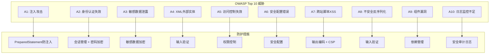

# 酒店管理系统 - 安全性设计详解

## 📋 目录
1. [概述](#概述)
2. [安全威胁分析](#安全威胁分析)
3. [身份认证与授权](#身份认证与授权)
4. [数据安全防护](#数据安全防护)
5. [输入验证与防护](#输入验证与防护)
6. [会话安全管理](#会话安全管理)
7. [日志安全审计](#日志安全审计)
8. [安全配置与部署](#安全配置与部署)

---

## 📖 概述

本酒店管理系统采用多层安全防护机制，从身份认证、授权控制、数据加密、输入验证、会话管理到安全审计，构建了一个全面的安全防护体系，确保系统和数据的安全性。

### 安全设计原则
- **深度防御**：多层安全防护机制
- **最小权限原则**：用户只获得必需的最低权限
- **安全默认**：默认配置采用最安全的选项
- **简单性**：安全机制简单易懂，减少出错概率
- **审计追踪**：所有安全相关操作都有日志记录

---

## 🚨 安全威胁分析

### OWASP Top 10 安全风险应对



### 系统面临的主要威胁

1. **SQL注入攻击**
   - 恶意SQL代码注入
   - 数据库信息泄露
   - 数据被篡改或删除

2. **跨站脚本攻击(XSS)**
   - 恶意脚本注入
   - 用户信息窃取
   - 会话劫持

3. **跨站请求伪造(CSRF)**
   - 伪造用户请求
   - 未授权操作执行

4. **身份认证绕过**
   - 弱密码攻击
   - 会话劫持
   - 认证机制缺陷

5. **敏感信息泄露**
   - 数据库连接信息
   - 用户密码明文
   - 个人隐私数据

---

## 🔐 身份认证与授权

### 1. 密码安全策略

#### 密码加密实现
```java
public class PasswordUtil {
    private static final String ALGORITHM = "MD5";
    private static final String CHARSET = "UTF-8";
    
    /**
     * 对密码进行MD5加密
     * @param password 原始密码
     * @return 加密后的密码
     */
    public static String encrypt(String password) {
        if (password == null || password.isEmpty()) {
            return null;
        }
        
        try {
            MessageDigest md = MessageDigest.getInstance(ALGORITHM);
            byte[] bytes = md.digest(password.getBytes(CHARSET));
            return bytesToHex(bytes);
        } catch (Exception e) {
            throw new RuntimeException("密码加密失败", e);
        }
    }
    
    /**
     * 验证密码
     * @param password 原始密码
     * @param encryptedPassword 加密后的密码
     * @return 密码正确返回true
     */
    public static boolean verify(String password, String encryptedPassword) {
        if (password == null || encryptedPassword == null) {
            return false;
        }
        
        String encrypted = encrypt(password);
        return encrypted.equals(encryptedPassword);
    }
    
    /**
     * 验证密码强度
     * @param password 密码
     * @return 强度等级（1-5，5为最强）
     */
    public static int checkPasswordStrength(String password) {
        if (password == null || password.isEmpty()) {
            return 0;
        }
        
        boolean hasLower = password.matches(".*[a-z].*");
        boolean hasUpper = password.matches(".*[A-Z].*");
        boolean hasDigit = password.matches(".*[0-9].*");
        boolean hasSpecial = password.matches(".*[!@#$%^&*()_+\\-=\\[\\]{};':\"\\\\|,.<>\\/?].*");
        
        int score = 1; // 基础分数
        
        // 长度奖励
        if (password.length() >= 8) score++;
        if (password.length() >= 12) score++;
        
        // 字符类型奖励
        if (hasUpper) score++;
        if (hasDigit) score++;
        if (hasSpecial) score++;
        
        return Math.min(score, 5);
    }
}
```

#### 用户认证流程
```java
public class AuthenticationService {
    private static final Logger logger = LogManager.getLogger(AuthenticationService.class);
    private UserDAO userDAO;
    
    public AuthenticationService() {
        this.userDAO = DAOFactory.getUserDAO();
    }
    
    /**
     * 用户登录验证
     * @param username 用户名
     * @param password 密码
     * @return 登录成功返回用户信息，失败返回null
     */
    public User authenticate(String username, String password) {
        try {
            // 1. 参数验证
            if (Utils.isEmpty(username) || Utils.isEmpty(password)) {
                logger.warn("登录失败：用户名或密码为空");
                return null;
            }
            
            // 2. 查找用户
            User user = userDAO.findByUsername(username.trim());
            if (user == null) {
                logger.warn("登录失败：用户不存在，用户名: {}", username);
                return null;
            }
            
            // 3. 检查用户状态
            if (user.getStatus() != UserStatus.ACTIVE) {
                logger.warn("登录失败：用户状态异常，用户名: {}, 状态: {}", username, user.getStatus());
                return null;
            }
            
            // 4. 验证密码
            if (!PasswordUtil.verify(password, user.getPassword())) {
                logger.warn("登录失败：密码错误，用户名: {}", username);
                // 记录登录失败次数
                recordLoginFailure(user.getUserId());
                return null;
            }
            
            // 5. 检查账户是否被锁定
            if (isAccountLocked(user.getUserId())) {
                logger.warn("登录失败：账户被锁定，用户名: {}", username);
                return null;
            }
            
            // 6. 登录成功
            logger.info("用户登录成功，用户名: {}", username);
            recordLoginSuccess(user.getUserId());
            
            return user;
            
        } catch (Exception e) {
            logger.error("用户认证过程中发生异常", e);
            return null;
        }
    }
    
    /**
     * 记录登录失败
     */
    private void recordLoginFailure(Long userId) {
        // 实现登录失败记录逻辑
        // 可以记录到数据库或缓存中
    }
    
    /**
     * 记录登录成功
     */
    private void recordLoginSuccess(Long userId) {
        // 清除失败记录，更新最后登录时间
    }
    
    /**
     * 检查账户是否被锁定
     */
    private boolean isAccountLocked(Long userId) {
        // 实现账户锁定检查逻辑
        // 例如：连续失败3次后锁定30分钟
        return false;
    }
}
```

### 2. 权限控制系统

#### 基于角色的访问控制(RBAC)
```java
/**
 * 用户角色枚举
 */
public enum UserRole {
    ADMIN("管理员", Arrays.asList(
        Permission.USER_MANAGE, Permission.ROOM_MANAGE, 
        Permission.BOOKING_MANAGE, Permission.CUSTOMER_MANAGE,
        Permission.SYSTEM_CONFIG, Permission.AUDIT_LOG
    )),
    MANAGER("经理", Arrays.asList(
        Permission.ROOM_MANAGE, Permission.BOOKING_MANAGE, 
        Permission.CUSTOMER_MANAGE, Permission.REPORT_VIEW
    )),
    STAFF("员工", Arrays.asList(
        Permission.BOOKING_MANAGE, Permission.CUSTOMER_MANAGE,
        Permission.ROOM_VIEW
    )),
    GUEST("访客", Arrays.asList(
        Permission.BOOKING_VIEW
    ));
    
    private final String displayName;
    private final List<Permission> permissions;
    
    UserRole(String displayName, List<Permission> permissions) {
        this.displayName = displayName;
        this.permissions = permissions;
    }
    
    public boolean hasPermission(Permission permission) {
        return permissions.contains(permission);
    }
}

/**
 * 权限枚举
 */
public enum Permission {
    // 用户管理权限
    USER_MANAGE("用户管理"),
    USER_VIEW("用户查看"),
    
    // 房间管理权限
    ROOM_MANAGE("房间管理"),
    ROOM_VIEW("房间查看"),
    
    // 预订管理权限
    BOOKING_MANAGE("预订管理"),
    BOOKING_VIEW("预订查看"),
    
    // 客户管理权限
    CUSTOMER_MANAGE("客户管理"),
    CUSTOMER_VIEW("客户查看"),
    
    // 系统权限
    SYSTEM_CONFIG("系统配置"),
    AUDIT_LOG("审计日志"),
    REPORT_VIEW("报表查看");
    
    private final String displayName;
    
    Permission(String displayName) {
        this.displayName = displayName;
    }
}
```

#### 权限验证拦截器
```java
/**
 * 权限验证注解
 */
@Target(ElementType.METHOD)
@Retention(RetentionPolicy.RUNTIME)
public @interface RequirePermission {
    Permission value();
}

/**
 * 权限验证服务
 */
public class AuthorizationService {
    private static final Logger logger = LogManager.getLogger(AuthorizationService.class);
    
    /**
     * 检查用户是否有指定权限
     * @param user 用户
     * @param permission 权限
     * @return 有权限返回true
     */
    public boolean hasPermission(User user, Permission permission) {
        if (user == null || permission == null) {
            return false;
        }
        
        UserRole role = user.getRole();
        boolean hasPermission = role.hasPermission(permission);
        
        logger.debug("权限检查 - 用户: {}, 角色: {}, 权限: {}, 结果: {}", 
                    user.getUsername(), role, permission, hasPermission);
        
        return hasPermission;
    }
    
    /**
     * 验证用户权限，无权限时抛出异常
     * @param user 用户
     * @param permission 权限
     * @throws SecurityException 无权限时抛出
     */
    public void checkPermission(User user, Permission permission) throws SecurityException {
        if (!hasPermission(user, permission)) {
            logger.warn("权限验证失败 - 用户: {}, 权限: {}", 
                       user != null ? user.getUsername() : "null", permission);
            throw new SecurityException("权限不足：" + permission.getDisplayName());
        }
    }
}
```

---

## 🛡️ 数据安全防护

### 1. SQL注入防护

#### PreparedStatement使用
```java
public class UserDAOImpl implements UserDAO {
    
    /**
     * 防SQL注入的用户查询
     * @param username 用户名
     * @return 用户信息
     */
    @Override
    public User findByUsername(String username) {
        // 使用参数化查询防止SQL注入
        String sql = "SELECT * FROM users WHERE username = ? AND status = 'ACTIVE'";
        
        try (Connection conn = connectionPool.getConnection();
             PreparedStatement stmt = conn.prepareStatement(sql)) {
            
            // 设置参数，自动转义特殊字符
            stmt.setString(1, username);
            
            try (ResultSet rs = stmt.executeQuery()) {
                if (rs.next()) {
                    return mapResultSetToUser(rs);
                }
            }
            
        } catch (SQLException e) {
            logger.error("查询用户失败", e);
        }
        
        return null;
    }
    
    /**
     * 危险示例：易受SQL注入攻击（已避免）
     * String sql = "SELECT * FROM users WHERE username = '" + username + "'";
     * 攻击示例：username = "admin'; DROP TABLE users; --"
     */
}
```

#### 输入验证与过滤
```java
public class InputValidator {
    
    // SQL注入检测模式
    private static final Pattern SQL_INJECTION_PATTERN = Pattern.compile(
        "(?i)\\b(union|select|insert|update|delete|drop|create|alter|exec|execute|script|javascript|vbscript)\\b"
    );
    
    /**
     * 检测是否包含SQL注入攻击
     * @param input 输入内容
     * @return 包含攻击代码返回true
     */
    public static boolean containsSQLInjection(String input) {
        if (input == null) {
            return false;
        }
        
        return SQL_INJECTION_PATTERN.matcher(input).find();
    }
    
    /**
     * 清理危险字符
     * @param input 输入内容
     * @return 清理后的内容
     */
    public static String sanitizeInput(String input) {
        if (input == null) {
            return null;
        }
        
        // 移除或转义危险字符
        return input.replaceAll("[<>\"'%;()&+]", "")
                   .replaceAll("--", "")
                   .replaceAll("/\\*", "")
                   .replaceAll("\\*/", "");
    }
    
    /**
     * 验证输入安全性
     * @param input 输入内容
     * @param fieldName 字段名称
     * @throws SecurityException 输入不安全时抛出
     */
    public static void validateInput(String input, String fieldName) throws SecurityException {
        if (input != null && containsSQLInjection(input)) {
            throw new SecurityException("输入内容包含危险字符：" + fieldName);
        }
    }
}
```

### 2. 敏感数据保护

#### 数据加密工具
```java
public class EncryptionUtil {
    private static final String AES_ALGORITHM = "AES";
    private static final String AES_TRANSFORMATION = "AES/CBC/PKCS5Padding";
    private static final String SECRET_KEY = "MySecretKey12345"; // 应从配置文件读取
    
    /**
     * AES加密
     * @param plainText 明文
     * @return 加密后的密文
     */
    public static String encrypt(String plainText) {
        try {
            SecretKeySpec keySpec = new SecretKeySpec(SECRET_KEY.getBytes(), AES_ALGORITHM);
            Cipher cipher = Cipher.getInstance(AES_TRANSFORMATION);
            cipher.init(Cipher.ENCRYPT_MODE, keySpec);
            
            byte[] encrypted = cipher.doFinal(plainText.getBytes());
            return Base64.getEncoder().encodeToString(encrypted);
            
        } catch (Exception e) {
            throw new RuntimeException("加密失败", e);
        }
    }
    
    /**
     * AES解密
     * @param cipherText 密文
     * @return 解密后的明文
     */
    public static String decrypt(String cipherText) {
        try {
            SecretKeySpec keySpec = new SecretKeySpec(SECRET_KEY.getBytes(), AES_ALGORITHM);
            Cipher cipher = Cipher.getInstance(AES_TRANSFORMATION);
            cipher.init(Cipher.DECRYPT_MODE, keySpec);
            
            byte[] decrypted = cipher.doFinal(Base64.getDecoder().decode(cipherText));
            return new String(decrypted);
            
        } catch (Exception e) {
            throw new RuntimeException("解密失败", e);
        }
    }
}

/**
 * 敏感数据处理服务
 */
public class SensitiveDataService {
    
    /**
     * 保存敏感客户信息
     * @param customer 客户信息
     */
    public void saveSensitiveCustomerData(Customer customer) {
        try {
            // 加密敏感信息
            if (customer.getIdCard() != null) {
                String encryptedIdCard = EncryptionUtil.encrypt(customer.getIdCard());
                customer.setIdCard(encryptedIdCard);
            }
            
            if (customer.getPhone() != null) {
                String encryptedPhone = EncryptionUtil.encrypt(customer.getPhone());
                customer.setPhone(encryptedPhone);
            }
            
            // 保存到数据库
            CustomerDAO customerDAO = DAOFactory.getCustomerDAO();
            customerDAO.save(customer);
            
        } catch (Exception e) {
            logger.error("保存敏感客户数据失败", e);
            throw new RuntimeException("数据保存失败");
        }
    }
    
    /**
     * 获取敏感客户信息
     * @param customerId 客户ID
     * @return 解密后的客户信息
     */
    public Customer getSensitiveCustomerData(Long customerId) {
        try {
            CustomerDAO customerDAO = DAOFactory.getCustomerDAO();
            Customer customer = customerDAO.findById(customerId);
            
            if (customer != null) {
                // 解密敏感信息
                if (customer.getIdCard() != null) {
                    String decryptedIdCard = EncryptionUtil.decrypt(customer.getIdCard());
                    customer.setIdCard(decryptedIdCard);
                }
                
                if (customer.getPhone() != null) {
                    String decryptedPhone = EncryptionUtil.decrypt(customer.getPhone());
                    customer.setPhone(decryptedPhone);
                }
            }
            
            return customer;
            
        } catch (Exception e) {
            logger.error("获取敏感客户数据失败", e);
            throw new RuntimeException("数据获取失败");
        }
    }
}
```

---

## 🔍 输入验证与防护

### 1. XSS防护

#### 输出编码防护
```java
public class XSSProtectionUtil {
    
    /**
     * HTML编码，防止XSS攻击
     * @param input 输入内容
     * @return 编码后的内容
     */
    public static String encodeHTML(String input) {
        if (input == null) {
            return null;
        }
        
        return input.replace("&", "&amp;")
                   .replace("<", "&lt;")
                   .replace(">", "&gt;")
                   .replace("\"", "&quot;")
                   .replace("'", "&#x27;")
                   .replace("/", "&#x2F;");
    }
    
    /**
     * JavaScript编码
     * @param input 输入内容
     * @return 编码后的内容
     */
    public static String encodeJavaScript(String input) {
        if (input == null) {
            return null;
        }
        
        return input.replace("\\", "\\\\")
                   .replace("\"", "\\\"")
                   .replace("'", "\\'")
                   .replace("\n", "\\n")
                   .replace("\r", "\\r")
                   .replace("\t", "\\t");
    }
    
    /**
     * 移除危险的HTML标签
     * @param input 输入内容
     * @return 清理后的内容
     */
    public static String sanitizeHTML(String input) {
        if (input == null) {
            return null;
        }
        
        // 移除危险标签
        return input.replaceAll("(?i)<script[^>]*>.*?</script>", "")
                   .replaceAll("(?i)<iframe[^>]*>.*?</iframe>", "")
                   .replaceAll("(?i)<object[^>]*>.*?</object>", "")
                   .replaceAll("(?i)<embed[^>]*>.*?</embed>", "")
                   .replaceAll("(?i)javascript:", "")
                   .replaceAll("(?i)vbscript:", "")
                   .replaceAll("(?i)onload=", "")
                   .replaceAll("(?i)onerror=", "")
                   .replaceAll("(?i)onclick=", "");
    }
}
```

#### JSP页面中的XSS防护
```jsp
<%@ page contentType="text/html;charset=UTF-8" language="java" %>
<%@ taglib prefix="c" uri="http://java.sun.com/jsp/jstl/core" %>

<!-- 正确的输出方式：使用c:out标签自动转义 -->
<td><c:out value="${customer.name}" escapeXml="true" /></td>

<!-- 错误的输出方式：直接输出可能导致XSS -->
<!-- <td>${customer.name}</td> -->

<!-- 在JavaScript中输出数据 -->
<script>
    // 正确方式：服务端编码
    var customerName = '<c:out value="${customer.name}" escapeXml="true" />';
    
    // 错误方式：直接输出
    // var customerName = '${customer.name}';
</script>
```

### 2. CSRF防护

#### CSRF Token生成与验证
```java
public class CSRFProtectionService {
    private static final String CSRF_TOKEN_ATTRIBUTE = "csrfToken";
    private static final int TOKEN_LENGTH = 32;
    
    /**
     * 生成CSRF Token
     * @param session HTTP会话
     * @return CSRF Token
     */
    public static String generateCSRFToken(HttpSession session) {
        String token = generateRandomToken(TOKEN_LENGTH);
        session.setAttribute(CSRF_TOKEN_ATTRIBUTE, token);
        return token;
    }
    
    /**
     * 验证CSRF Token
     * @param request HTTP请求
     * @return 验证通过返回true
     */
    public static boolean validateCSRFToken(HttpServletRequest request) {
        HttpSession session = request.getSession(false);
        if (session == null) {
            return false;
        }
        
        String sessionToken = (String) session.getAttribute(CSRF_TOKEN_ATTRIBUTE);
        String requestToken = request.getParameter("csrfToken");
        
        return sessionToken != null && sessionToken.equals(requestToken);
    }
    
    /**
     * 生成随机Token
     */
    private static String generateRandomToken(int length) {
        String chars = "ABCDEFGHIJKLMNOPQRSTUVWXYZabcdefghijklmnopqrstuvwxyz0123456789";
        SecureRandom random = new SecureRandom();
        StringBuilder token = new StringBuilder();
        
        for (int i = 0; i < length; i++) {
            token.append(chars.charAt(random.nextInt(chars.length())));
        }
        
        return token.toString();
    }
}
```

#### CSRF防护过滤器
```java
public class CSRFProtectionFilter implements Filter {
    private static final Logger logger = LogManager.getLogger(CSRFProtectionFilter.class);
    
    // 需要CSRF保护的方法
    private static final Set<String> PROTECTED_METHODS = Set.of("POST", "PUT", "DELETE");
    
    // 排除的URL路径
    private static final Set<String> EXCLUDED_PATHS = Set.of("/login", "/logout");
    
    @Override
    public void doFilter(ServletRequest request, ServletResponse response, FilterChain chain)
            throws IOException, ServletException {
        
        HttpServletRequest httpRequest = (HttpServletRequest) request;
        HttpServletResponse httpResponse = (HttpServletResponse) response;
        
        String method = httpRequest.getMethod();
        String path = httpRequest.getServletPath();
        
        // 检查是否需要CSRF保护
        if (PROTECTED_METHODS.contains(method) && !isExcludedPath(path)) {
            
            if (!CSRFProtectionService.validateCSRFToken(httpRequest)) {
                logger.warn("CSRF Token验证失败 - 路径: {}, 方法: {}", path, method);
                
                httpResponse.setStatus(HttpServletResponse.SC_FORBIDDEN);
                httpResponse.setContentType("application/json;charset=UTF-8");
                httpResponse.getWriter().write("{\"error\":\"CSRF Token验证失败\"}");
                return;
            }
        }
        
        chain.doFilter(request, response);
    }
    
    private boolean isExcludedPath(String path) {
        return EXCLUDED_PATHS.stream().anyMatch(path::startsWith);
    }
}
```

---

## 🔒 会话安全管理

### 1. 会话配置

#### 会话超时设置
```xml
<!-- web.xml中的会话配置 -->
<session-config>
    <!-- 会话超时时间：30分钟 -->
    <session-timeout>30</session-timeout>
    
    <!-- Cookie配置 -->
    <cookie-config>
        <!-- 启用HttpOnly，防止XSS攻击获取Cookie -->
        <http-only>true</http-only>
        <!-- 启用Secure，只在HTTPS下传输Cookie -->
        <secure>true</secure>
        <!-- 设置SameSite属性，防止CSRF攻击 -->
        <same-site>Strict</same-site>
    </cookie-config>
</session-config>
```

#### 会话管理服务
```java
public class SessionManager {
    private static final Logger logger = LogManager.getLogger(SessionManager.class);
    private static final int MAX_INACTIVE_INTERVAL = 30 * 60; // 30分钟
    
    /**
     * 创建安全会话
     * @param request HTTP请求
     * @param user 用户信息
     */
    public static void createSecureSession(HttpServletRequest request, User user) {
        HttpSession session = request.getSession(true);
        
        // 设置会话属性
        session.setAttribute("user", user);
        session.setAttribute("loginTime", new Date());
        session.setAttribute("lastAccessTime", new Date());
        
        // 设置会话超时
        session.setMaxInactiveInterval(MAX_INACTIVE_INTERVAL);
        
        // 生成CSRF Token
        String csrfToken = CSRFProtectionService.generateCSRFToken(session);
        session.setAttribute("csrfToken", csrfToken);
        
        logger.info("用户会话创建成功 - 用户: {}, 会话ID: {}", 
                   user.getUsername(), session.getId());
    }
    
    /**
     * 验证会话有效性
     * @param request HTTP请求
     * @return 会话有效返回用户信息，否则返回null
     */
    public static User validateSession(HttpServletRequest request) {
        HttpSession session = request.getSession(false);
        if (session == null) {
            return null;
        }
        
        User user = (User) session.getAttribute("user");
        if (user == null) {
            return null;
        }
        
        // 更新最后访问时间
        session.setAttribute("lastAccessTime", new Date());
        
        return user;
    }
    
    /**
     * 销毁会话
     * @param request HTTP请求
     */
    public static void destroySession(HttpServletRequest request) {
        HttpSession session = request.getSession(false);
        if (session != null) {
            User user = (User) session.getAttribute("user");
            String username = user != null ? user.getUsername() : "unknown";
            
            session.invalidate();
            
            logger.info("用户会话销毁 - 用户: {}", username);
        }
    }
    
    /**
     * 检查会话是否过期
     * @param session HTTP会话
     * @return 过期返回true
     */
    public static boolean isSessionExpired(HttpSession session) {
        if (session == null) {
            return true;
        }
        
        Date lastAccessTime = (Date) session.getAttribute("lastAccessTime");
        if (lastAccessTime == null) {
            return true;
        }
        
        long inactiveTime = System.currentTimeMillis() - lastAccessTime.getTime();
        return inactiveTime > (MAX_INACTIVE_INTERVAL * 1000);
    }
}
```

### 2. 会话劫持防护

#### 会话固定攻击防护
```java
public class SessionSecurityService {
    private static final Logger logger = LogManager.getLogger(SessionSecurityService.class);
    
    /**
     * 重新生成会话ID，防止会话固定攻击
     * @param request HTTP请求
     */
    public static void regenerateSessionId(HttpServletRequest request) {
        HttpSession oldSession = request.getSession(false);
        if (oldSession != null) {
            
            // 保存旧会话的属性
            Map<String, Object> attributes = new HashMap<>();
            Enumeration<String> attributeNames = oldSession.getAttributeNames();
            while (attributeNames.hasMoreElements()) {
                String name = attributeNames.nextElement();
                attributes.put(name, oldSession.getAttribute(name));
            }
            
            // 使旧会话无效
            oldSession.invalidate();
            
            // 创建新会话
            HttpSession newSession = request.getSession(true);
            
            // 恢复会话属性
            for (Map.Entry<String, Object> entry : attributes.entrySet()) {
                newSession.setAttribute(entry.getKey(), entry.getValue());
            }
            
            logger.info("会话ID重新生成成功");
        }
    }
    
    /**
     * 检查会话来源IP
     * @param request HTTP请求
     * @return IP一致返回true
     */
    public static boolean validateSessionIP(HttpServletRequest request) {
        HttpSession session = request.getSession(false);
        if (session == null) {
            return false;
        }
        
        String sessionIP = (String) session.getAttribute("sessionIP");
        String currentIP = getClientIP(request);
        
        if (sessionIP == null) {
            // 首次访问，记录IP
            session.setAttribute("sessionIP", currentIP);
            return true;
        }
        
        return sessionIP.equals(currentIP);
    }
    
    /**
     * 获取客户端真实IP
     */
    private static String getClientIP(HttpServletRequest request) {
        String ip = request.getHeader("X-Forwarded-For");
        if (ip == null || ip.isEmpty() || "unknown".equalsIgnoreCase(ip)) {
            ip = request.getHeader("Proxy-Client-IP");
        }
        if (ip == null || ip.isEmpty() || "unknown".equalsIgnoreCase(ip)) {
            ip = request.getHeader("WL-Proxy-Client-IP");
        }
        if (ip == null || ip.isEmpty() || "unknown".equalsIgnoreCase(ip)) {
            ip = request.getRemoteAddr();
        }
        return ip;
    }
}
```

---

## 📊 日志安全审计

### 1. 安全审计日志

#### 审计事件定义
```java
public class AuditEvent {
    private String eventType;
    private String username;
    private String ipAddress;
    private String resource;
    private String action;
    private String result;
    private Date timestamp;
    private String details;
    
    // 事件类型常量
    public static final String LOGIN_SUCCESS = "LOGIN_SUCCESS";
    public static final String LOGIN_FAILURE = "LOGIN_FAILURE";
    public static final String LOGOUT = "LOGOUT";
    public static final String ACCESS_DENIED = "ACCESS_DENIED";
    public static final String DATA_ACCESS = "DATA_ACCESS";
    public static final String DATA_MODIFY = "DATA_MODIFY";
    public static final String SECURITY_VIOLATION = "SECURITY_VIOLATION";
    
    // 构造函数和getter/setter方法...
}
```

#### 审计日志服务
```java
public class AuditLogService {
    private static final Logger auditLogger = LogManager.getLogger("AUDIT");
    private static final Logger logger = LogManager.getLogger(AuditLogService.class);
    
    /**
     * 记录审计事件
     * @param event 审计事件
     */
    public static void logAuditEvent(AuditEvent event) {
        try {
            // 记录到审计日志
            auditLogger.info("AUDIT|{}|{}|{}|{}|{}|{}|{}|{}", 
                event.getTimestamp(),
                event.getEventType(),
                event.getUsername(),
                event.getIpAddress(),
                event.getResource(),
                event.getAction(),
                event.getResult(),
                event.getDetails()
            );
            
            // 可选：存储到数据库
            saveAuditEventToDatabase(event);
            
        } catch (Exception e) {
            logger.error("记录审计日志失败", e);
        }
    }
    
    /**
     * 记录登录成功事件
     */
    public static void logLoginSuccess(String username, String ipAddress) {
        AuditEvent event = new AuditEvent();
        event.setEventType(AuditEvent.LOGIN_SUCCESS);
        event.setUsername(username);
        event.setIpAddress(ipAddress);
        event.setResource("SYSTEM");
        event.setAction("LOGIN");
        event.setResult("SUCCESS");
        event.setTimestamp(new Date());
        
        logAuditEvent(event);
    }
    
    /**
     * 记录登录失败事件
     */
    public static void logLoginFailure(String username, String ipAddress, String reason) {
        AuditEvent event = new AuditEvent();
        event.setEventType(AuditEvent.LOGIN_FAILURE);
        event.setUsername(username);
        event.setIpAddress(ipAddress);
        event.setResource("SYSTEM");
        event.setAction("LOGIN");
        event.setResult("FAILURE");
        event.setDetails(reason);
        event.setTimestamp(new Date());
        
        logAuditEvent(event);
    }
    
    /**
     * 记录数据访问事件
     */
    public static void logDataAccess(String username, String ipAddress, 
                                   String resource, String action) {
        AuditEvent event = new AuditEvent();
        event.setEventType(AuditEvent.DATA_ACCESS);
        event.setUsername(username);
        event.setIpAddress(ipAddress);
        event.setResource(resource);
        event.setAction(action);
        event.setResult("SUCCESS");
        event.setTimestamp(new Date());
        
        logAuditEvent(event);
    }
    
    private static void saveAuditEventToDatabase(AuditEvent event) {
        // 实现数据库存储逻辑
    }
}
```

### 2. 安全监控

#### 异常行为检测
```java
public class SecurityMonitor {
    private static final Logger logger = LogManager.getLogger(SecurityMonitor.class);
    
    // 使用缓存记录用户行为
    private static final Map<String, UserBehavior> userBehaviorMap = new ConcurrentHashMap<>();
    
    /**
     * 检测异常登录行为
     * @param username 用户名
     * @param ipAddress IP地址
     * @return 检测到异常返回true
     */
    public static boolean detectAbnormalLogin(String username, String ipAddress) {
        UserBehavior behavior = userBehaviorMap.computeIfAbsent(username, 
            k -> new UserBehavior());
        
        // 检查登录频率
        if (behavior.isLoginTooFrequent()) {
            logger.warn("检测到异常登录频率 - 用户: {}, IP: {}", username, ipAddress);
            AuditLogService.logSecurityViolation(username, ipAddress, "异常登录频率");
            return true;
        }
        
        // 检查IP地址变化
        if (behavior.hasIPChanged(ipAddress)) {
            logger.warn("检测到IP地址异常变化 - 用户: {}, 新IP: {}, 原IP: {}", 
                       username, ipAddress, behavior.getLastIP());
            AuditLogService.logSecurityViolation(username, ipAddress, "IP地址异常变化");
            return true;
        }
        
        // 更新行为记录
        behavior.recordLogin(ipAddress);
        
        return false;
    }
    
    /**
     * 检测数据访问异常
     * @param username 用户名
     * @param resource 资源
     * @return 检测到异常返回true
     */
    public static boolean detectAbnormalDataAccess(String username, String resource) {
        UserBehavior behavior = userBehaviorMap.computeIfAbsent(username, 
            k -> new UserBehavior());
        
        // 检查数据访问频率
        if (behavior.isDataAccessTooFrequent(resource)) {
            logger.warn("检测到异常数据访问频率 - 用户: {}, 资源: {}", username, resource);
            AuditLogService.logSecurityViolation(username, "", "异常数据访问频率");
            return true;
        }
        
        behavior.recordDataAccess(resource);
        return false;
    }
}

/**
 * 用户行为记录
 */
class UserBehavior {
    private String lastIP;
    private Date lastLoginTime;
    private int loginCount;
    private Map<String, Integer> dataAccessCount;
    private Date lastResetTime;
    
    public UserBehavior() {
        this.dataAccessCount = new HashMap<>();
        this.lastResetTime = new Date();
    }
    
    public boolean isLoginTooFrequent() {
        // 1分钟内登录超过5次认为异常
        if (lastLoginTime != null) {
            long timeDiff = System.currentTimeMillis() - lastLoginTime.getTime();
            if (timeDiff < 60000 && loginCount > 5) {
                return true;
            }
        }
        return false;
    }
    
    public boolean hasIPChanged(String currentIP) {
        return lastIP != null && !lastIP.equals(currentIP);
    }
    
    public void recordLogin(String ipAddress) {
        Date now = new Date();
        
        // 重置计数器（每小时重置）
        if (lastResetTime == null || 
            (now.getTime() - lastResetTime.getTime()) > 3600000) {
            loginCount = 0;
            lastResetTime = now;
        }
        
        this.lastIP = ipAddress;
        this.lastLoginTime = now;
        this.loginCount++;
    }
    
    public boolean isDataAccessTooFrequent(String resource) {
        Integer count = dataAccessCount.getOrDefault(resource, 0);
        return count > 100; // 1小时内访问同一资源超过100次
    }
    
    public void recordDataAccess(String resource) {
        Date now = new Date();
        
        // 重置计数器（每小时重置）
        if (lastResetTime == null || 
            (now.getTime() - lastResetTime.getTime()) > 3600000) {
            dataAccessCount.clear();
            lastResetTime = now;
        }
        
        dataAccessCount.merge(resource, 1, Integer::sum);
    }
    
    // getter方法...
}
```

---

## ⚙️ 安全配置与部署

### 1. 应用服务器安全配置

#### Tomcat安全配置
```xml
<!-- server.xml安全配置 -->
<Server port="8005" shutdown="SHUTDOWN">
    <!-- 隐藏服务器版本信息 -->
    <Connector port="8080" protocol="HTTP/1.1"
               connectionTimeout="20000"
               redirectPort="8443"
               server="Apache" />
    
    <!-- HTTPS配置 -->
    <Connector port="8443" protocol="org.apache.coyote.http11.Http11NioProtocol"
               maxThreads="150" SSLEnabled="true" scheme="https" secure="true"
               clientAuth="false" sslProtocol="TLS"
               keystoreFile="conf/keystore.jks"
               keystorePass="password" />
</Server>
```

#### web.xml安全配置
```xml
<web-app>
    <!-- 安全约束 -->
    <security-constraint>
        <web-resource-collection>
            <web-resource-name>Admin Area</web-resource-name>
            <url-pattern>/admin/*</url-pattern>
        </web-resource-collection>
        <auth-constraint>
            <role-name>admin</role-name>
        </auth-constraint>
        <user-data-constraint>
            <transport-guarantee>CONFIDENTIAL</transport-guarantee>
        </user-data-constraint>
    </security-constraint>
    
    <!-- 错误页面配置 -->
    <error-page>
        <error-code>404</error-code>
        <location>/error/404.jsp</location>
    </error-page>
    <error-page>
        <error-code>500</error-code>
        <location>/error/500.jsp</location>
    </error-page>
    
    <!-- HTTP安全头 -->
    <filter>
        <filter-name>SecurityHeadersFilter</filter-name>
        <filter-class>com.hotel.filter.SecurityHeadersFilter</filter-class>
    </filter>
    <filter-mapping>
        <filter-name>SecurityHeadersFilter</filter-name>
        <url-pattern>/*</url-pattern>
    </filter-mapping>
</web-app>
```

### 2. 安全响应头设置

#### 安全头过滤器
```java
public class SecurityHeadersFilter implements Filter {
    
    @Override
    public void doFilter(ServletRequest request, ServletResponse response, FilterChain chain)
            throws IOException, ServletException {
        
        HttpServletResponse httpResponse = (HttpServletResponse) response;
        
        // X-Frame-Options: 防止点击劫持
        httpResponse.setHeader("X-Frame-Options", "DENY");
        
        // X-Content-Type-Options: 防止MIME类型嗅探
        httpResponse.setHeader("X-Content-Type-Options", "nosniff");
        
        // X-XSS-Protection: 启用浏览器XSS过滤
        httpResponse.setHeader("X-XSS-Protection", "1; mode=block");
        
        // Strict-Transport-Security: 强制HTTPS
        httpResponse.setHeader("Strict-Transport-Security", 
                              "max-age=31536000; includeSubDomains");
        
        // Content-Security-Policy: 内容安全策略
        httpResponse.setHeader("Content-Security-Policy", 
                              "default-src 'self'; script-src 'self' 'unsafe-inline' cdn.jsdelivr.net cdnjs.cloudflare.com; style-src 'self' 'unsafe-inline' cdn.jsdelivr.net; font-src 'self' cdnjs.cloudflare.com");
        
        // Referrer-Policy: 引用策略
        httpResponse.setHeader("Referrer-Policy", "strict-origin-when-cross-origin");
        
        // Permissions-Policy: 权限策略
        httpResponse.setHeader("Permissions-Policy", 
                              "camera=(), microphone=(), geolocation=()");
        
        chain.doFilter(request, response);
    }
}
```

### 3. 数据库安全配置

#### 数据库连接安全
```properties
# db.properties安全配置

# 数据库连接（使用最小权限账户）
db.username=hotel_app_user
db.password=encrypted_password

# 连接池安全配置
db.initialSize=5
db.maxActive=20
db.maxWait=60000
db.timeBetweenEvictionRunsMillis=60000
db.minEvictableIdleTimeMillis=300000

# 连接验证
db.validationQuery=SELECT 1
db.testWhileIdle=true
db.testOnBorrow=false
db.testOnReturn=false

# SSL连接
db.useSSL=true
db.requireSSL=true
db.verifyServerCertificate=true
```

---

## 🔚 总结

本酒店管理系统的安全设计涵盖了从输入验证到输出编码、从身份认证到权限控制、从数据加密到安全审计的全方位安全防护：

### 安全防护体系
1. **身份认证安全**：密码加密、会话管理、登录保护
2. **授权控制**：基于角色的权限控制、细粒度权限验证
3. **数据安全**：敏感数据加密、SQL注入防护、XSS防护
4. **会话安全**：安全会话配置、会话劫持防护、CSRF防护
5. **安全审计**：全面的日志记录、异常行为监控、安全事件追踪
6. **部署安全**：安全配置、安全响应头、数据库安全

### 安全设计特点
- **多层防护**：在多个层面设置安全防护措施
- **主动防御**：不仅被动防护，还主动监测异常行为
- **全面覆盖**：涵盖OWASP Top 10的主要安全风险
- **可扩展性**：安全机制设计灵活，便于扩展和维护

通过这些安全措施的实施，系统能够有效抵御常见的网络攻击，保护用户数据和系统资源的安全。