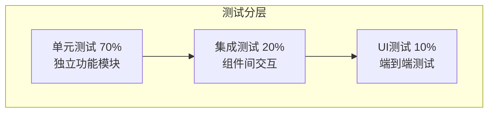
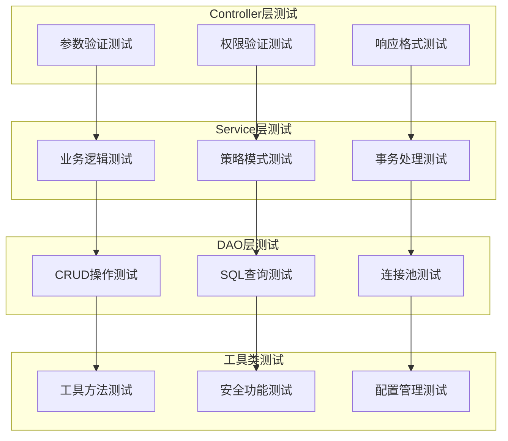
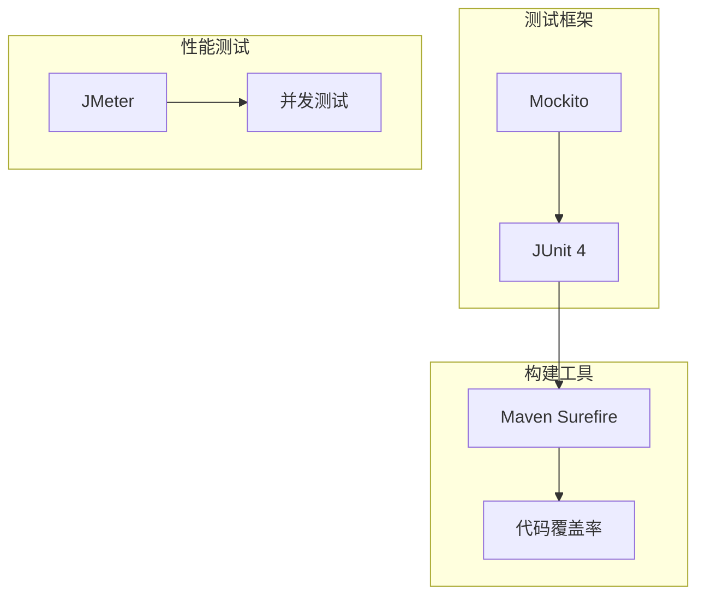

# 酒店管理系统 - 测试详解

## 📋 目录
1. [概述](#概述)
2. [测试架构](#测试架构)
3. [单元测试](#单元测试)
4. [集成测试](#集成测试)
5. [性能测试](#性能测试)
6. [测试工具](#测试工具)

---

## 📖 概述

本酒店管理系统采用全面的测试策略，确保系统质量、稳定性和可靠性。测试覆盖从单元测试到集成测试，从功能验证到性能保障的各个层面。

### 测试目标
- **功能正确性**：确保所有功能按需求正确实现
- **系统稳定性**：验证系统在各种情况下的稳定运行
- **性能保障**：确保系统满足性能要求
- **安全性验证**：验证安全机制的有效性

### 测试金字塔


---

## 🏗️ 测试架构

### 测试分层设计



### 测试基础设施

#### 测试基础类
```java
/**
 * 测试基础类
 */
public abstract class BaseTest {
    protected static final Logger logger = LogManager.getLogger();
    
    @BeforeClass
    public static void setUpClass() {
        System.setProperty("test.mode", "true");
        initTestDatabase();
    }
    
    @Before
    public void setUp() {
        logger.info("开始执行测试方法: {}", getTestMethodName());
    }
    
    @After
    public void tearDown() {
        logger.info("测试方法执行完成: {}", getTestMethodName());
    }
    
    protected String getTestMethodName() {
        StackTraceElement[] stackTrace = Thread.currentThread().getStackTrace();
        for (StackTraceElement element : stackTrace) {
            if (element.getMethodName().startsWith("test")) {
                return element.getMethodName();
            }
        }
        return "unknown";
    }
}
```

---

## 🔬 单元测试

### 1. 工具类测试

#### 密码工具测试
```java
public class PasswordUtilTest extends BaseTest {
    
    @Test
    public void testEncrypt() {
        String password = "test123";
        String encrypted = PasswordUtil.encrypt(password);
        
        assertNotNull("加密结果不应该为null", encrypted);
        assertNotEquals("加密后的密码应该与原密码不同", password, encrypted);
        assertEquals("相同密码加密结果应该相同", encrypted, PasswordUtil.encrypt(password));
        assertEquals("MD5结果应该是32位", 32, encrypted.length());
    }
    
    @Test
    public void testPasswordStrengthCheck() {
        assertEquals("空密码强度应该为0", 0, PasswordUtil.checkPasswordStrength(""));
        assertEquals("纯小写密码强度较低", 1, PasswordUtil.checkPasswordStrength("password"));
        assertEquals("复杂密码强度应该最高", 5, PasswordUtil.checkPasswordStrength("Password123!@#"));
    }
    
    @Test(expected = IllegalArgumentException.class)
    public void testGenerateRandomPasswordInvalidLength() {
        PasswordUtil.generateRandomPassword(3);
    }
}
```

#### 连接池测试
```java
public class ConnectionPoolTest extends BaseTest {
    
    @Test
    public void testSingletonPattern() {
        ConnectionPool pool1 = ConnectionPool.getInstance();
        ConnectionPool pool2 = ConnectionPool.getInstance();
        assertSame("应该返回同一个实例", pool1, pool2);
    }
    
    @Test
    public void testGetConnection() {
        try (Connection connection = ConnectionPool.getInstance().getConnection()) {
            if (connection != null) {
                assertNotNull("连接不应该为null", connection);
                assertFalse("连接应该是打开的", connection.isClosed());
                assertTrue("连接应该有效", connection.isValid(5));
            }
        } catch (SQLException e) {
            logger.warn("数据库连接测试失败: {}", e.getMessage());
        }
    }
}
```

### 2. 业务逻辑测试

#### 预订服务测试
```java
public class BookingServiceTest extends BaseTest {
    
    private BookingService bookingService;
    
    @Before
    public void setUp() {
        super.setUp();
        bookingService = new BookingServiceImpl();
    }
    
    @Test
    public void testCreateBooking() {
        try {
            Booking booking = new Booking();
            booking.setCustomerId(1L);
            booking.setRoomId(1L);
            booking.setCheckInDate(Date.valueOf("2025-12-01"));
            booking.setCheckOutDate(Date.valueOf("2025-12-03"));
            booking.setGuestsCount(2);
            booking.setStatus(Booking.BookingStatus.PENDING);
            
            Integer bookingId = bookingService.createBooking(booking);
            assertNotNull("预订创建应该成功", bookingId);
            
            // 验证预订信息
            Booking created = bookingService.getBookingById(bookingId);
            assertNotNull("应该能查询到创建的预订", created);
            assertEquals("状态应该正确", Booking.BookingStatus.PENDING, created.getStatus());
            
            // 清理测试数据
            bookingService.deleteBooking(bookingId);
            
        } catch (Exception e) {
            logger.error("预订创建测试失败", e);
        }
    }
    
    @Test
    public void testBookingStatusFlow() {
        try {
            Booking booking = createTestBooking();
            if (booking == null) return;
            
            Integer bookingId = booking.getBookingId();
            
            // 确认预订
            boolean confirmResult = bookingService.confirmBooking(bookingId);
            assertTrue("预订确认应该成功", confirmResult);
            
            // 办理入住
            boolean checkInResult = bookingService.checkIn(bookingId);
            assertTrue("办理入住应该成功", checkInResult);
            
            // 办理退房
            boolean checkOutResult = bookingService.checkOut(bookingId);
            assertTrue("办理退房应该成功", checkOutResult);
            
            bookingService.deleteBooking(bookingId);
            
        } catch (Exception e) {
            logger.error("预订状态流转测试失败", e);
        }
    }
}
```

---

## 🔗 集成测试

### 1. 预订冲突检测测试

```java
public class BookingConflictTest extends BaseTest {
    
    @Test
    public void testBookingConflictDetection() {
        // 现有预订：2025-09-26 到 2025-09-28
        LocalDate existingCheckIn = LocalDate.of(2025, 9, 26);
        LocalDate existingCheckOut = LocalDate.of(2025, 9, 28);
        
        // 测试用例：[新入住日期, 新退房日期, 是否应该冲突, 描述]
        Object[][] testCases = {
            {LocalDate.of(2025, 9, 24), LocalDate.of(2025, 9, 26), false, "早于现有预订"},
            {LocalDate.of(2025, 9, 28), LocalDate.of(2025, 9, 30), false, "晚于现有预订"},
            {LocalDate.of(2025, 9, 25), LocalDate.of(2025, 9, 27), true, "跨越入住日期"},
            {LocalDate.of(2025, 9, 27), LocalDate.of(2025, 9, 29), true, "跨越退房日期"},
            {LocalDate.of(2025, 9, 26), LocalDate.of(2025, 9, 28), true, "完全重叠"}
        };
        
        for (Object[] testCase : testCases) {
            LocalDate newCheckIn = (LocalDate) testCase[0];
            LocalDate newCheckOut = (LocalDate) testCase[1];
            boolean expectedConflict = (Boolean) testCase[2];
            String description = (String) testCase[3];
            
            // 使用SQL逻辑检查冲突
            boolean hasConflict = !(existingCheckOut.compareTo(newCheckIn) <= 0 || 
                                   existingCheckIn.compareTo(newCheckOut) >= 0);
            
            assertEquals("冲突检查结果应该正确：" + description, expectedConflict, hasConflict);
        }
    }
}
```

### 2. Controller参数验证测试

```java
public class BookingControllerParameterTest extends BaseTest {
    
    @Test
    public void testParameterValidation() {
        // 测试入住人数验证
        String[] testValues = {"", "0", "-1", "1", "2", "abc", null};
        
        for (String value : testValues) {
            ParameterValidationResult result = validateGuestsCount(value);
            System.out.printf("测试值: '%s' -> %s%n", value, 
                result.isValid() ? "✅ 验证通过" : "❌ " + result.getErrorMessage());
        }
    }
    
    private ParameterValidationResult validateGuestsCount(String value) {
        if (Utils.isEmpty(value)) {
            return new ParameterValidationResult(false, "入住人数不能为空");
        }
        
        try {
            int guestsCount = Integer.parseInt(value.trim());
            if (guestsCount <= 0) {
                return new ParameterValidationResult(false, "入住人数必须为正数");
            }
            return new ParameterValidationResult(true, null);
        } catch (NumberFormatException e) {
            return new ParameterValidationResult(false, "入住人数格式不正确");
        }
    }
    
    private static class ParameterValidationResult {
        private final boolean valid;
        private final String errorMessage;
        
        public ParameterValidationResult(boolean valid, String errorMessage) {
            this.valid = valid;
            this.errorMessage = errorMessage;
        }
        
        public boolean isValid() { return valid; }
        public String getErrorMessage() { return errorMessage; }
    }
}
```

---

## ⚡ 性能测试

### 并发预订测试

```java
public class BookingPerformanceTest extends BaseTest {
    
    @Test
    public void testConcurrentBookingCreation() {
        int threadCount = 20;
        int bookingsPerThread = 10;
        CountDownLatch startLatch = new CountDownLatch(1);
        CountDownLatch completeLatch = new CountDownLatch(threadCount);
        AtomicInteger successCount = new AtomicInteger(0);
        AtomicInteger failureCount = new AtomicInteger(0);
        
        ExecutorService executor = Executors.newFixedThreadPool(threadCount);
        
        for (int i = 0; i < threadCount; i++) {
            final int threadId = i;
            executor.submit(() -> {
                try {
                    startLatch.await();
                    
                    for (int j = 0; j < bookingsPerThread; j++) {
                        try {
                            Booking booking = createTestBooking(threadId, j);
                            Integer bookingId = bookingService.createBooking(booking);
                            
                            if (bookingId != null) {
                                successCount.incrementAndGet();
                                bookingService.deleteBooking(bookingId);
                            } else {
                                failureCount.incrementAndGet();
                            }
                        } catch (Exception e) {
                            failureCount.incrementAndGet();
                        }
                    }
                } catch (InterruptedException e) {
                    Thread.currentThread().interrupt();
                } finally {
                    completeLatch.countDown();
                }
            });
        }
        
        long startTime = System.currentTimeMillis();
        startLatch.countDown();
        
        try {
            completeLatch.await(60, TimeUnit.SECONDS);
            long duration = System.currentTimeMillis() - startTime;
            
            int totalOperations = threadCount * bookingsPerThread;
            double tps = (double) totalOperations / (duration / 1000.0);
            
            System.out.println("并发测试结果:");
            System.out.println("- 总操作数: " + totalOperations);
            System.out.println("- 成功数: " + successCount.get());
            System.out.println("- 失败数: " + failureCount.get());
            System.out.println("- TPS: " + String.format("%.2f", tps));
            
            assertTrue("成功率应该大于80%", 
                      (double) successCount.get() / totalOperations > 0.8);
            
        } catch (InterruptedException e) {
            Thread.currentThread().interrupt();
        } finally {
            executor.shutdown();
        }
    }
}
```

---

## 🛠️ 测试工具

### 技术栈



### Maven配置

```xml
<dependencies>
    <dependency>
        <groupId>junit</groupId>
        <artifactId>junit</artifactId>
        <version>4.13.2</version>
        <scope>test</scope>
    </dependency>
    
    <dependency>
        <groupId>org.mockito</groupId>
        <artifactId>mockito-core</artifactId>
        <version>3.12.4</version>
        <scope>test</scope>
    </dependency>
</dependencies>

<build>
    <plugins>
        <plugin>
            <groupId>org.apache.maven.plugins</groupId>
            <artifactId>maven-surefire-plugin</artifactId>
            <version>3.0.0-M7</version>
            <configuration>
                <includes>
                    <include>**/*Test.java</include>
                </includes>
            </configuration>
        </plugin>
        
        <plugin>
            <groupId>org.jacoco</groupId>
            <artifactId>jacoco-maven-plugin</artifactId>
            <version>0.8.7</version>
            <executions>
                <execution>
                    <goals>
                        <goal>prepare-agent</goal>
                    </goals>
                </execution>
                <execution>
                    <id>report</id>
                    <phase>test</phase>
                    <goals>
                        <goal>report</goal>
                    </goals>
                </execution>
            </executions>
        </plugin>
    </plugins>
</build>
```

### 测试执行命令

```bash
# 运行所有测试
mvn test

# 运行特定测试类
mvn test -Dtest=BookingServiceTest

# 生成代码覆盖率报告
mvn clean test jacoco:report

# 运行性能测试
mvn test -Dtest=*PerformanceTest
```

---

## 📊 测试覆盖率

### 覆盖率目标
- **代码行覆盖率**: ≥ 80%
- **分支覆盖率**: ≥ 70%
- **方法覆盖率**: ≥ 85%

### 关键测试场景
1. **正常业务流程**: 预订创建、确认、入住、退房
2. **异常处理**: 参数验证、数据库异常、业务规则违反
3. **边界条件**: 空值处理、数据范围验证、并发冲突
4. **安全测试**: 权限验证、输入过滤、SQL注入防护
5. **性能测试**: 并发处理、响应时间、资源使用

---

## 🔚 总结

本酒店管理系统的测试体系确保了：

### 测试完整性
- **单元测试**：覆盖所有工具类和核心业务逻辑
- **集成测试**：验证组件间的协作和数据一致性
- **性能测试**：保证系统在高负载下的稳定性

### 质量保障
- **自动化测试**：通过Maven构建集成，确保每次构建都执行测试
- **代码覆盖率**：通过JaCoCo监控测试覆盖率，确保测试充分性
- **持续集成**：测试结果及时反馈，快速发现和修复问题

### 最佳实践
- **测试独立性**：每个测试都能独立运行，不依赖其他测试
- **测试可重复性**：相同的测试在任何环境下都能得到一致结果
- **测试可维护性**：清晰的测试结构和命名，便于理解和维护

通过全面的测试策略，系统在功能正确性、稳定性和性能方面都得到了有效保障。