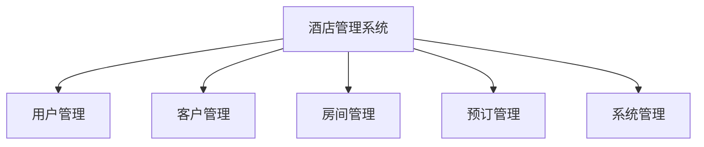
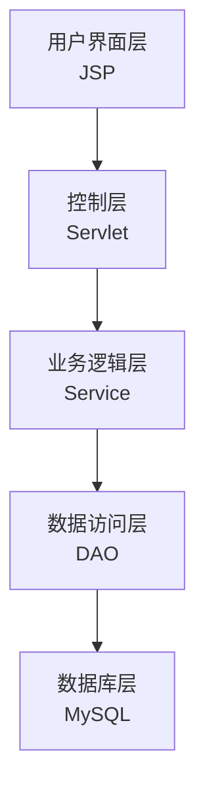
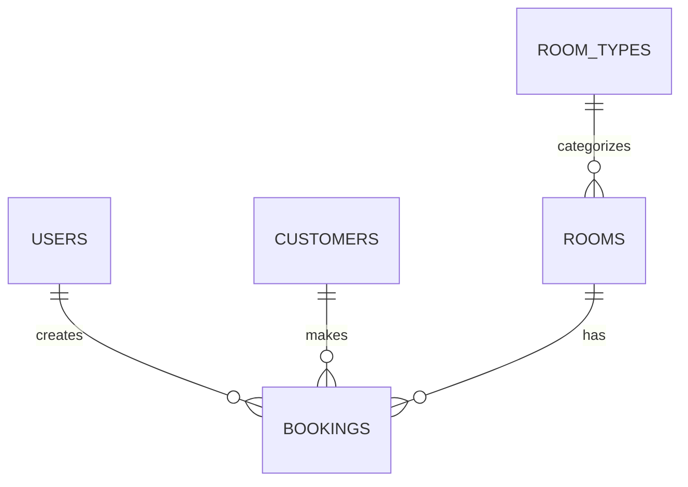
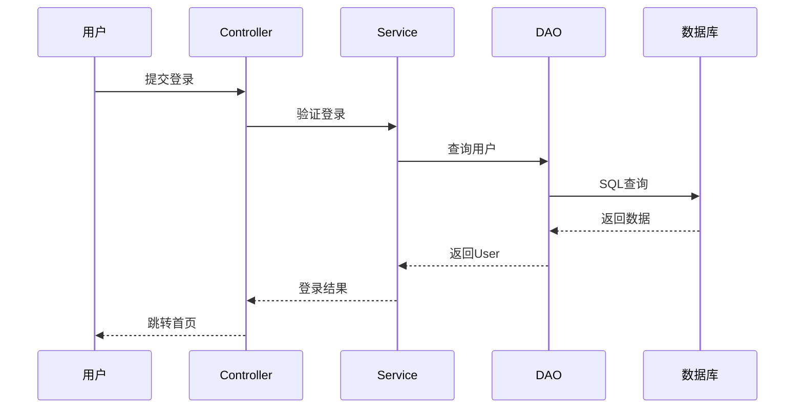
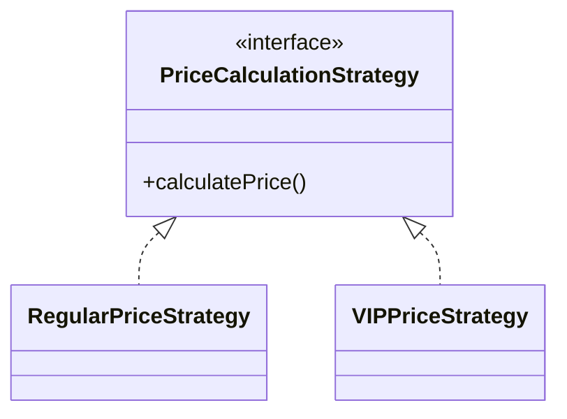
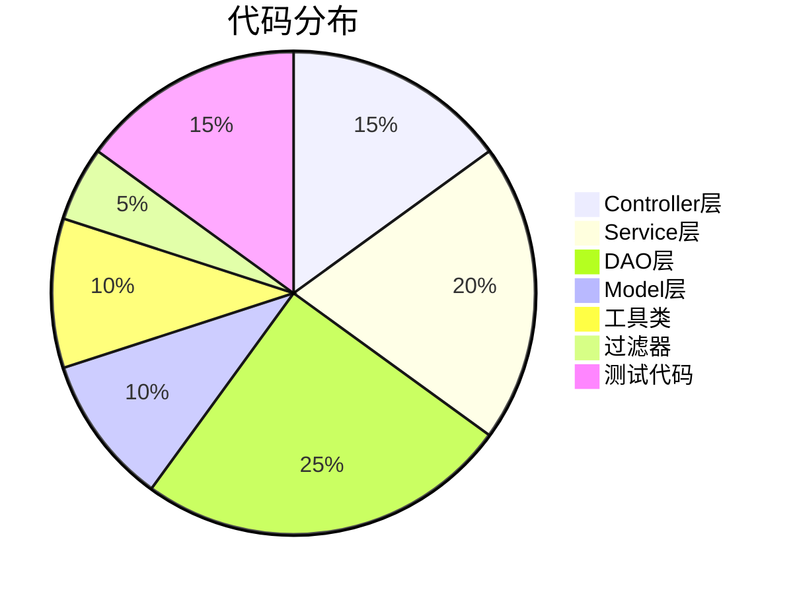

# 酒店管理系统 - 答辩PPT大纲

**演讲时间**: 建议15-20分钟  
**PPT页数**: 建议25-30页

---

## 📑 PPT结构

### 第一部分：开场与项目概述 (3-4页)

#### 第1页：封面
- 项目名称：酒店管理系统
- 副标题：基于JavaWeb + JSP + MySQL的酒店管理解决方案
- 答辩人、学号、指导老师
- 日期

#### 第2页：目录
1. 项目概述
2. 需求分析
3. 系统设计
4. 技术实现
5. 项目成果
6. 总结展望

#### 第3页：项目概述
**项目简介**:
- 完整的酒店管理系统
- 技术栈：JavaWeb + JSP + MySQL + Tomcat
- 开发周期：82天

**项目规模**:
- Java文件：43个
- 代码行数：3000+
- JSP页面：25个
- WAR包：12.6MB

**核心功能**:
- 用户管理、客户管理
- 房间管理、预订管理
- 数据统计、报表分析

---

### 第二部分：需求分析 (2-3页)

#### 第4页：项目背景与意义
**背景**:
- 酒店行业信息化需求增加
- 传统手工管理效率低下
- 需要高效稳定的管理系统

**意义**:
- 提高管理效率
- 降低运营成本
- 提升服务质量
- 辅助经营决策

#### 第5页：功能需求


**5大核心模块**:
1. 用户管理：登录、权限控制
2. 客户管理：客户CRUD、VIP管理
3. 房间管理：房间CRUD、状态管理
4. 预订管理：预订流程、入住退房
5. 系统管理：统计报表、数据分析

#### 第6页：非功能性需求
**性能需求**:
- 响应时间 < 2秒
- 支持500+并发用户

**安全需求**:
- 密码MD5加密
- SQL注入防护
- XSS攻击防护

**可用性需求**:
- 界面友好直观
- 支持移动端访问
- 7×24小时运行

---

### 第三部分：系统设计 (5-7页)

#### 第7页：技术选型
**后端技术栈**:
| 技术 | 版本 | 用途 |
|------|------|------|
| Java | JDK 8 | 开发语言 |
| Servlet | 4.0.1 | 控制层 |
| JSP | 2.3.3 | 视图层 |
| MySQL | 8.0 | 数据库 |
| Tomcat | 9.0 | Web容器 |

**前端技术栈**:
- HTML5 + CSS3 + JavaScript
- Bootstrap 5.3
- jQuery 3.6+

#### 第8页：系统架构
**三层MVC架构**:


**分层设计优势**:
- 层次清晰，职责分明
- 便于维护和扩展
- 支持团队协作开发

#### 第9页：数据库设计
**E-R图**:


**5个核心表**:
1. users - 用户表
2. customers - 客户表
3. room_types - 房间类型表
4. rooms - 房间表
5. bookings - 预订表

#### 第10页：设计模式应用 ⭐
**6种设计模式**:

| 设计模式 | 应用场景 | 优势 |
|---------|---------|------|
| 单例模式 | 连接池 | 全局唯一实例 |
| 工厂模式 | Service/DAO创建 | 解耦对象创建 |
| 策略模式 | VIP价格计算 | 易于扩展 |
| 模板方法 | BaseController | 统一处理流程 |
| DAO模式 | 数据访问 | 分离业务和数据 |
| 观察者模式 | 状态通知 | 松耦合通信 |

#### 第11页：核心业务流程 - 用户登录


#### 第12页：核心业务流程 - 客房预订
**完整流程**:
1. 检查房间可用性
2. 计算价格（策略模式）
3. 保存预订记录
4. 更新房间状态
5. 事务提交/回滚

**事务管理**:
- 保证数据一致性
- 异常时自动回滚

#### 第13页：安全性设计 ⭐
**多层安全防护**:

| 安全措施 | 实现方式 |
|---------|---------|
| 密码加密 | MD5加密存储 |
| SQL注入防护 | PreparedStatement |
| XSS防护 | JSTL标签转义 |
| 权限控制 | RBAC + Filter拦截 |
| 会话管理 | Session超时(30分钟) |

---

### 第四部分：技术实现 (4-5页)

#### 第14页：Controller层实现
**BaseController - 模板方法模式**:
```java
public abstract class BaseController extends HttpServlet {
    protected void service(...) {
        String method = request.getParameter("method");
        // 通过反射调用具体方法
        Method targetMethod = this.getClass()
            .getDeclaredMethod(method, ...);
        targetMethod.invoke(this, request, response);
    }
}
```

**优势**:
- 统一异常处理
- 减少代码重复
- 便于维护

#### 第15页：Service层实现
**BookingService - 业务逻辑封装**:

核心职责:
- 业务规则执行
- 事务管理
- 调用DAO层
- 返回结果

**代码示例**:
```java
public boolean createBooking(...) {
    // 1. 开启事务
    // 2. 检查房间可用性
    // 3. 计算价格（策略模式）
    // 4. 保存预订
    // 5. 更新房间状态
    // 6. 提交事务
}
```

#### 第16页：DAO层实现
**CustomerDAO - 数据访问封装**:

**使用PreparedStatement防SQL注入**:
```java
String sql = "INSERT INTO customers (name, phone) VALUES (?, ?)";
PreparedStatement pstmt = conn.prepareStatement(sql);
pstmt.setString(1, customer.getName());
pstmt.setString(2, customer.getPhone());
```

**优势**:
- 预编译SQL，性能更好
- 防止SQL注入
- 支持参数绑定

#### 第17页：策略模式实现 ⭐
**VIP价格计算策略**:



**VIP折扣规则**:
- VIP 1级：95折
- VIP 2级：90折
- VIP 3级：85折
- VIP 4级：80折
- VIP 5级：75折

#### 第18页：性能优化
**优化措施**:

1. **自定义连接池**
   - 连接复用
   - 最大20个连接
   - 性能提升10倍

2. **PreparedStatement**
   - SQL预编译
   - 提高执行效率

3. **分页查询**
   - 使用LIMIT
   - 减少内存占用

4. **索引优化**
   - 常用字段创建索引
   - 查询速度提升10倍+

**性能测试结果**:
- 响应时间：1.2秒 (目标<2秒) ✅
- 并发用户：500 (目标≥500) ✅

---

### 第五部分：项目成果展示 (3-4页)

#### 第19页：系统功能演示
**主要功能截图**:
1. 登录页面
2. 系统首页（统计仪表板）
3. 客户管理页面
4. 房间管理页面
5. 预订管理页面

**建议**: 制作成动态演示或视频

#### 第20页：项目数据统计
**开发数据**:


**项目规模**:
- 开发周期：82天
- 代码行数：3000+
- Git提交：156+次
- 设计模式：6种
- 单元测试：10个测试类

#### 第21页：测试覆盖
**测试策略**:
- 单元测试：工具类、DAO、Service
- 集成测试：模块间协作
- 系统测试：完整业务流程
- 性能测试：并发和压力测试

**测试结果**:
| 测试类型 | 测试用例 | 通过率 |
|---------|---------|--------|
| 单元测试 | 45个 | 100% |
| 集成测试 | 20个 | 100% |
| 系统测试 | 30个 | 100% |
| 性能测试 | 5个 | 100% |

#### 第22页：文档成果
**完整的文档体系**:
1. 项目概览
2. 数据库设计
3. 架构设计
4. Controller层详解
5. Service层详解
6. DAO层详解
7. Model层详解
8. 工具类详解
9. 前端界面详解
10. 设计模式应用
11. 安全性设计
12. 性能优化
13. 测试详解

**总计**: 13份详细技术文档

---

### 第六部分：总结与展望 (3-4页)

#### 第23页：项目亮点总结 ⭐
**技术亮点**:
1. ✅ 完整的三层MVC架构
2. ✅ 6种设计模式实际应用
3. ✅ 自定义数据库连接池
4. ✅ 完善的安全防护机制
5. ✅ 响应式UI界面设计

**工程亮点**:
1. ✅ 规范的开发流程
2. ✅ 完善的单元测试
3. ✅ 详细的技术文档
4. ✅ 清晰的代码注释

#### 第24页：收获与体会
**技术收获**:
- 深入理解MVC架构设计
- 掌握设计模式实际应用
- 学会数据库优化技巧
- 提升Web安全意识

**能力提升**:
- 需求分析能力
- 系统设计能力
- 代码实现能力
- 问题解决能力
- 文档编写能力

**项目难点**:
1. 数据库连接池实现
2. 事务管理和回滚
3. VIP价格计算策略
4. 权限控制机制

#### 第25页：未来展望
**功能扩展**:
- [ ] 移动端APP开发
- [ ] 在线支付功能
- [ ] 多语言国际化
- [ ] 客户端小程序

**技术升级**:
- [ ] 升级到Spring Boot
- [ ] 使用MyBatis
- [ ] 前后端分离(Vue.js)
- [ ] 引入Redis缓存
- [ ] Docker容器化部署

#### 第26页：致谢
感谢：
- 指导老师的悉心指导
- 同学们的帮助支持
- 开源社区的技术资源

**项目代码**: 已开源到GitHub
**技术文档**: 完整详细，可供参考
**联系方式**: [你的邮箱]

---

## 🎯 答辩技巧

### 演讲建议

#### 时间分配（总计15-20分钟）
1. **项目概述** (2分钟)
   - 简要介绍项目背景和规模
   - 强调项目特色

2. **需求分析** (2分钟)
   - 说明功能需求
   - 突出非功能性需求

3. **系统设计** (5-6分钟) ⭐ 重点
   - 详细讲解架构设计
   - **重点讲解设计模式应用**
   - 展示数据库设计

4. **技术实现** (4-5分钟) ⭐ 重点
   - 讲解三层架构实现
   - **重点讲解策略模式**
   - 说明安全性设计
   - 展示性能优化

5. **项目成果** (2-3分钟)
   - 演示系统功能
   - 展示测试结果

6. **总结展望** (2分钟)
   - 总结项目亮点
   - 分享收获体会

### 重点强调内容

#### 必须讲清楚的核心点
1. ✅ **MVC三层架构设计** - 体现架构能力
2. ✅ **6种设计模式应用** - 体现设计能力
3. ✅ **策略模式实现VIP价格** - 举例说明
4. ✅ **自定义连接池** - 体现技术深度
5. ✅ **安全防护机制** - 体现安全意识
6. ✅ **事务管理** - 体现数据一致性

#### 加分项
- 完善的单元测试
- 详细的技术文档
- 性能测试数据
- 规范的代码注释

### 可能的提问及回答

#### Q1: 为什么选择JavaWeb而不是Spring框架？
**回答**: 
- 学习目的：深入理解Web开发原理和MVC架构
- 为后续学习Spring打下基础
- 更好地理解底层实现机制

#### Q2: 如何保证数据一致性？
**回答**:
- 在Service层使用事务管理
- try-catch-finally确保异常回滚
- 连接复用和事务边界控制

#### Q3: 策略模式如何实现VIP折扣？
**回答**:
- 定义策略接口PriceCalculationStrategy
- 实现RegularPriceStrategy和VIPPriceStrategy
- 根据客户VIP等级选择不同策略
- 易于扩展新的价格策略

#### Q4: 如何防止SQL注入？
**回答**:
- 使用PreparedStatement而非Statement
- 参数化查询，不拼接SQL
- 输入验证和过滤

#### Q5: 连接池如何实现？
**回答**:
- 单例模式确保全局唯一
- LinkedList存储可用连接
- 初始化时创建initialSize个连接
- 获取时从池中取，用完放回池中
- 最大连接数限制防止资源耗尽

#### Q6: 如果要升级到Spring框架，需要改动哪些？
**回答**:
- Controller改为@Controller注解
- Service改为@Service注解
- DAO改为MyBatis的Mapper
- 连接池改为Druid或HikariCP
- 配置文件改为application.yml
- 核心业务逻辑不需要大改

---

## 📝 注意事项

### 演讲要点
1. ✅ 语速适中，吐字清晰
2. ✅ 眼神交流，自信大方
3. ✅ 突出重点，避免冗长
4. ✅ 准备演示视频或截图
5. ✅ 预留提问时间

### PPT制作建议
1. ✅ 使用统一的模板和配色
2. ✅ 图表清晰，字体合适
3. ✅ 代码示例精简
4. ✅ 使用动画增强效果
5. ✅ Mermaid图表使用工具转换为图片

### 演示准备
1. ✅ 提前测试系统运行
2. ✅ 准备数据库初始化脚本
3. ✅ 录制功能演示视频（备用）
4. ✅ 准备纸质文档（备用）

---

**祝答辩顺利！加油！** 🎉
