# 酒店管理系统 - 系统图示文档

本文档包含了酒店管理系统的各种系统图示，包括ER图、UML类图、时序图、架构图等。

---

## 目录

1. [系统架构图](#1-系统架构图)
2. [数据库ER图](#2-数据库er图)
3. [核心实体类图](#3-核心实体类图)
4. [服务层类图](#4-服务层类图)
5. [DAO层类图](#5-dao层类图)
6. [控制器层类图](#6-控制器层类图)
7. [业务流程图](#7-业务流程图)
8. [时序图](#8-时序图)
9. [状态图](#9-状态图)

---

## 1. 系统架构图

### 1.1 整体架构

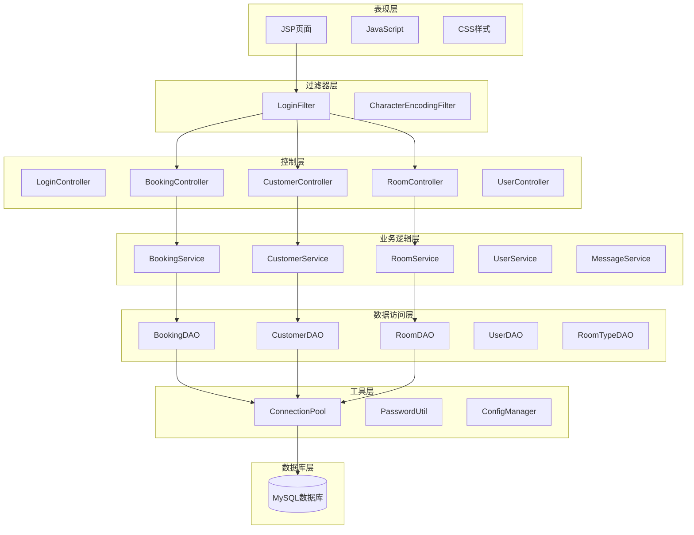
```mermaid
graph TB
    subgraph 表现层
        A[JSP页面]
        B[JavaScript]
        C[CSS样式]
    end
    
    subgraph 控制层
        D[LoginController]
        E[BookingController]
        F[CustomerController]
        G[RoomController]
        H[UserController]
    end
    
    subgraph 过滤器层
        I[LoginFilter]
        J[CharacterEncodingFilter]
    end
    
    subgraph 业务逻辑层
        K[BookingService]
        L[CustomerService]
        M[RoomService]
        N[UserService]
        O[MessageService]
    end
    
    subgraph 数据访问层
        P[BookingDAO]
        Q[CustomerDAO]
        R[RoomDAO]
        S[UserDAO]
        T[RoomTypeDAO]
    end
    
    subgraph 工具层
        U[ConnectionPool]
        V[PasswordUtil]
        W[ConfigManager]
    end
    
    subgraph 数据库层
        Y[(MySQL数据库)]
    end
    
    A --> I
    I --> E
    I --> F
    I --> G
    
    E --> K
    F --> L
    G --> M
    
    K --> P
    L --> Q
    M --> R
    
    P --> U
    Q --> U
    R --> U
    
    U --> Y
```

### 1.2 MVC架构分层

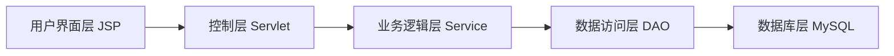
```mermaid
graph LR
    A[用户界面层 JSP] --> B[控制层 Servlet]
    B --> C[业务逻辑层 Service]
    C --> D[数据访问层 DAO]
    D --> E[数据库层 MySQL]
```

---

## 2. 数据库ER图

### 2.1 完整ER图

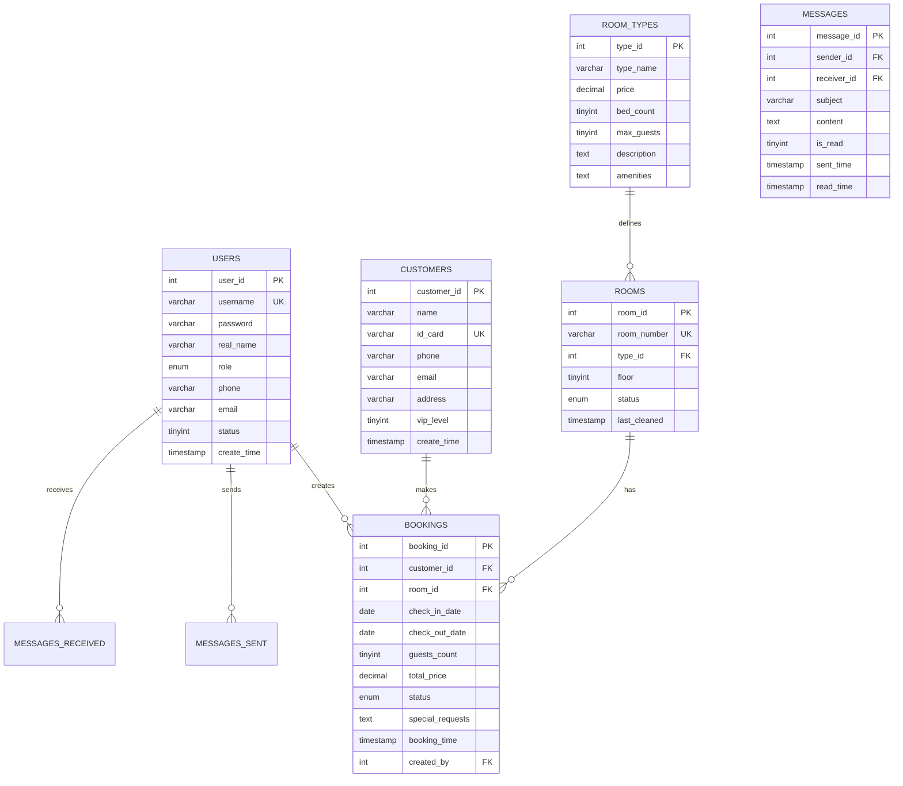
```mermaid
erDiagram
    USERS ||--o{ BOOKINGS : creates
    CUSTOMERS ||--o{ BOOKINGS : makes
    ROOMS ||--o{ BOOKINGS : has
    ROOM_TYPES ||--o{ ROOMS : defines
    USERS ||--o{ MESSAGES_SENT : sends
    USERS ||--o{ MESSAGES_RECEIVED : receives
    
    USERS {
        int user_id PK
        varchar username UK
        varchar password
        varchar real_name
        enum role
        varchar phone
        varchar email
        tinyint status
        timestamp create_time
    }
    
    CUSTOMERS {
        int customer_id PK
        varchar name
        varchar id_card UK
        varchar phone
        varchar email
        varchar address
        tinyint vip_level
        timestamp create_time
    }
    
    ROOM_TYPES {
        int type_id PK
        varchar type_name
        decimal price
        tinyint bed_count
        tinyint max_guests
        text description
        text amenities
    }
    
    ROOMS {
        int room_id PK
        varchar room_number UK
        int type_id FK
        tinyint floor
        enum status
        timestamp last_cleaned
    }
    
    BOOKINGS {
        int booking_id PK
        int customer_id FK
        int room_id FK
        date check_in_date
        date check_out_date
        tinyint guests_count
        decimal total_price
        enum status
        text special_requests
        timestamp booking_time
        int created_by FK
    }
    
    MESSAGES {
        int message_id PK
        int sender_id FK
        int receiver_id FK
        varchar subject
        text content
        tinyint is_read
        timestamp sent_time
        timestamp read_time
    }
```

---

## 3. 核心实体类图

### 3.1 实体类关系

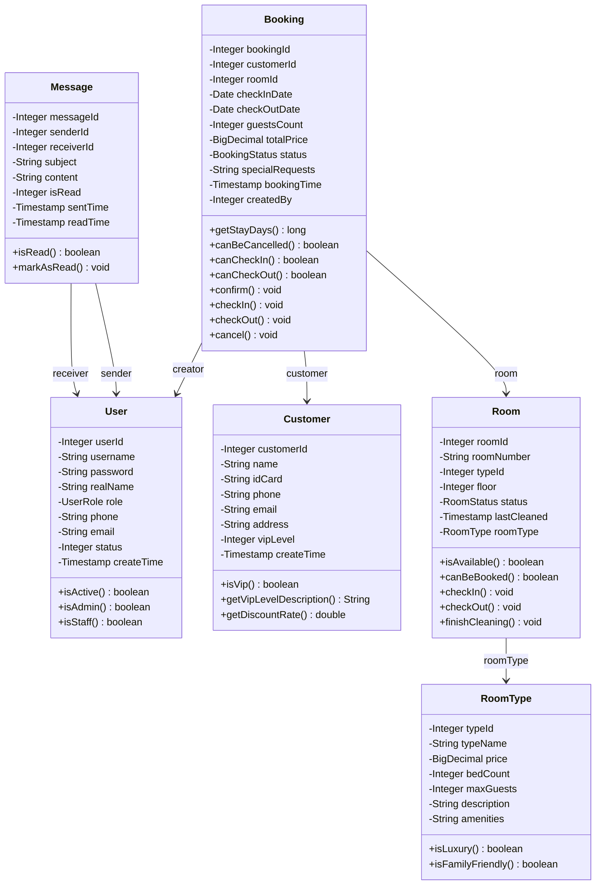
```mermaid
classDiagram
    class User {
        -Integer userId
        -String username
        -String password
        -String realName
        -UserRole role
        -String phone
        -String email
        -Integer status
        -Timestamp createTime
        +isActive() boolean
        +isAdmin() boolean
        +isStaff() boolean
    }
    
    class Customer {
        -Integer customerId
        -String name
        -String idCard
        -String phone
        -String email
        -String address
        -Integer vipLevel
        -Timestamp createTime
        +isVip() boolean
        +getVipLevelDescription() String
        +getDiscountRate() double
    }
    
    class Room {
        -Integer roomId
        -String roomNumber
        -Integer typeId
        -Integer floor
        -RoomStatus status
        -Timestamp lastCleaned
        -RoomType roomType
        +isAvailable() boolean
        +canBeBooked() boolean
        +checkIn() void
        +checkOut() void
        +finishCleaning() void
    }
    
    class RoomType {
        -Integer typeId
        -String typeName
        -BigDecimal price
        -Integer bedCount
        -Integer maxGuests
        -String description
        -String amenities
        +isLuxury() boolean
        +isFamilyFriendly() boolean
    }
    
    class Booking {
        -Integer bookingId
        -Integer customerId
        -Integer roomId
        -Date checkInDate
        -Date checkOutDate
        -Integer guestsCount
        -BigDecimal totalPrice
        -BookingStatus status
        -String specialRequests
        -Timestamp bookingTime
        -Integer createdBy
        +getStayDays() long
        +canBeCancelled() boolean
        +canCheckIn() boolean
        +canCheckOut() boolean
        +confirm() void
        +checkIn() void
        +checkOut() void
        +cancel() void
    }
    
    class Message {
        -Integer messageId
        -Integer senderId
        -Integer receiverId
        -String subject
        -String content
        -Integer isRead
        -Timestamp sentTime
        -Timestamp readTime
        +isRead() boolean
        +markAsRead() void
    }
    
    Booking --> Customer : customer
    Booking --> Room : room
    Booking --> User : creator
    Room --> RoomType : roomType
    Message --> User : sender
    Message --> User : receiver
```

### 3.2 枚举类图

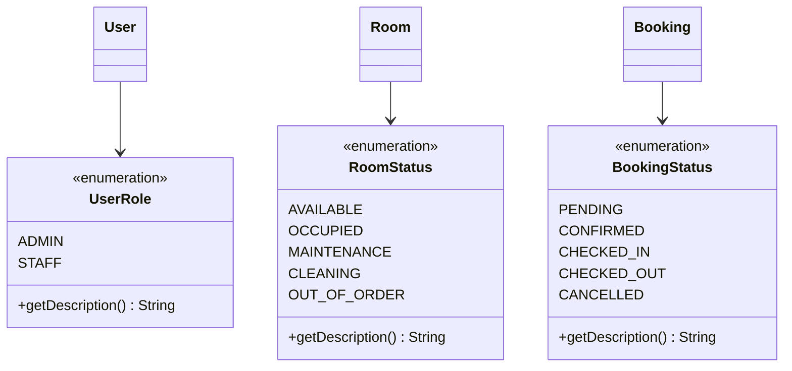
```mermaid
classDiagram
    class UserRole {
        <<enumeration>>
        ADMIN
        STAFF
        +getDescription() String
    }
    
    class RoomStatus {
        <<enumeration>>
        AVAILABLE
        OCCUPIED
        MAINTENANCE
        CLEANING
        OUT_OF_ORDER
        +getDescription() String
    }
    
    class BookingStatus {
        <<enumeration>>
        PENDING
        CONFIRMED
        CHECKED_IN
        CHECKED_OUT
        CANCELLED
        +getDescription() String
    }
    
    User --> UserRole
    Room --> RoomStatus
    Booking --> BookingStatus
```

---

## 4. 服务层类图

### 4.1 服务接口与实现

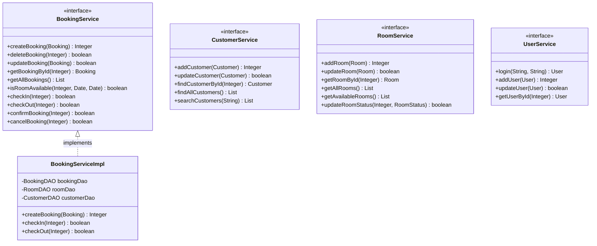
```mermaid
classDiagram
    class BookingService {
        <<interface>>
        +createBooking(Booking) Integer
        +deleteBooking(Integer) boolean
        +updateBooking(Booking) boolean
        +getBookingById(Integer) Booking
        +getAllBookings() List
        +isRoomAvailable(Integer, Date, Date) boolean
        +checkIn(Integer) boolean
        +checkOut(Integer) boolean
        +confirmBooking(Integer) boolean
        +cancelBooking(Integer) boolean
    }
    
    class BookingServiceImpl {
        -BookingDAO bookingDao
        -RoomDAO roomDao
        -CustomerDAO customerDao
        +createBooking(Booking) Integer
        +checkIn(Integer) boolean
        +checkOut(Integer) boolean
    }
    
    class CustomerService {
        <<interface>>
        +addCustomer(Customer) Integer
        +updateCustomer(Customer) boolean
        +findCustomerById(Integer) Customer
        +findAllCustomers() List
        +searchCustomers(String) List
    }
    
    class RoomService {
        <<interface>>
        +addRoom(Room) Integer
        +updateRoom(Room) boolean
        +getRoomById(Integer) Room
        +getAllRooms() List
        +getAvailableRooms() List
        +updateRoomStatus(Integer, RoomStatus) boolean
    }
    
    class UserService {
        <<interface>>
        +login(String, String) User
        +addUser(User) Integer
        +updateUser(User) boolean
        +getUserById(Integer) User
    }
    
    BookingService <|.. BookingServiceImpl : implements
```

### 4.2 策略模式 - 价格计算

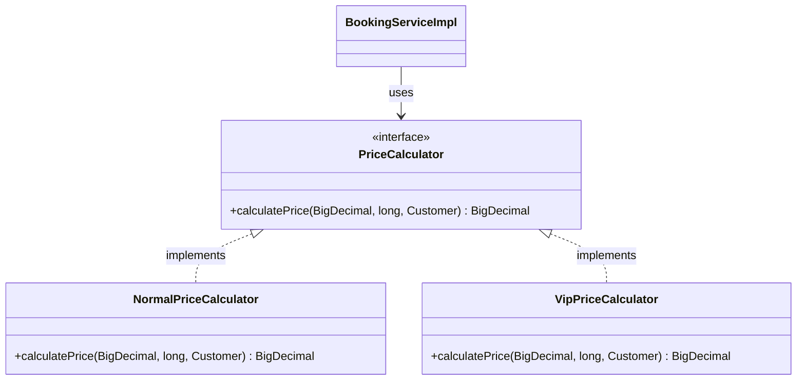
```mermaid
classDiagram
    class PriceCalculator {
        <<interface>>
        +calculatePrice(BigDecimal, long, Customer) BigDecimal
    }
    
    class NormalPriceCalculator {
        +calculatePrice(BigDecimal, long, Customer) BigDecimal
    }
    
    class VipPriceCalculator {
        +calculatePrice(BigDecimal, long, Customer) BigDecimal
    }
    
    PriceCalculator <|.. NormalPriceCalculator : implements
    PriceCalculator <|.. VipPriceCalculator : implements
    BookingServiceImpl --> PriceCalculator : uses
```

---

## 5. DAO层类图

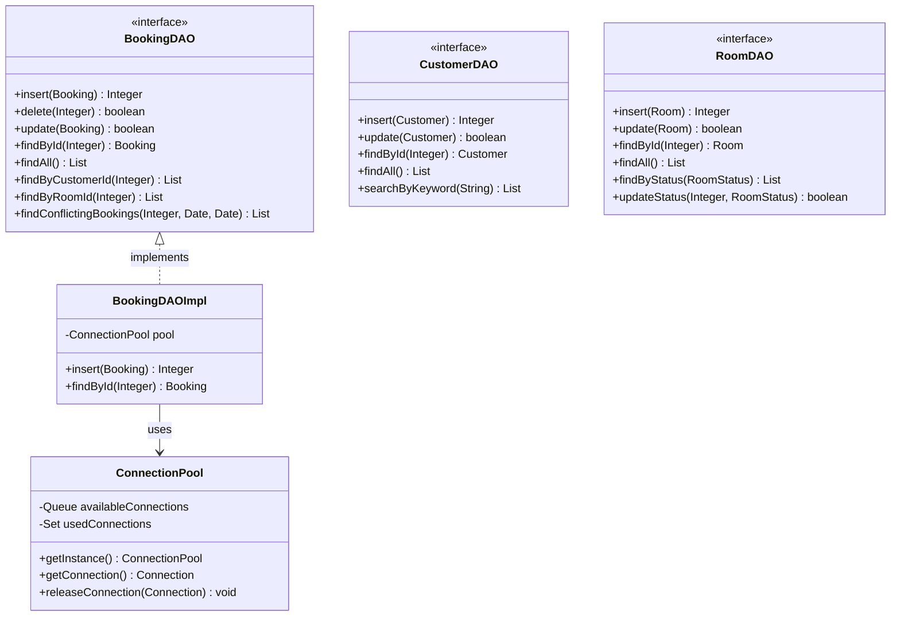
```mermaid
classDiagram
    class BookingDAO {
        <<interface>>
        +insert(Booking) Integer
        +delete(Integer) boolean
        +update(Booking) boolean
        +findById(Integer) Booking
        +findAll() List
        +findByCustomerId(Integer) List
        +findByRoomId(Integer) List
        +findConflictingBookings(Integer, Date, Date) List
    }
    
    class BookingDAOImpl {
        -ConnectionPool pool
        +insert(Booking) Integer
        +findById(Integer) Booking
    }
    
    class CustomerDAO {
        <<interface>>
        +insert(Customer) Integer
        +update(Customer) boolean
        +findById(Integer) Customer
        +findAll() List
        +searchByKeyword(String) List
    }
    
    class RoomDAO {
        <<interface>>
        +insert(Room) Integer
        +update(Room) boolean
        +findById(Integer) Room
        +findAll() List
        +findByStatus(RoomStatus) List
        +updateStatus(Integer, RoomStatus) boolean
    }
    
    class ConnectionPool {
        -Queue availableConnections
        -Set usedConnections
        +getInstance() ConnectionPool
        +getConnection() Connection
        +releaseConnection(Connection) void
    }
    
    BookingDAO <|.. BookingDAOImpl : implements
    BookingDAOImpl --> ConnectionPool : uses
```

---

## 6. 控制器层类图

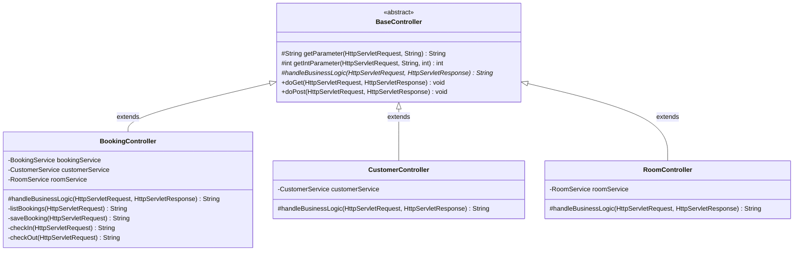
```mermaid
classDiagram
    class BaseController {
        <<abstract>>
        #String getParameter(HttpServletRequest, String) String
        #int getIntParameter(HttpServletRequest, String, int) int
        #handleBusinessLogic(HttpServletRequest, HttpServletResponse)* String
        +doGet(HttpServletRequest, HttpServletResponse) void
        +doPost(HttpServletRequest, HttpServletResponse) void
    }
    
    class BookingController {
        -BookingService bookingService
        -CustomerService customerService
        -RoomService roomService
        #handleBusinessLogic(HttpServletRequest, HttpServletResponse) String
        -listBookings(HttpServletRequest) String
        -saveBooking(HttpServletRequest) String
        -checkIn(HttpServletRequest) String
        -checkOut(HttpServletRequest) String
    }
    
    class CustomerController {
        -CustomerService customerService
        #handleBusinessLogic(HttpServletRequest, HttpServletResponse) String
    }
    
    class RoomController {
        -RoomService roomService
        #handleBusinessLogic(HttpServletRequest, HttpServletResponse) String
    }
    
    BaseController <|-- BookingController : extends
    BaseController <|-- CustomerController : extends
    BaseController <|-- RoomController : extends
```

---

## 7. 业务流程图

### 7.1 用户登录流程

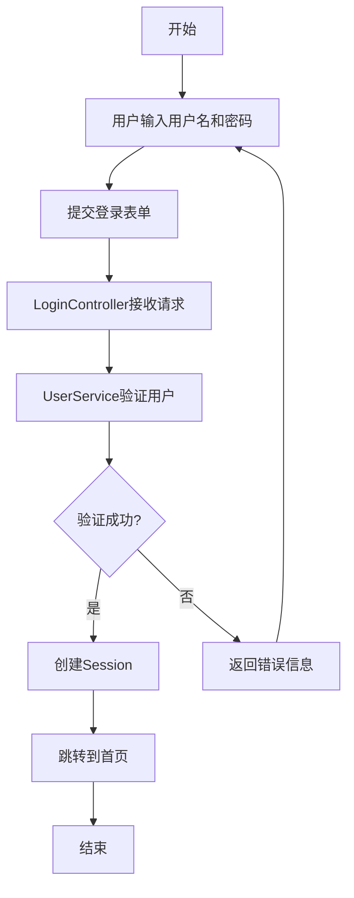
```mermaid
graph TB
    A[开始] --> B[用户输入用户名和密码]
    B --> C[提交登录表单]
    C --> D[LoginController接收请求]
    D --> E[UserService验证用户]
    E --> F{验证成功?}
    F -->|是| G[创建Session]
    G --> H[跳转到首页]
    F -->|否| I[返回错误信息]
    I --> B
    H --> J[结束]
```

### 7.2 预订创建流程

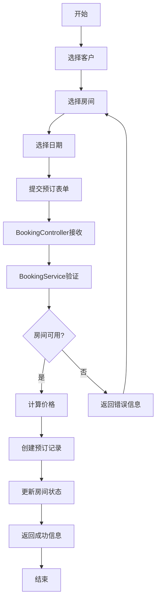
```mermaid
graph TB
    A[开始] --> B[选择客户]
    B --> C[选择房间]
    C --> D[选择日期]
    D --> E[提交预订表单]
    E --> F[BookingController接收]
    F --> G[BookingService验证]
    G --> H{房间可用?}
    H -->|是| I[计算价格]
    I --> J[创建预订记录]
    J --> K[更新房间状态]
    K --> L[返回成功信息]
    H -->|否| M[返回错误信息]
    L --> N[结束]
    M --> C
```

### 7.3 入住办理流程

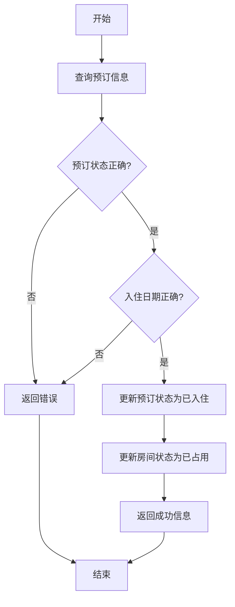
```mermaid
graph TB
    A[开始] --> B[查询预订信息]
    B --> C{预订状态正确?}
    C -->|否| D[返回错误]
    C -->|是| E{入住日期正确?}
    E -->|否| D
    E -->|是| F[更新预订状态为已入住]
    F --> G[更新房间状态为已占用]
    G --> H[返回成功信息]
    H --> I[结束]
    D --> I
```

### 7.4 退房办理流程

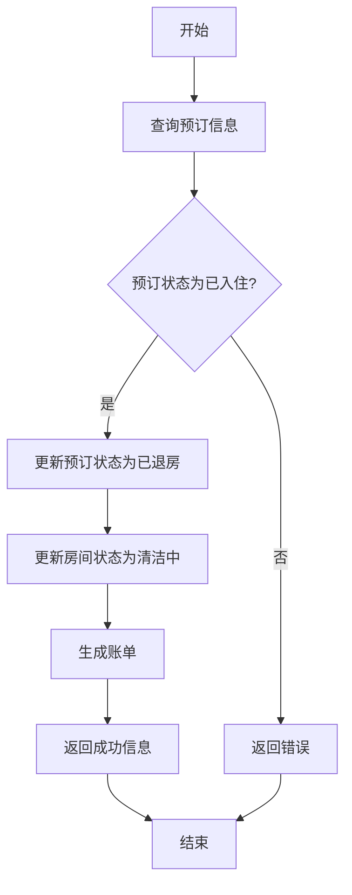
```mermaid
graph TB
    A[开始] --> B[查询预订信息]
    B --> C{预订状态为已入住?}
    C -->|否| D[返回错误]
    C -->|是| E[更新预订状态为已退房]
    E --> F[更新房间状态为清洁中]
    F --> G[生成账单]
    G --> H[返回成功信息]
    H --> I[结束]
    D --> I
```

---

## 8. 时序图

### 8.1 用户登录时序图

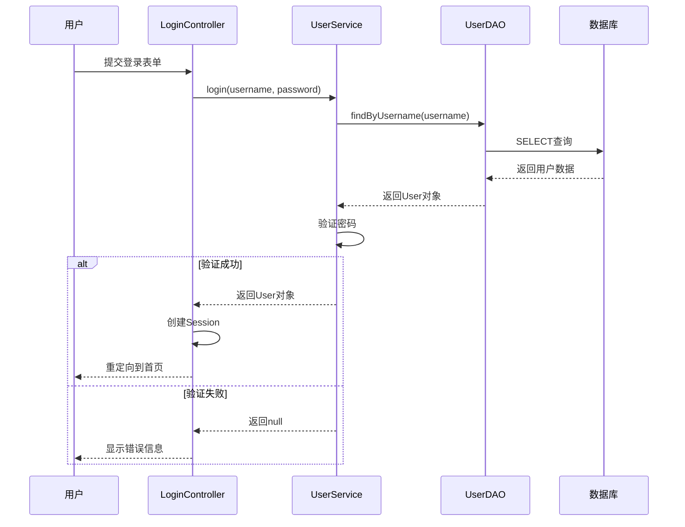
```mermaid
sequenceDiagram
    participant U as 用户
    participant C as LoginController
    participant S as UserService
    participant D as UserDAO
    participant DB as 数据库
    
    U->>C: 提交登录表单
    C->>S: login(username, password)
    S->>D: findByUsername(username)
    D->>DB: SELECT查询
    DB-->>D: 返回用户数据
    D-->>S: 返回User对象
    S->>S: 验证密码
    alt 验证成功
        S-->>C: 返回User对象
        C->>C: 创建Session
        C-->>U: 重定向到首页
    else 验证失败
        S-->>C: 返回null
        C-->>U: 显示错误信息
    end
```

### 8.2 预订创建时序图

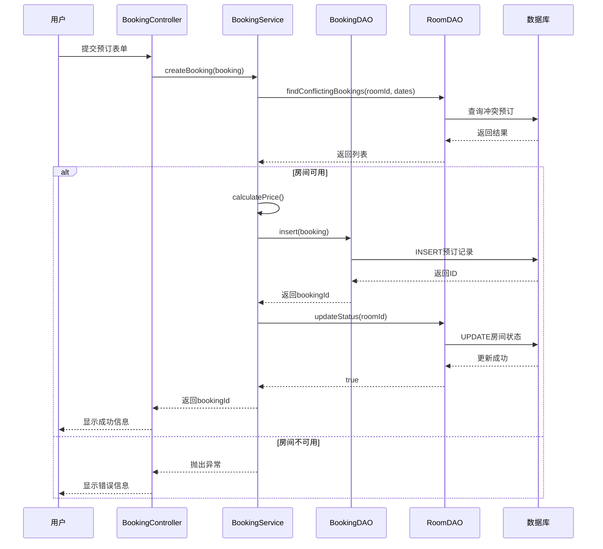
```mermaid
sequenceDiagram
    participant U as 用户
    participant C as BookingController
    participant S as BookingService
    participant D as BookingDAO
    participant R as RoomDAO
    participant DB as 数据库
    
    U->>C: 提交预订表单
    C->>S: createBooking(booking)
    S->>R: findConflictingBookings(roomId, dates)
    R->>DB: 查询冲突预订
    DB-->>R: 返回结果
    R-->>S: 返回列表
    alt 房间可用
        S->>S: calculatePrice()
        S->>D: insert(booking)
        D->>DB: INSERT预订记录
        DB-->>D: 返回ID
        D-->>S: 返回bookingId
        S->>R: updateStatus(roomId)
        R->>DB: UPDATE房间状态
        DB-->>R: 更新成功
        R-->>S: true
        S-->>C: 返回bookingId
        C-->>U: 显示成功信息
    else 房间不可用
        S-->>C: 抛出异常
        C-->>U: 显示错误信息
    end
```

### 8.3 入住办理时序图

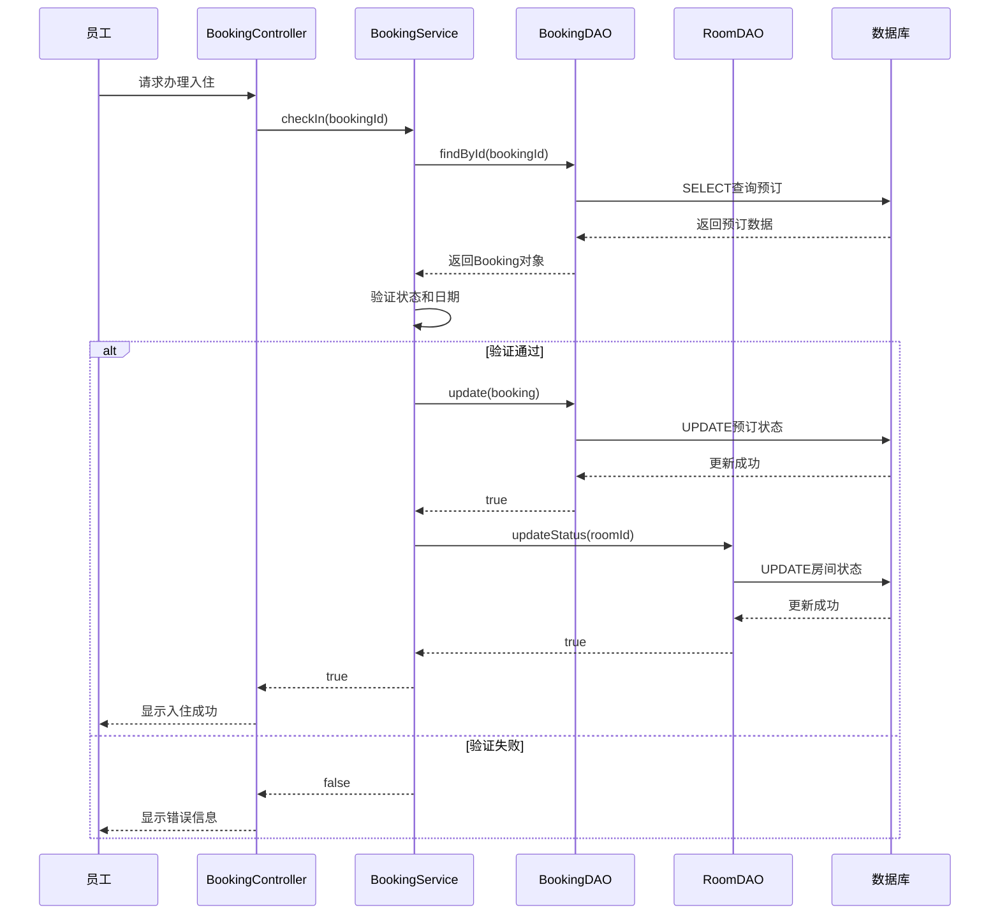
```mermaid
sequenceDiagram
    participant U as 员工
    participant C as BookingController
    participant S as BookingService
    participant D as BookingDAO
    participant R as RoomDAO
    participant DB as 数据库
    
    U->>C: 请求办理入住
    C->>S: checkIn(bookingId)
    S->>D: findById(bookingId)
    D->>DB: SELECT查询预订
    DB-->>D: 返回预订数据
    D-->>S: 返回Booking对象
    S->>S: 验证状态和日期
    alt 验证通过
        S->>D: update(booking)
        D->>DB: UPDATE预订状态
        DB-->>D: 更新成功
        D-->>S: true
        S->>R: updateStatus(roomId)
        R->>DB: UPDATE房间状态
        DB-->>R: 更新成功
        R-->>S: true
        S-->>C: true
        C-->>U: 显示入住成功
    else 验证失败
        S-->>C: false
        C-->>U: 显示错误信息
    end
```

---

## 9. 状态图

### 9.1 预订状态转换图

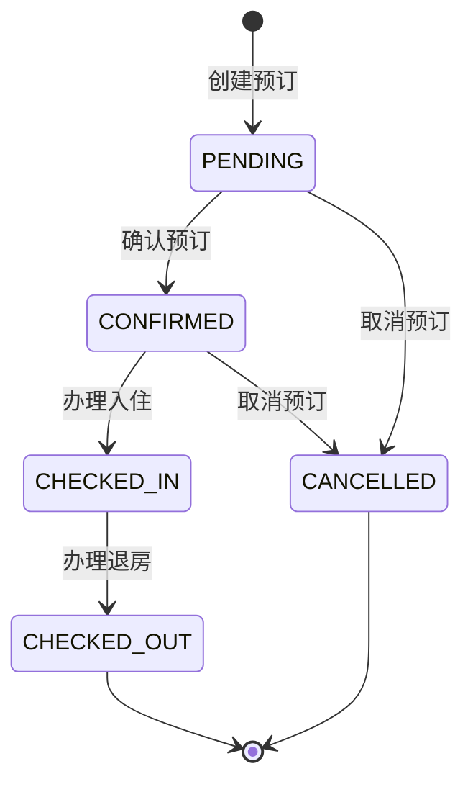
```mermaid
stateDiagram-v2
    [*] --> PENDING: 创建预订
    PENDING --> CONFIRMED: 确认预订
    PENDING --> CANCELLED: 取消预订
    CONFIRMED --> CHECKED_IN: 办理入住
    CONFIRMED --> CANCELLED: 取消预订
    CHECKED_IN --> CHECKED_OUT: 办理退房
    CHECKED_OUT --> [*]
    CANCELLED --> [*]
```

### 9.2 房间状态转换图

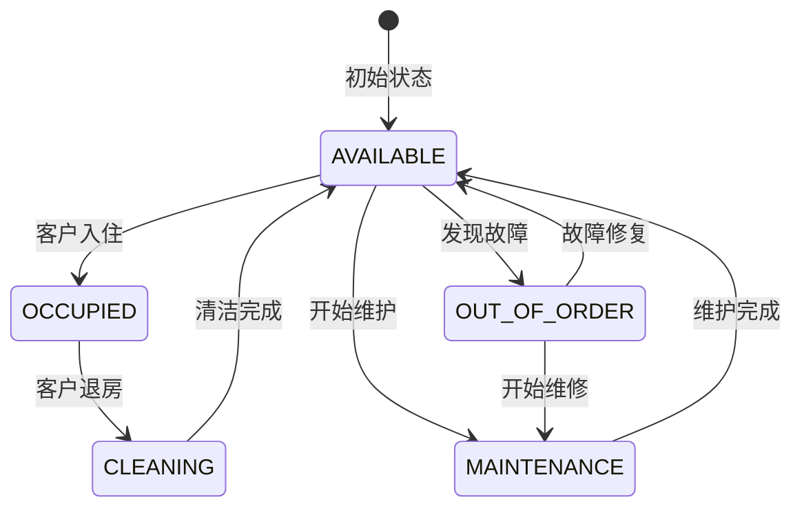
```mermaid
stateDiagram-v2
    [*] --> AVAILABLE: 初始状态
    AVAILABLE --> OCCUPIED: 客户入住
    AVAILABLE --> MAINTENANCE: 开始维护
    AVAILABLE --> OUT_OF_ORDER: 发现故障
    OCCUPIED --> CLEANING: 客户退房
    CLEANING --> AVAILABLE: 清洁完成
    MAINTENANCE --> AVAILABLE: 维护完成
    OUT_OF_ORDER --> MAINTENANCE: 开始维修
    OUT_OF_ORDER --> AVAILABLE: 故障修复
```

### 9.3 用户会话状态图

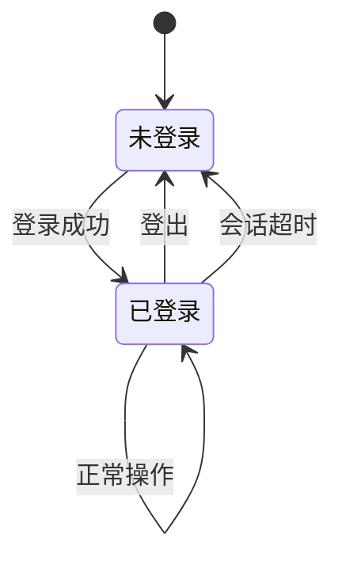
```mermaid
stateDiagram-v2
    [*] --> 未登录
    未登录 --> 已登录: 登录成功
    已登录 --> 未登录: 登出
    已登录 --> 未登录: 会话超时
    已登录 --> 已登录: 正常操作
```

---

## 10. 组件交互图

### 10.1 核心组件交互

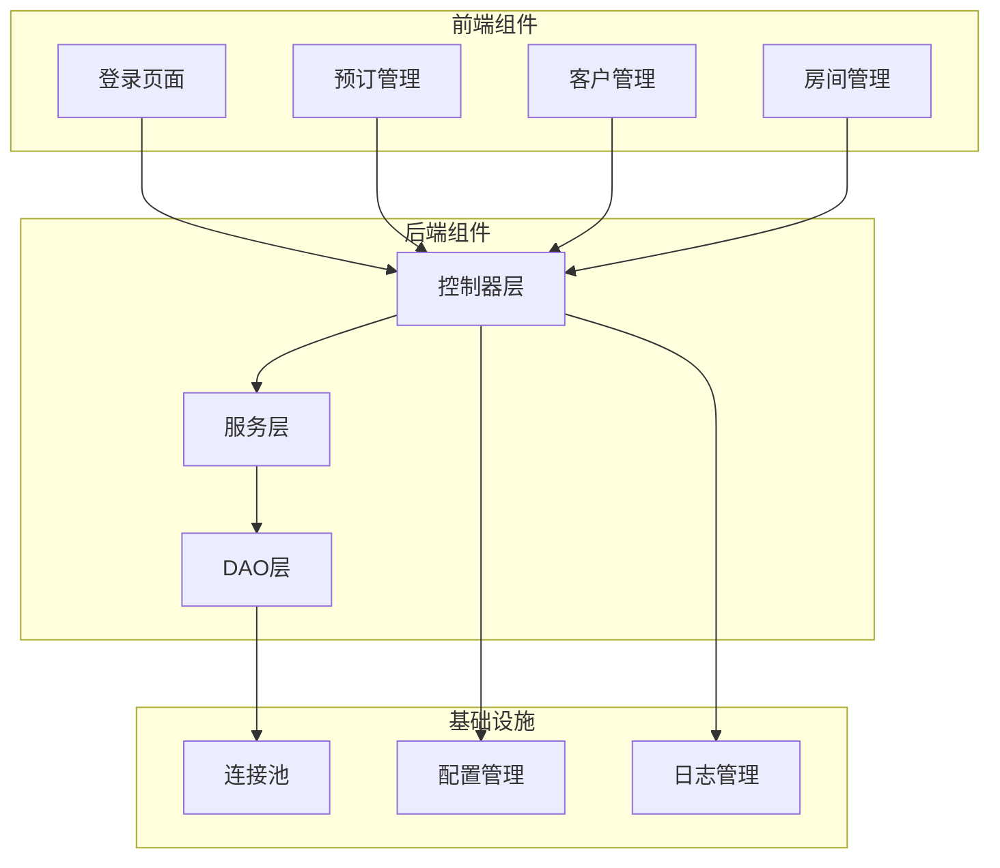
```mermaid
graph TB
    subgraph 前端组件
        A[登录页面]
        B[预订管理]
        C[客户管理]
        D[房间管理]
    end
    
    subgraph 后端组件
        E[控制器层]
        F[服务层]
        G[DAO层]
    end
    
    subgraph 基础设施
        H[连接池]
        I[配置管理]
        J[日志管理]
    end
    
    A --> E
    B --> E
    C --> E
    D --> E
    E --> F
    F --> G
    G --> H
    E --> I
    E --> J
```

---

## 总结

本文档提供了酒店管理系统的完整图示说明，包括：

1. **架构图** - 展示系统的整体架构和分层设计
2. **ER图** - 展示数据库实体关系
3. **类图** - 展示核心类的结构和关系
4. **流程图** - 展示主要业务流程
5. **时序图** - 展示对象间的交互顺序
6. **状态图** - 展示对象状态的转换

这些图示有助于理解系统的设计思想、实现细节和业务逻辑。
