# 过滤器模式 UML 图

本文档展示了酒店管理系统中过滤器模式的设计和实现。

---

## 1. 过滤器模式类图

### 1.1 核心过滤器类图

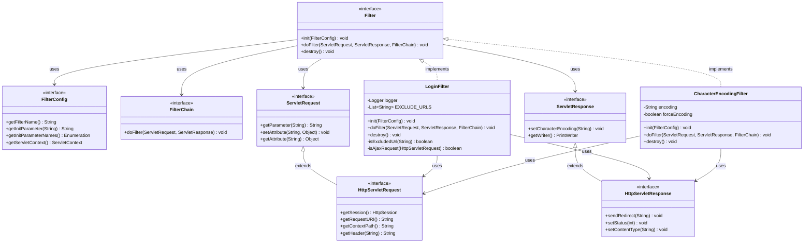

### 1.2 过滤器详细设计

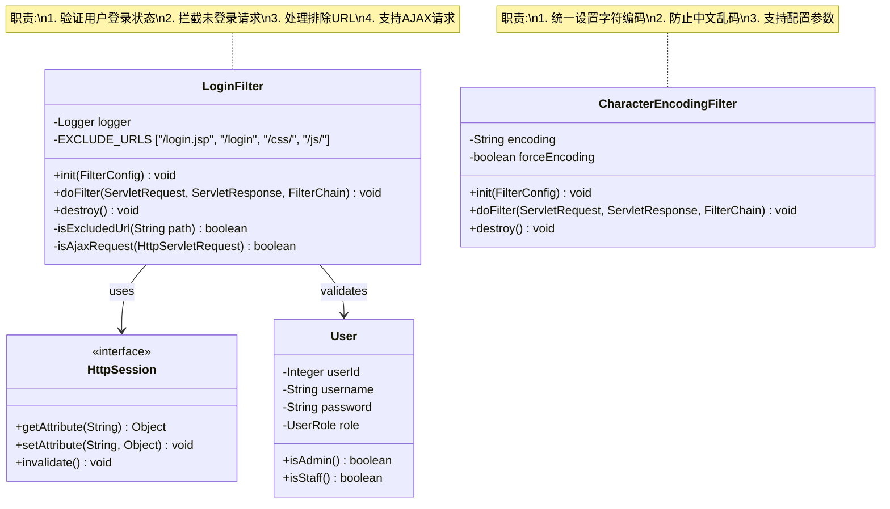

---

## 2. 过滤器链执行流程

### 2.1 过滤器链顺序图

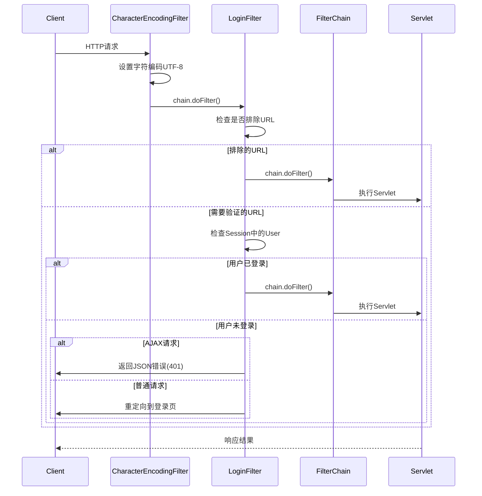

### 2.2 登录验证过滤器流程图

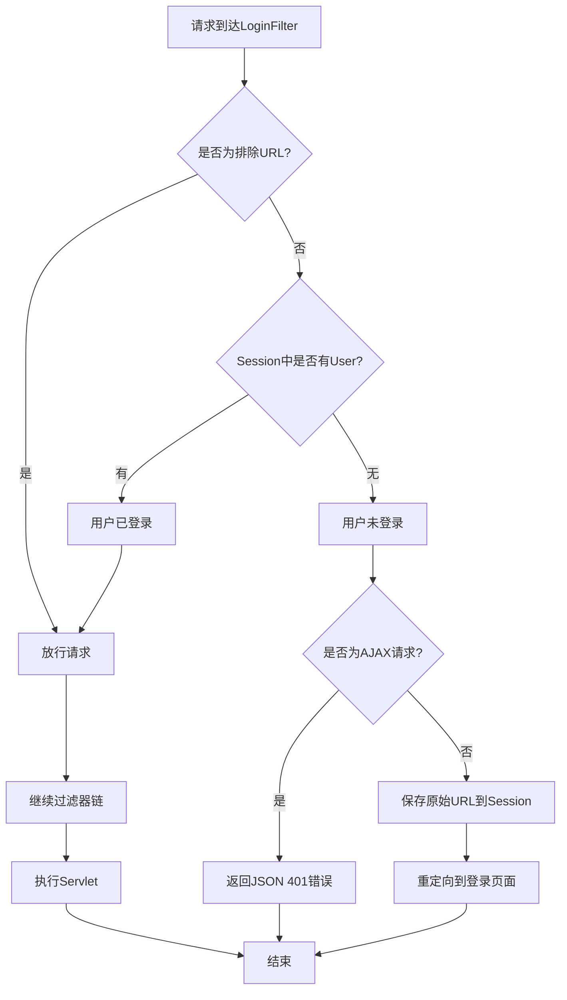

### 2.3 字符编码过滤器流程图

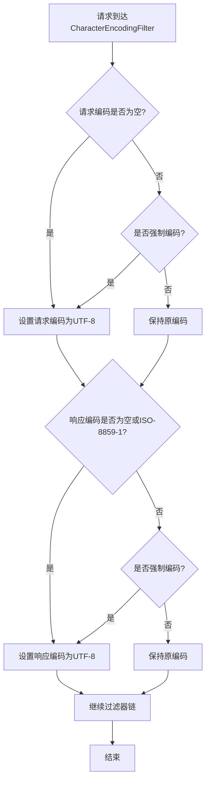

---

## 3. 过滤器配置

### 3.1 Web.xml配置关系图

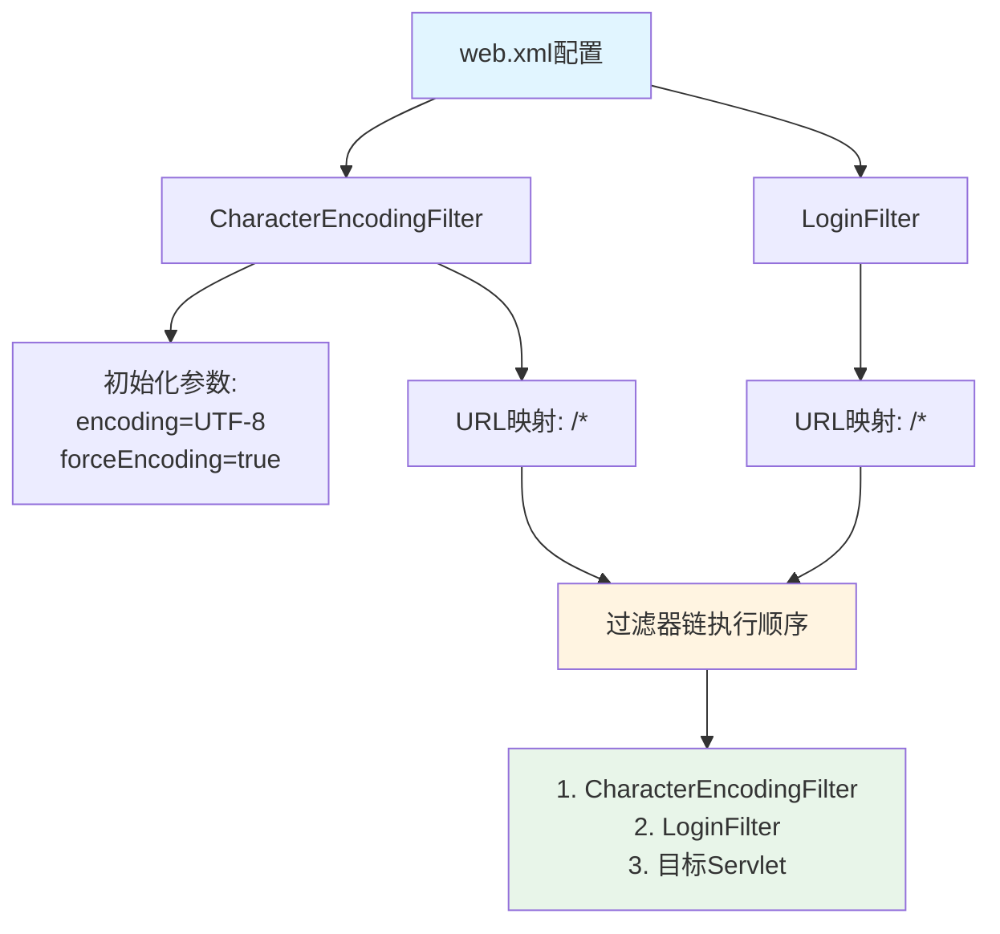

### 3.2 过滤器与Servlet映射关系

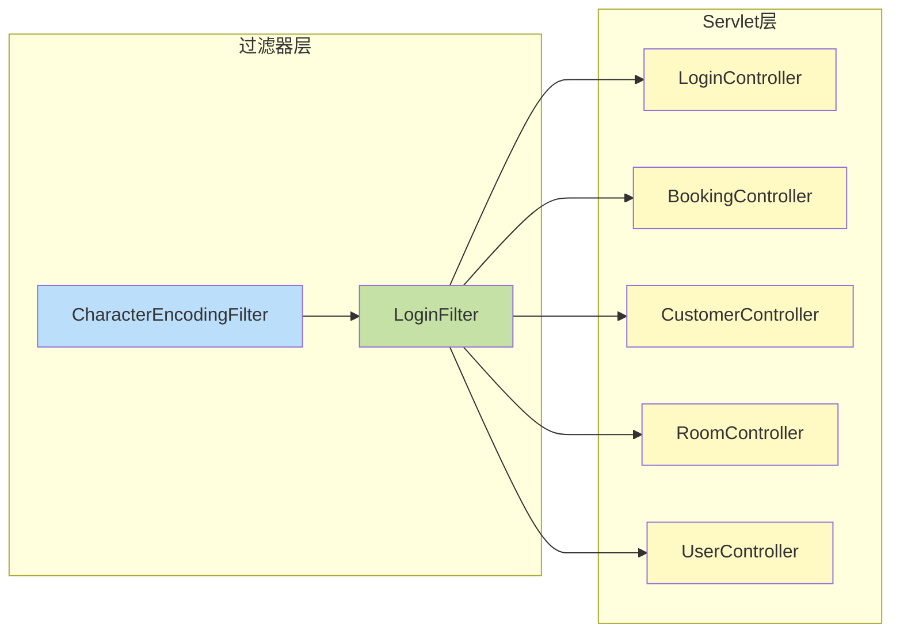

---

## 4. 过滤器模式优势

### 4.1 设计优势图

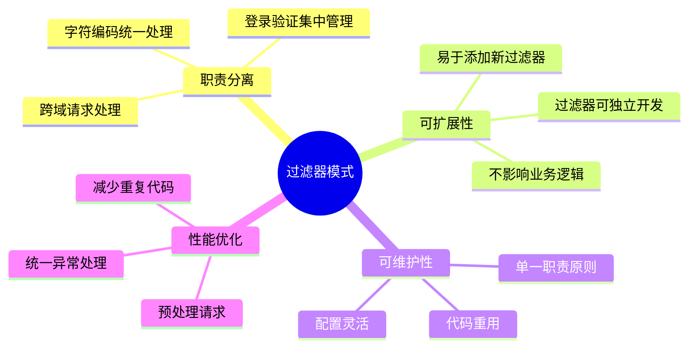

### 4.2 过滤器责任链模式

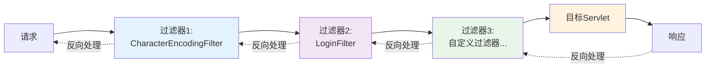

---

## 5. 实际应用场景

### 5.1 登录验证场景

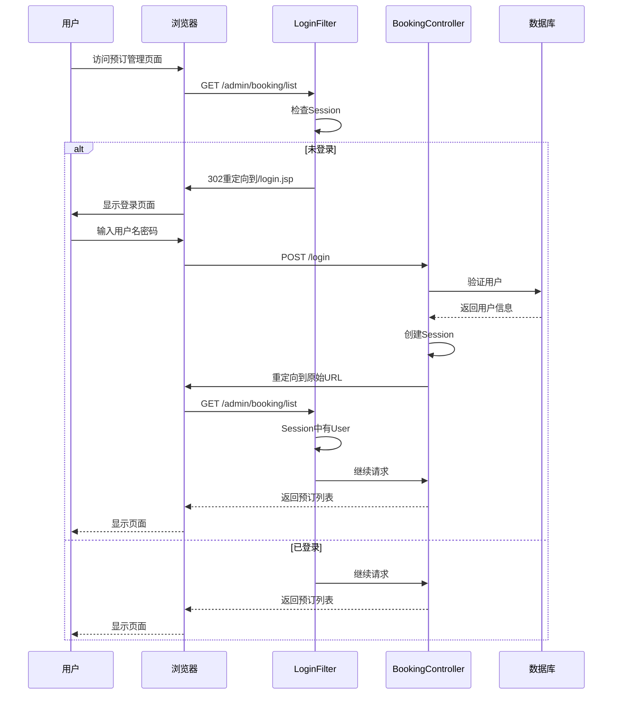

### 5.2 字符编码处理场景

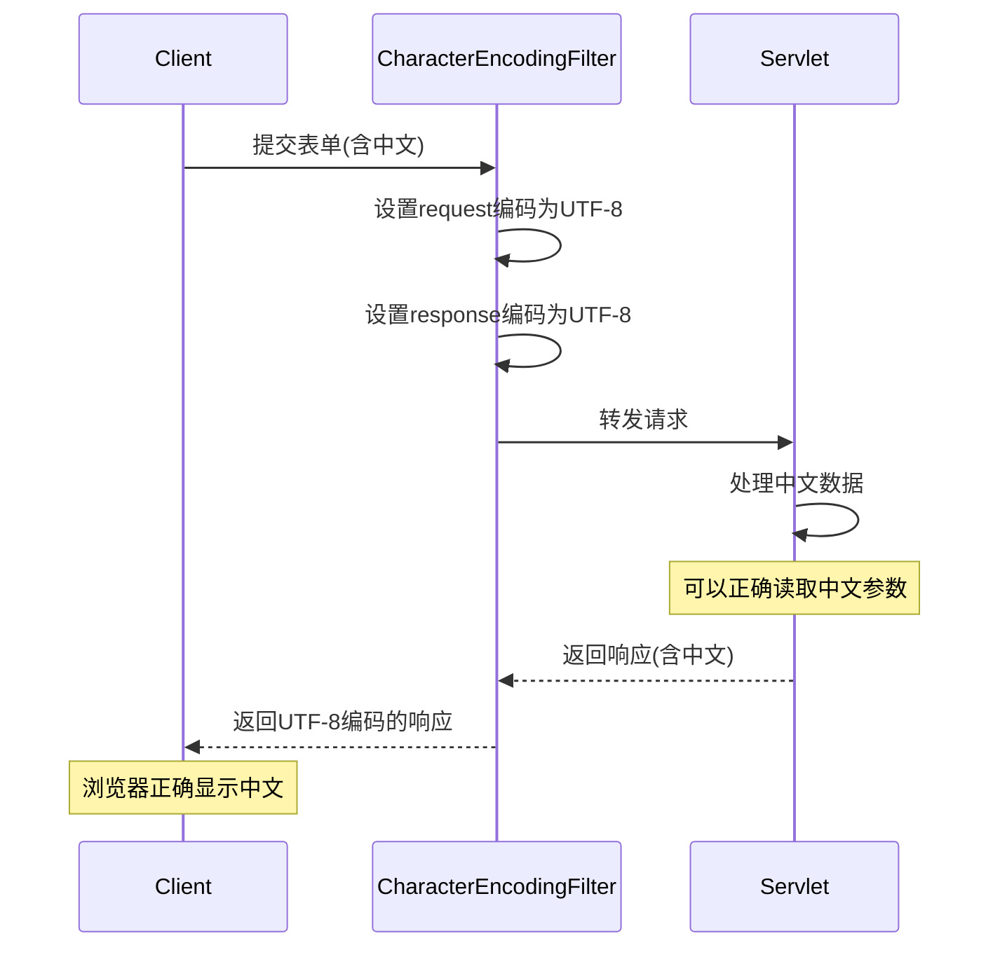

---

## 6. 过滤器生命周期

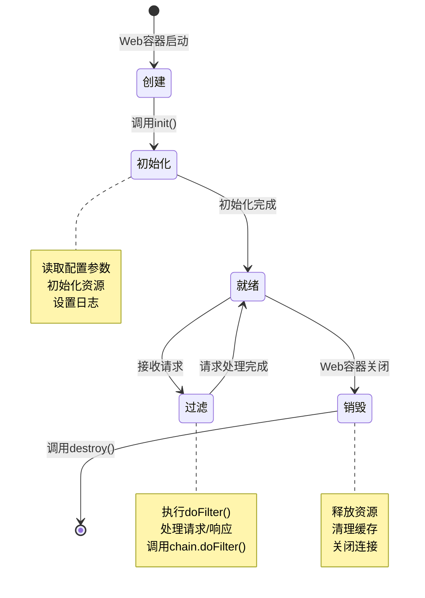

---

## 7. 总结

### 7.1 过滤器模式的关键特点

1. **责任链模式**：多个过滤器形成链式结构，按顺序执行
2. **可插拔性**：可以灵活添加或移除过滤器
3. **透明性**：对业务逻辑透明，不影响Servlet代码
4. **双向处理**：可以在请求前和响应后都进行处理

### 7.2 本项目中的过滤器应用

| 过滤器 | 职责 | 执行顺序 |
|--------|------|----------|
| CharacterEncodingFilter | 统一字符编码为UTF-8 | 1 |
| LoginFilter | 验证用户登录状态 | 2 |

### 7.3 过滤器模式 vs 拦截器模式

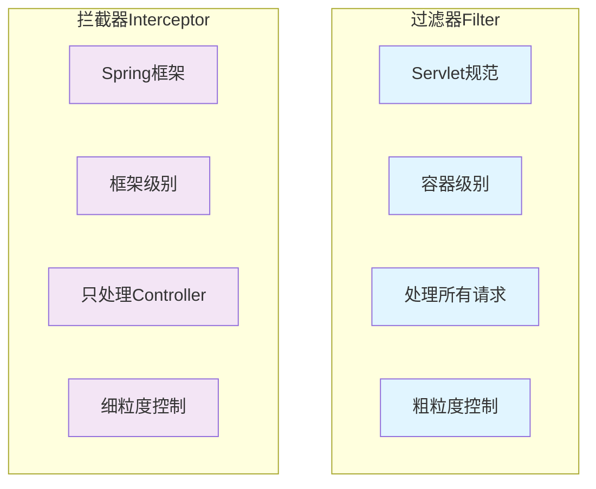

---

## 附录：相关文件

- **LoginFilter实现**: `src/main/java/com/hotel/filter/LoginFilter.java`
- **CharacterEncodingFilter实现**: `src/main/java/com/hotel/filter/CharacterEncodingFilter.java`
- **配置文件**: `src/main/webapp/WEB-INF/web.xml`
