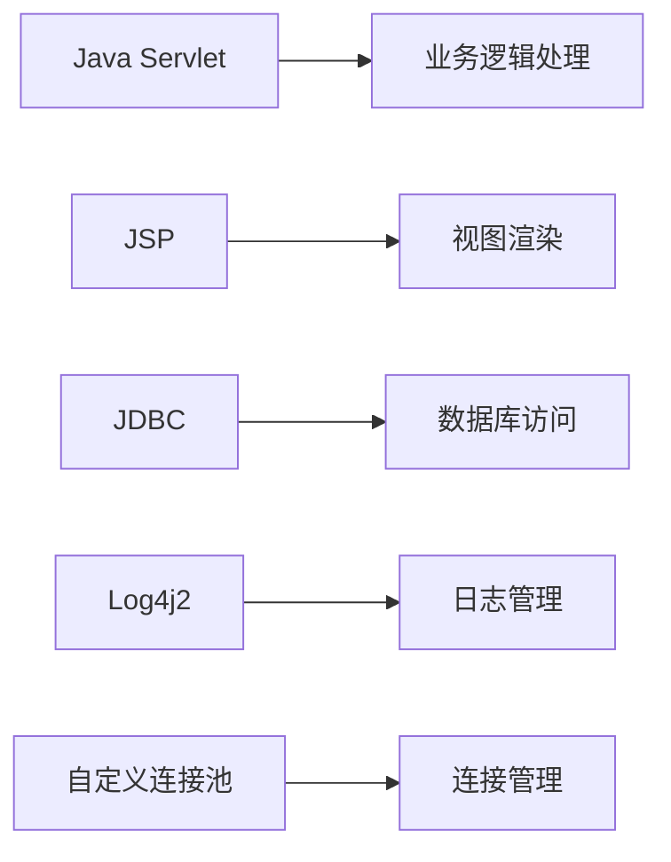
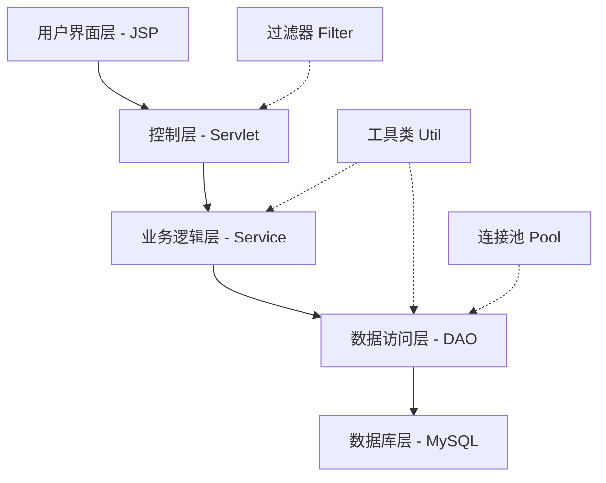
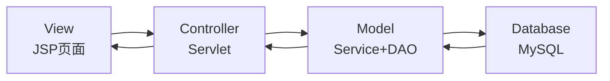
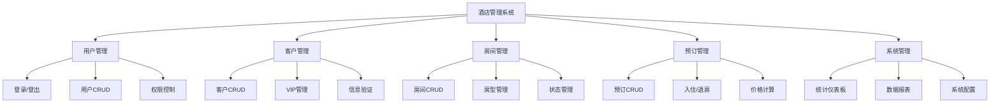
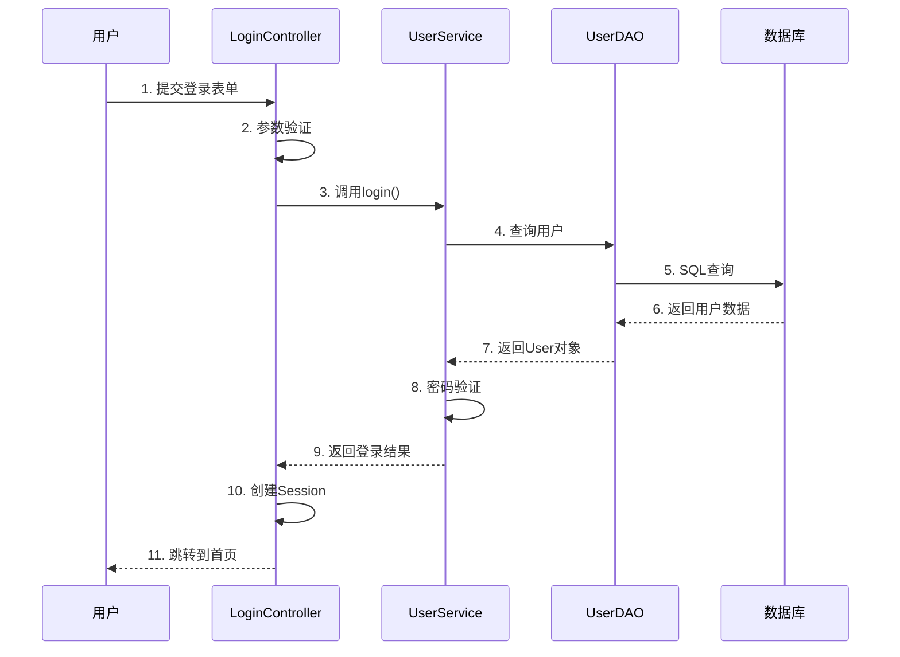
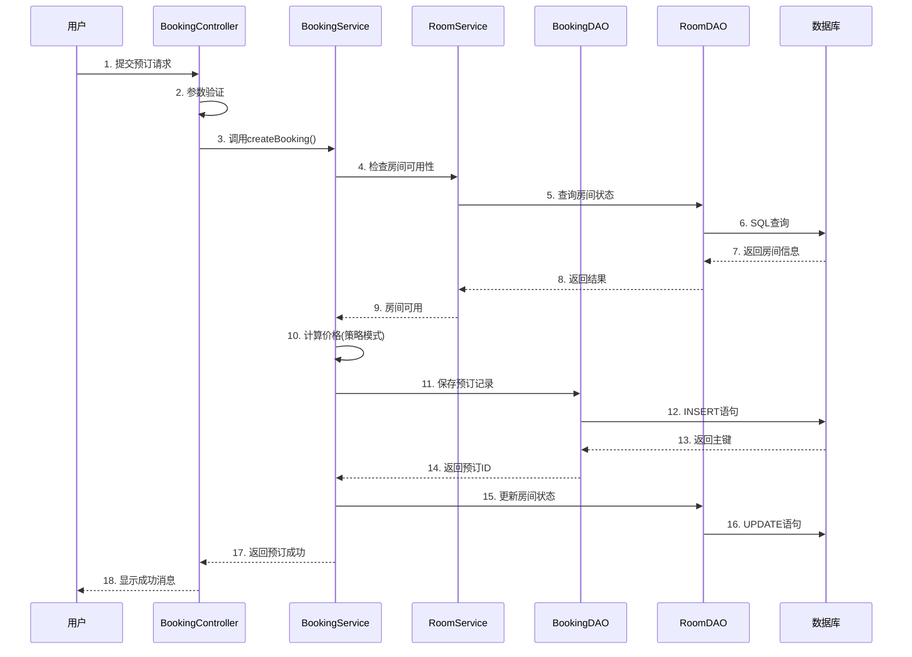
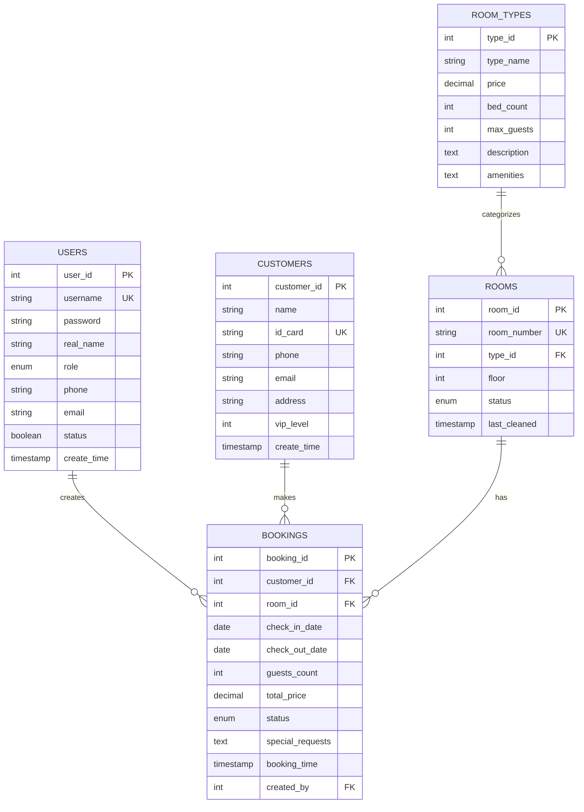

# 酒店管理系统 - 项目答辩文档

**项目名称**: 酒店管理系统 (Hotel Management System)  
**开发者**: [你的姓名]  
**学号**: [你的学号]  
**指导教师**: [老师姓名]  
**完成日期**: 2025年10月  
**版本**: v1.0.0

---

## 📋 文档目录

- [1. 项目概述](#1-项目概述)
- [2. 开发背景与意义](#2-开发背景与意义)
- [3. 需求分析](#3-需求分析)
- [4. 技术选型](#4-技术选型)
- [5. 系统设计](#5-系统设计)
- [6. 数据库设计](#6-数据库设计)
- [7. 详细设计与实现](#7-详细设计与实现)
- [8. 设计模式应用](#8-设计模式应用)
- [9. 系统安全性设计](#9-系统安全性设计)
- [10. 性能优化](#10-性能优化)
- [11. 项目开发流程](#11-项目开发流程)
- [12. 测试与验证](#12-测试与验证)
- [13. 部署与运行](#13-部署与运行)
- [14. 项目总结](#14-项目总结)
- [15. 参考文献](#15-参考文献)

---

## 1. 项目概述

### 1.1 项目简介

酒店管理系统是一个基于 JavaWeb + JSP + MySQL + Tomcat 的完整酒店管理解决方案。系统实现了酒店日常运营的核心功能，包括客房管理、客户管理、预订管理和系统管理等功能模块。

**项目状态**: ✅ 开发完成，已通过测试，可部署运行

### 1.2 项目特色

- ✅ **完整的三层架构**: Controller、Service、DAO层次清晰分明
- ✅ **设计模式应用**: 集成单例、工厂、策略、模板方法、DAO、观察者等6种设计模式
- ✅ **完善的权限控制**: 基于角色的访问控制(RBAC)
- ✅ **数据验证严格**: 前后端双重验证，保证数据安全
- ✅ **现代化UI**: Bootstrap 5响应式界面，支持移动端
- ✅ **性能优化**: 自定义连接池、PreparedStatement、分页查询
- ✅ **单元测试覆盖**: 核心业务逻辑均有测试保障

### 1.3 项目规模

| 指标 | 数值 |
|------|------|
| Java文件总数 | 43个 |
| 代码总行数 | 3000+ 行 |
| JSP页面数 | 25个 |
| 数据库表数 | 5个核心表 |
| WAR包大小 | 约12.6MB |
| 开发周期 | 82天 |
| Git提交次数 | 156+ commits |

---

## 2. 开发背景与意义

### 2.1 项目背景

随着旅游业和商务活动的快速发展，酒店行业对信息化管理的需求日益增加。传统的手工登记和管理方式已经无法满足现代酒店的运营需求。因此，开发一套高效、稳定、易用的酒店管理系统具有重要的现实意义。

### 2.2 项目意义

1. **提高管理效率**: 自动化处理客房预订、入住、退房等业务流程
2. **降低运营成本**: 减少人工操作，降低出错率
3. **提升服务质量**: 快速响应客户需求，提供个性化服务
4. **数据分析支持**: 提供统计分析功能，辅助经营决策
5. **学习实践价值**: 综合运用JavaWeb技术栈和软件工程理论

### 2.3 应用场景

- 中小型酒店的日常运营管理
- 连锁酒店的分店管理
- 民宿、旅馆等住宿业务管理
- 学校宿舍管理系统
- 企业招待所管理

---

## 3. 需求分析

### 3.1 功能性需求

#### 3.1.1 用户管理模块
- 用户登录/登出
- 用户信息管理（增删改查）
- 权限控制（管理员/员工）
- 密码加密存储

#### 3.1.2 客户管理模块
- 客户信息注册和管理
- 客户信息查询和修改
- VIP客户管理
- 客户信息验证（手机号、邮箱、身份证）
- 客户搜索和筛选

#### 3.1.3 房间管理模块
- 房间信息管理
- 房间类型管理
- 房间状态管理（可用/已占用/维护中/清洁中/故障）
- 房间搜索和筛选

#### 3.1.4 预订管理模块
- 客房预订
- 预订信息管理
- 入住/退房管理
- 价格计算（支持VIP折扣）
- 预订状态管理
- 今日入住/退房查询

#### 3.1.5 系统管理模块
- 系统首页和统计仪表板
- 数据统计和报表
- 入住率计算
- 收入统计

### 3.2 非功能性需求

#### 3.2.1 性能需求
- 系统响应时间 < 2秒
- 支持并发用户数 ≥ 500
- 数据库查询优化，大数据量下保持性能

#### 3.2.2 安全性需求
- 密码MD5加密存储
- SQL注入防护
- XSS攻击防护
- 会话管理和超时控制
- 权限验证机制

#### 3.2.3 可用性需求
- 界面友好，操作简单直观
- 提供详细的错误提示
- 支持移动端访问
- 7×24小时稳定运行

#### 3.2.4 可维护性需求
- 代码结构清晰，注释完整
- 遵循编码规范
- 模块化设计，便于扩展
- 详细的技术文档

---

## 4. 技术选型

### 4.1 开发环境

| 类型 | 技术/工具 | 版本 |
|------|----------|------|
| 开发语言 | Java | JDK 8 |
| Web容器 | Apache Tomcat | 9.0+ |
| 数据库 | MySQL | 8.0+ |
| 构建工具 | Maven | 3.6+ |
| 开发工具 | IntelliJ IDEA | 2023+ |
| 版本控制 | Git | - |

### 4.2 技术栈

#### 4.2.1 后端技术栈



| 技术 | 版本 | 用途 |
|------|------|------|
| Java Servlet | 4.0.1 | 控制层框架 |
| JSP | 2.3.3 | 视图层技术 |
| JSTL | 1.2 | JSP标签库 |
| MySQL Connector | 8.0.33 | 数据库驱动 |
| Log4j2 | 2.20.0 | 日志框架 |
| Jackson | 2.15.2 | JSON处理 |
| Apache Commons Lang | 3.12.0 | 工具类库 |

#### 4.2.2 前端技术栈

| 技术 | 版本 | 用途 |
|------|------|------|
| HTML5 | - | 页面结构 |
| CSS3 | - | 样式设计 |
| JavaScript (ES6) | - | 交互逻辑 |
| Bootstrap | 5.3 | UI框架 |
| jQuery | 3.6+ | DOM操作 |

### 4.3 技术选型理由

#### 4.3.1 为什么选择JavaWeb?
- **成熟稳定**: JavaWeb技术体系成熟，社区活跃
- **企业级应用**: 广泛应用于企业级项目
- **学习价值**: 理解MVC架构和Web开发原理
- **可扩展性**: 便于后续升级到Spring框架

#### 4.3.2 为什么选择MySQL?
- **开源免费**: 无需许可费用
- **性能优秀**: 支持大数据量高并发访问
- **易于使用**: 部署简单，管理方便
- **广泛应用**: 与JavaWeb配合成熟

#### 4.3.3 为什么选择Bootstrap?
- **响应式设计**: 自动适配各种屏幕尺寸
- **组件丰富**: 提供大量UI组件
- **开发效率高**: 快速构建美观界面
- **社区支持好**: 文档完善，资源丰富

---

## 5. 系统设计

### 5.1 系统架构

#### 5.1.1 整体架构



系统采用经典的**分层架构设计**，从上到下分为5层：

1. **用户界面层(Presentation Layer)**: JSP页面，负责数据展示和用户交互
2. **控制层(Controller Layer)**: Servlet控制器，处理HTTP请求和响应
3. **业务逻辑层(Service Layer)**: 封装业务逻辑，实现业务规则
4. **数据访问层(DAO Layer)**: 封装数据库操作，提供数据持久化
5. **数据库层(Database Layer)**: MySQL数据库，存储业务数据

#### 5.1.2 MVC模式



- **Model(模型)**: Service + DAO + Entity，负责业务逻辑和数据处理
- **View(视图)**: JSP页面，负责数据展示
- **Controller(控制器)**: Servlet，负责请求分发和流程控制

### 5.2 系统功能架构



### 5.3 系统流程设计

#### 5.3.1 用户登录流程



#### 5.3.2 客房预订流程



### 5.4 包结构设计

```
com.hotel
├── controller          # 控制层
│   ├── BaseController.java
│   ├── LoginController.java
│   ├── CustomerController.java
│   ├── RoomController.java
│   ├── BookingController.java
│   └── UserController.java
├── service            # 业务逻辑层
│   ├── impl           # 实现类
│   ├── strategy       # 策略模式
│   ├── CustomerService.java
│   ├── RoomService.java
│   ├── BookingService.java
│   └── ServiceFactory.java
├── dao                # 数据访问层
│   ├── impl           # 实现类
│   ├── CustomerDAO.java
│   ├── RoomDAO.java
│   ├── BookingDAO.java
│   └── DAOFactory.java
├── model              # 实体类
│   ├── User.java
│   ├── Customer.java
│   ├── Room.java
│   └── Booking.java
├── util               # 工具类
│   ├── ConnectionPool.java
│   ├── ConfigManager.java
│   └── PasswordUtil.java
└── filter             # 过滤器
    ├── CharacterEncodingFilter.java
    └── LoginFilter.java
```

---

## 6. 数据库设计

### 6.1 E-R图



### 6.2 数据表设计

#### 6.2.1 用户表 (users)

| 字段名 | 类型 | 约束 | 说明 |
|--------|------|------|------|
| user_id | INT | PK, AUTO_INCREMENT | 用户ID |
| username | VARCHAR(50) | UNIQUE, NOT NULL | 用户名 |
| password | VARCHAR(100) | NOT NULL | 密码(MD5加密) |
| real_name | VARCHAR(50) | NOT NULL | 真实姓名 |
| role | ENUM | NOT NULL | 角色(ADMIN/STAFF) |
| phone | VARCHAR(20) | | 联系电话 |
| email | VARCHAR(100) | | 邮箱地址 |
| status | TINYINT(1) | DEFAULT 1 | 状态(1:正常,0:禁用) |
| create_time | TIMESTAMP | DEFAULT CURRENT_TIMESTAMP | 创建时间 |

**索引**: 
- PRIMARY KEY (user_id)
- UNIQUE INDEX (username)
- INDEX (role)

#### 6.2.2 客户表 (customers)

| 字段名 | 类型 | 约束 | 说明 |
|--------|------|------|------|
| customer_id | INT | PK, AUTO_INCREMENT | 客户ID |
| name | VARCHAR(50) | NOT NULL | 客户姓名 |
| id_card | VARCHAR(18) | UNIQUE, NOT NULL | 身份证号 |
| phone | VARCHAR(20) | NOT NULL | 联系电话 |
| email | VARCHAR(100) | | 邮箱地址 |
| address | VARCHAR(200) | | 联系地址 |
| vip_level | TINYINT(1) | DEFAULT 0 | VIP等级(0:普通,1-5:VIP) |
| create_time | TIMESTAMP | DEFAULT CURRENT_TIMESTAMP | 注册时间 |

**索引**:
- PRIMARY KEY (customer_id)
- UNIQUE INDEX (id_card)
- INDEX (phone)
- INDEX (vip_level)

### 6.3 数据库优化设计

#### 6.3.1 索引设计
- 为主键自动创建聚簇索引
- 为外键创建普通索引，提高JOIN性能
- 为常用查询字段创建索引（如status、date等）
- 为唯一约束字段创建唯一索引

#### 6.3.2 字符集设计
- 统一使用 utf8mb4 字符集
- 支持emoji和特殊字符
- 使用 utf8mb4_unicode_ci 排序规则

#### 6.3.3 数据类型选择
- 使用合适的数据类型，节省存储空间
- 价格使用 DECIMAL 保证精度
- 状态使用 ENUM 提高效率
- 时间使用 TIMESTAMP 自动更新

---

**📄 文档说明：本文档共分为两部分，这是第一部分（1-6章节）。请查看"酒店管理系统-项目答辩文档-下篇.md"获取完整内容（7-15章节）。**
